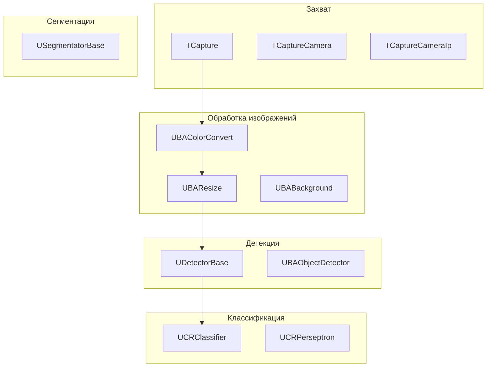

# Архитектура Rdk-CvBasicLib

## RU

### Обзор

Rdk-CvBasicLib построена на базе OpenCV и предоставляет компонентный интерфейс для работы с компьютерным зрением.

### Структура библиотеки

### Основные модули

#### Захват видео и изображений

- **TCapture** - базовый класс захвата
- **TCaptureCamera** - захват с камеры
- **TCaptureCameraIp** - захват с IP-камеры
- **TCaptureImageSequence** - захват последовательности изображений

#### Обработка изображений

- **UBAColorConvert** - конвертация цветовых пространств
- **UBAResize** - изменение размера
- **UBABackground** - работа с фоном
- **UBABinarization** - бинаризация
- **UBALabeling** - маркировка объектов

#### Детекция объектов

- **UDetectorBase** - базовый детектор
- **UBAObjectDetector** - детектор объектов

#### Классификация

- **UCRClassifier** - базовый классификатор
- **UCRPerseptron** - перцептрон
- **UCRConvolutionNetwork** - сверточная сеть

#### Сегментация

- **USegmentatorBase** - базовый сегментатор

### Зависимости

- `rdk.static.qt` - ядро Rdk
- OpenCV - библиотека компьютерного зрения

### См. также

- [Usage-Examples.md](Usage-Examples.md) - примеры использования
- [API-Overview.md](API-Overview.md) - обзор API

---

## EN

### Overview

Rdk-CvBasicLib is built on OpenCV and provides a component interface for computer vision work.

### Library Structure

### Main Modules

#### Video and Image Capture

- **TCapture** - base capture class
- **TCaptureCamera** - camera capture
- **TCaptureCameraIp** - IP camera capture
- **TCaptureImageSequence** - image sequence capture

#### Image Processing

- **UBAColorConvert** - color space conversion
- **UBAResize** - resize
- **UBABackground** - background handling
- **UBABinarization** - binarization
- **UBALabeling** - object labeling

#### Object Detection

- **UDetectorBase** - base detector
- **UBAObjectDetector** - object detector

#### Classification

- **UCRClassifier** - base classifier
- **UCRPerseptron** - perceptron
- **UCRConvolutionNetwork** - convolutional network

#### Segmentation

- **USegmentatorBase** - base segmentator

### Dependencies

- `rdk.static.qt` - Rdk core
- OpenCV - computer vision library

### See Also

- [Usage-Examples.md](Usage-Examples.md) - usage examples
- [API-Overview.md](API-Overview.md) - API overview
