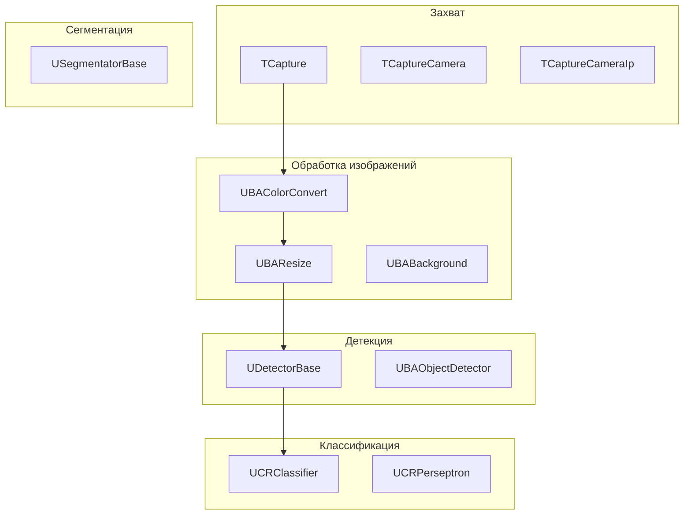
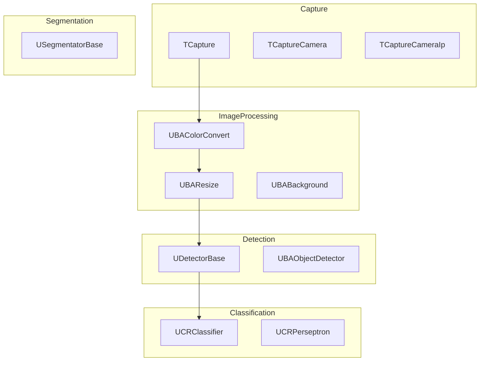

# Архитектура Rdk-CvBasicLib

## RU

### Обзор

Rdk-CvBasicLib построена на базе OpenCV и предоставляет компонентный интерфейс для работы с компьютерным зрением.

### Структура библиотеки



### Основные модули

#### Захват видео и изображений

- **TCapture** - базовый класс для захвата видео и изображений. Наследники реализуют конкретные источники: камеры (USB, IP), файлы, последовательности изображений
- **TCaptureCamera** - захват с камеры (веб-камера, USB-камера)
- **TCaptureCameraIp** - захват с IP-камеры по сети
- **TCaptureImageSequence** - захват последовательности изображений из файлов
- **TCaptureSupport** - вспомогательные функции для захвата

#### Источники изображений

- **UBASource** - базовый источник изображений
- **UBASourceFile** - источник изображений из файла
- **UBASourceMultiFile** - источник из множества файлов
- **UBABitmapSource** - источник из растровых изображений (UBitmap)

#### Обработка изображений (UBA* компоненты)

Компоненты обработки изображений с префиксом UBA (UBitmap Algorithm) для обработки пикселей, геометрических преобразований, фильтрации и детекции объектов:

- **UBAColorConvert** - конвертация цветовых пространств (RGB, HSV, Grayscale и др.)
- **UBAResize** - изменение размера изображения
- **UBARotate** - поворот изображения
- **UBAFlipImage** - отражение изображения (горизонтальное/вертикальное)
- **UBACrop** - обрезка изображения
- **UBAReduce** - уменьшение размерности изображения
- **UBADifferenceFrame** - вычисление разности кадров
- **UBABackground** - работа с фоновым изображением
- **UBABinarization** - бинаризация изображения
- **UBALooping** - циклическое воспроизведение изображений
- **UBALabeling** - маркировка объектов на изображении
- **UBAMovingDetector** - детектор движения
- **UBAObjectDetector** - детектор объектов (базовый)
- **UBAShowObjects** - отображение объектов на изображении
- **UBAGuiSelection** - графический выбор области на изображении
- **UBShowRect** - отображение прямоугольников

#### Симуляторы данных

- **UBAVideoSimulator** - симулятор видео
- **UBADataSimulator** - симулятор данных
- **UBARotCameraSimulator** - симулятор вращающейся камеры

#### Математические операции

- **UBMathOperator** - математические операции над изображениями
- **UMatrixMath** - математические операции с матрицами
- **UMDMatrixMux** - мультиплексор матриц

#### Классификаторы (UCR* компоненты)

Компоненты классификации и распознавания с префиксом UCR:

- **UCRClassifier** - базовый классификатор
- **UCRPerseptron** - перцептрон для классификации
- **UCRDirectCompare** - прямое сравнение для классификации
- **UCRDistance** - классификация по расстоянию
- **UCRFusion** - слияние результатов классификации
- **UCRSample** - образец для обучения
- **UCRTeacher** - учитель (обучение классификаторов)
- **UCRTeacherPerseptronBP** - обучение перцептрона методом обратного распространения
- **UCRTeacherPerseptronDL** - обучение перцептрона с глубоким обучением
- **UCRTeacherCVNetworkBP** - обучение сверточной сети методом обратного распространения
- **UCRConvolutionNetwork** - сверточная нейронная сеть
- **UCRPrincipalComponentAnalysis** - анализ главных компонент (PCA)
- **UCRBarnesHutTSNE** - t-SNE визуализация (Barnes-Hut алгоритм)
- **UClassifierBase** - базовый класс классификатора
- **UClassifierResSaver** - сохранение результатов классификации

#### Детекторы

- **UDetectorBase** - базовый класс детектора объектов
- **UDetResSaverPVOC** - сохранение результатов детекции в формате PASCAL VOC

#### Сегментация

- **USegmentatorBase** - базовый класс сегментатора

#### Статистика

- **UBStatistic** - статистика по изображениям

#### Конвейеры обработки

- **UBPipeline** - конвейер обработки изображений

#### Модели

- **UBAModel** - модель для обработки изображений

### Специальные алгоритмы

#### PCA/
Подкаталог с реализацией PCA (Principal Component Analysis).

#### TSNE/
Подкаталог с реализацией t-SNE (t-distributed Stochastic Neighbor Embedding):
- `sptree.cpp/h` - пространственное дерево
- `tsne.cpp/h` - основной алгоритм t-SNE
- `vptree.h` - VP-дерево

#### UCVNetwork/
Подкаталог с реализацией сверточной нейронной сети:
- `CNetwork.cpp/h` - сеть
- `CNeuron.cpp/h` - нейрон
- `CNField.cpp/h` - поле нейронов
- `CNLayer.cpp/h` - слой сети

### Ключевые классы

#### CvBasicLib

Главный класс библиотеки:

```cpp
class CvBasicLib : public ULibrary
{
public:
    CvBasicLib(void);
    virtual void CreateClassSamples(UStorage *storage);
    
    // Функция для создания свойств из мок-сетей
    static bool CvBasicLibCrPropMock(RDK::USerStorageXML* serstorage, 
                                     RDK::UMockUNet* mock_unet);
};
```

Библиотека автоматически загружается при инициализации:

```cpp
libs_list.push_back(&RDK::CvBasicLibrary);
```

### Зависимости

- **rdk.static.qt** - ядро Rdk (обязательно)
- **OpenCV** - библиотека компьютерного зрения (обязательно)
- Стандартная библиотека C++

### Зависимости от этой библиотеки

- **Nmsdk-MotionControlLib** - использует компоненты компьютерного зрения для систем управления движением

### Примеры использования

#### Захват с камеры

```cpp
// Создание компонента захвата с камеры
TCaptureCamera* capture = storage->CreateComponent<TCaptureCamera>();
// Настройка индекса камеры и параметров
```

#### Обработка изображения

```cpp
// Создание конвейера обработки
UBPipeline* pipeline = storage->CreateComponent<UBPipeline>();
// Добавление этапов обработки: resize, color convert, binarization
```

#### Классификация

```cpp
// Создание классификатора
UCRClassifier* classifier = storage->CreateComponent<UCRClassifier>();
// Обучение и классификация
```

### См. также

- [Usage-Examples.md](Usage-Examples.md) - примеры использования
- [API-Overview.md](API-Overview.md) - обзор API

---

## EN

### Overview

Rdk-CvBasicLib is built on OpenCV and provides a component interface for computer vision work.

### Library Structure



The diagram reflects a typical pipeline: capture → preprocessing → detection → classification. In practice, components exchange images and detection results via properties (e.g., bitmap inputs/outputs and object lists).

### Main Modules

#### Video and Image Capture

- **TCapture** - base capture class
- **TCaptureCamera** - camera capture
- **TCaptureCameraIp** - IP camera capture
- **TCaptureImageSequence** - image sequence capture

#### Image Sources

- **UBASource** - base image source
- **UBASourceFile** - image source from file
- **UBASourceMultiFile** - source from multiple files
- **UBABitmapSource** - source from bitmap images (UBitmap)

#### Image Processing (UBA* components)

Image processing components with UBA prefix (UBitmap Algorithm) for pixel processing, geometric transformations, filtering, and object detection:

- **UBAColorConvert** - color space conversion (RGB, HSV, Grayscale, etc.)
- **UBAResize** - image resizing
- **UBARotate** - image rotation
- **UBAFlipImage** - image flipping (horizontal/vertical)
- **UBACrop** - image cropping
- **UBAReduce** - dimensionality reduction
- **UBADifferenceFrame** - frame difference computation
- **UBABackground** - background image handling
- **UBABinarization** - image binarization
- **UBALooping** - cyclic image playback
- **UBALabeling** - object labeling on image
- **UBAMovingDetector** - motion detector
- **UBAObjectDetector** - object detector (base)
- **UBAShowObjects** - object display on image
- **UBAGuiSelection** - graphical area selection on image
- **UBShowRect** - rectangle display

#### Data Simulators

- **UBAVideoSimulator** - video simulator
- **UBADataSimulator** - data simulator
- **UBARotCameraSimulator** - rotating camera simulator

#### Mathematical Operations

- **UBMathOperator** - mathematical operations on images
- **UMatrixMath** - matrix mathematical operations
- **UMDMatrixMux** - matrix multiplexer

#### Classifiers (UCR* components)

Classification and recognition components with UCR prefix:

- **UCRClassifier** - base classifier
- **UCRPerseptron** - perceptron for classification
- **UCRDirectCompare** - direct comparison for classification
- **UCRDistance** - distance-based classification
- **UCRFusion** - classification result fusion
- **UCRSample** - training sample
- **UCRTeacher** - teacher (classifier training)
- **UCRTeacherPerseptronBP** - perceptron training with backpropagation
- **UCRTeacherPerseptronDL** - perceptron training with deep learning
- **UCRTeacherCVNetworkBP** - convolutional network training with backpropagation
- **UCRConvolutionNetwork** - convolutional neural network
- **UCRPrincipalComponentAnalysis** - Principal Component Analysis (PCA)
- **UCRBarnesHutTSNE** - t-SNE visualization (Barnes-Hut algorithm)
- **UClassifierBase** - base classifier class
- **UClassifierResSaver** - classification result saving

#### Detectors

- **UDetectorBase** - base object detector class
- **UDetResSaverPVOC** - detection result saving in PASCAL VOC format

#### Segmentation

- **USegmentatorBase** - base segmentator class

#### Statistics

- **UBStatistic** - image statistics

#### Processing Pipelines

- **UBPipeline** - image processing pipeline

#### Models

- **UBAModel** - model for image processing

### Special Algorithms

#### PCA/
Subdirectory with PCA (Principal Component Analysis) implementation.

#### TSNE/
Subdirectory with t-SNE (t-distributed Stochastic Neighbor Embedding) implementation:
- `sptree.cpp/h` - spatial tree
- `tsne.cpp/h` - main t-SNE algorithm
- `vptree.h` - VP-tree

#### UCVNetwork/
Subdirectory with convolutional neural network implementation:
- `CNetwork.cpp/h` - network
- `CNeuron.cpp/h` - neuron
- `CNField.cpp/h` - neuron field
- `CNLayer.cpp/h` - network layer

### Key Classes

#### CvBasicLib

Main library class:

```cpp
class CvBasicLib : public ULibrary
{
public:
    CvBasicLib(void);
    virtual void CreateClassSamples(UStorage *storage);
    
    // Function for creating properties from mock networks
    static bool CvBasicLibCrPropMock(RDK::USerStorageXML* serstorage, 
                                     RDK::UMockUNet* mock_unet);
};
```

The library is automatically loaded during initialization:

```cpp
libs_list.push_back(&RDK::CvBasicLibrary);
```

### Dependencies

- **rdk.static.qt** - Rdk core (required)
- **OpenCV** - computer vision library (required)
- Standard C++ library

### Libraries Depending on This Library

- **Nmsdk-MotionControlLib** - uses computer vision components for motion control systems

### Usage Examples

#### Camera Capture

```cpp
// Create camera capture component
TCaptureCamera* capture = storage->CreateComponent<TCaptureCamera>();
// Configure camera index and parameters
```

#### Image Processing

```cpp
// Create processing pipeline
UBPipeline* pipeline = storage->CreateComponent<UBPipeline>();
// Add processing stages: resize, color convert, binarization
```

#### Classification

```cpp
// Create classifier
UCRClassifier* classifier = storage->CreateComponent<UCRClassifier>();
// Training and classification
```

### See Also

- [Usage-Examples.md](Usage-Examples.md) - usage examples
- [API-Overview.md](API-Overview.md) - API overview
