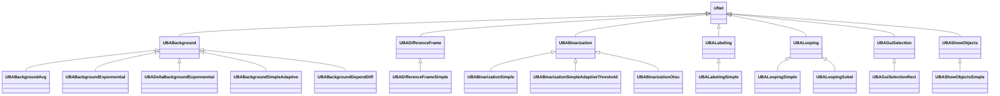
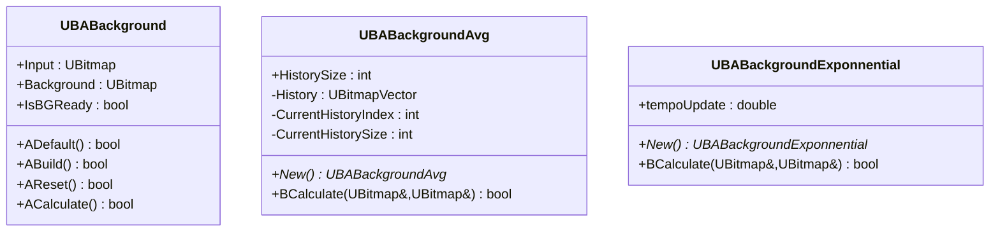
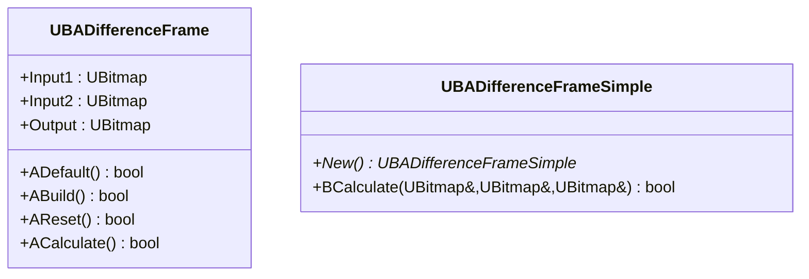
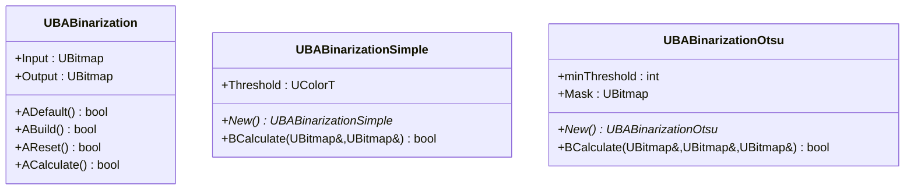
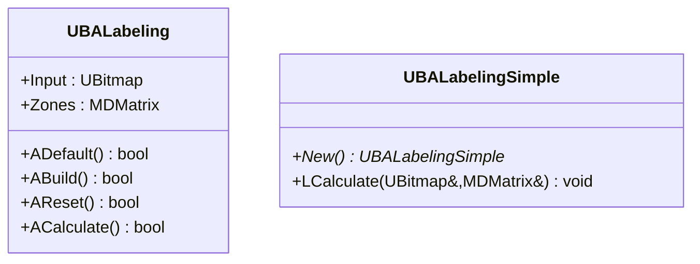
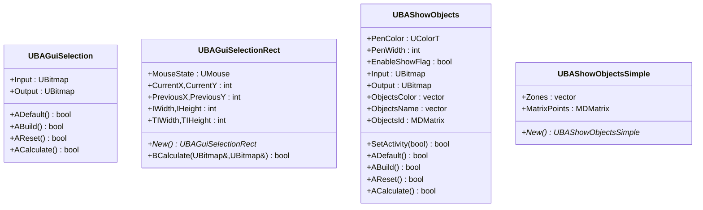
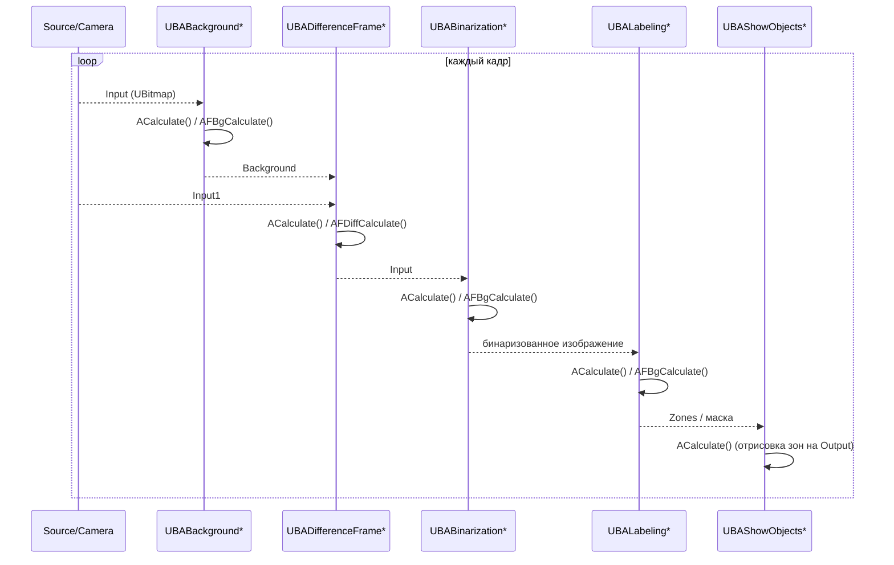
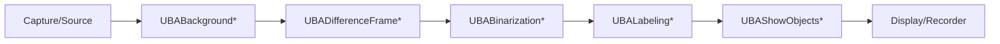

## RU

## Background / Difference / Binarization / Labeling / Looping / GUI — фон, разность, бинаризация и разметка (Rdk-CvBasicLib)

### Назначение

Группа компонентов `UBABackground*`, `UBADifferenceFrame*`, `UBABinarization*`, `UBALabeling*`, `UBALooping*`, `UBAGuiSelection*`, `UBAShowObjects*` реализует этапы фоново‑разностной обработки, пороговой сегментации и визуализации/разметки в пайплайнах компьютерного зрения.

---

## EN

## Background / Difference / Binarization / Labeling / Looping / GUI — фон, difference, binarization, and labeling (Rdk-CvBasicLib)

### Class diagram (overview)



---

### UBABackground* — estimation background

#### UML (base class и examples descendants)



#### Idea

- `UBABackground` stores current фон (`Background`) и readiness flag (`IsBGReady`).  
- Descendants implement different strategies update background: moving average, exponential smoothing, adaptive models с accounting foreground plan.

---

### UBADifferenceFrame* — difference frames



Components compute per-frame difference (`Input1 - Input2`) и are used как part chain detection motion и computation background.

---

### UBABinarization* — binarization



Configuration alias `TBinarizationSimpleAdaptiveThreshold` matches `UBABinarizationSimpleAdaptiveThreshold` (adaptive threshold).

`UBABinarizationSimpleAdaptiveThreshold` adds adaptive threshold с accounting background, statistics и maps counters foreground/background plan.

---

### UBALabeling* — labeling component



`Zones` contains labels/description of connected components (coordinates, areas, etc.), used downstream by detectors/visualizers.

---

### UBALooping* — cyclic processing

```mermaid
class UBALooping {
    +Input : UBitmap
    +Output : UBitmap
    +ADefault() bool
    +ABuild() bool
    +AReset() bool
    +ACalculate() bool
}

class UBALoopingSimple {
    +New() UBALoopingSimple*
    +BCalculate(UBitmap&,UBitmap&) bool
}

class UBALoopingSobel {
    +New() UBALoopingSobel*
    +BCalculate(UBitmap&,UBitmap&) bool
}
```

Provide repeated application simple operators (в т.ч. Sobel‑filter) к sequence frames.

---

### UBAGuiSelection* и UBAShowObjects* — GUI и visualization



Are used для interactive selection rectangles, display зон detection и labels objects over source images.

---

### Sequence diagram (фон → difference → binarization → labeling)



---

### Example configuration XML (simplified)

```xml
<Component Id="Background" Class="BackgroundAvg">
    <Parameters>
        <HistorySize>30</HistorySize>
    </Parameters>
</Component>

<Component Id="Diff" Class="DifferenceFrameSimple">
    <Parameters/>
</Component>

<Component Id="Bin" Class="BinarizationSimple">
    <Parameters>
        <Threshold>128</Threshold>
    </Parameters>
</Component>

<Component Id="Label" Class="LabelingSimple">
    <Parameters/>
</Component>

<Component Id="Show" Class="ShowObjectsSimple">
    <Parameters>
        <PenColor>#00FF00</PenColor>
        <PenWidth>2</PenWidth>
    </Parameters>
</Component>
```

---

### Flow data component в library



Эти components form typical pipeline “фон + motion + binarization + labeling”, used во many configurations `Bin/Configs/*` для tasks detection motion, segmentation по threshold и visualization results.
