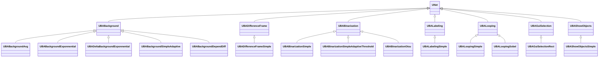
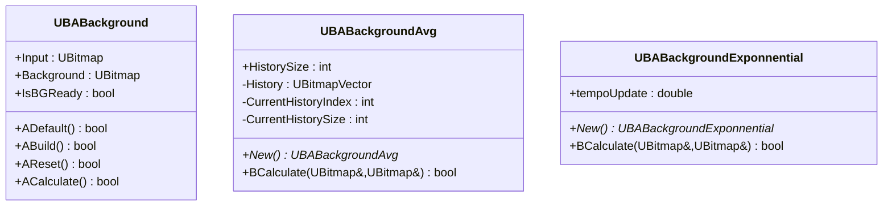
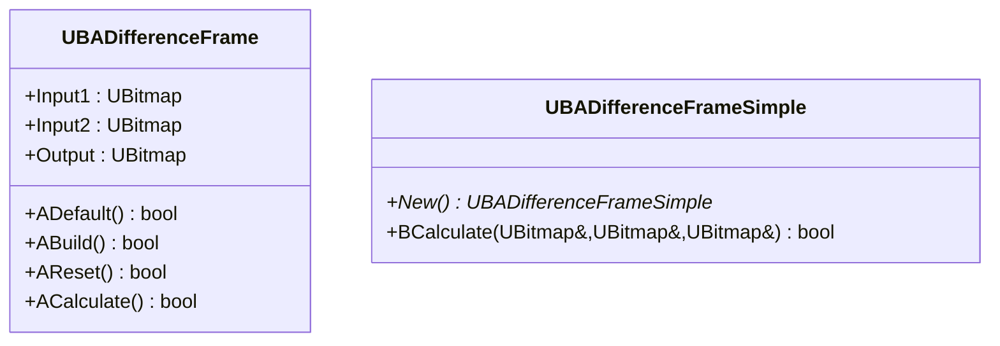
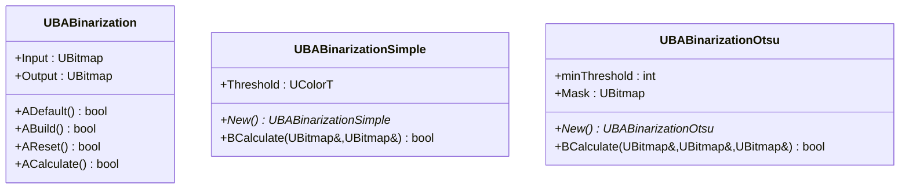
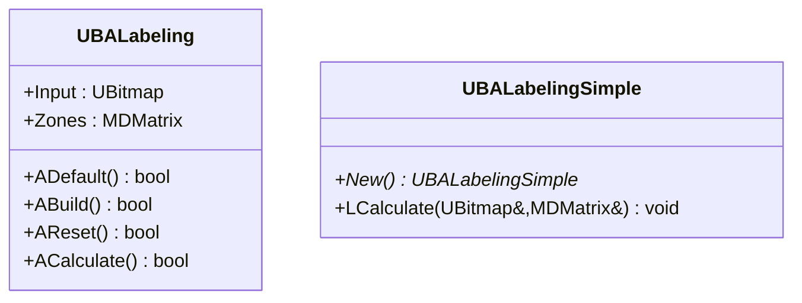
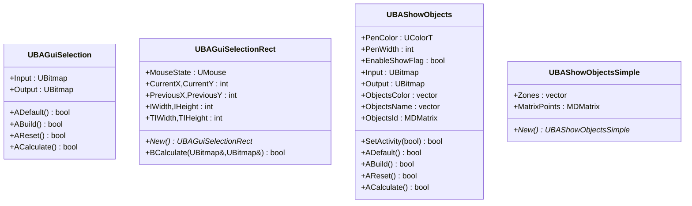
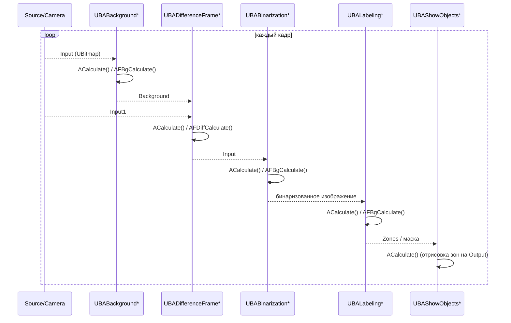
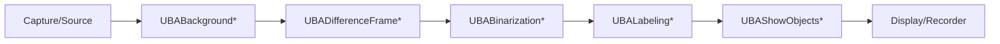

## RU

## Background / Difference / Binarization / Labeling / Looping / GUI — фон, разность, бинаризация и разметка (Rdk-CvBasicLib)

### Назначение

Группа компонентов `UBABackground*`, `UBADifferenceFrame*`, `UBABinarization*`, `UBALabeling*`, `UBALooping*`, `UBAGuiSelection*`, `UBAShowObjects*` реализует этапы фоново‑разностной обработки, пороговой сегментации и визуализации/разметки в пайплайнах компьютерного зрения.

---

## EN

### UML-диаграмма классов (обзор)



---

### UBABackground* — оценка фона

#### UML (базовый класс и примеры наследников)



#### Идея

- `UBABackground` хранит текущий фон (`Background`) и признак готовности (`IsBGReady`).  
- Наследники реализуют разные стратегии обновления фона: скользящее среднее, экспоненциальное сглаживание, адаптивные модели с учётом переднего плана.

---

### UBADifferenceFrame* — разность кадров



Компоненты вычисляют покадровую разность (`Input1 - Input2`) и используются как часть цепочки детекции движения и вычисления фона.

---

### UBABinarization* — бинаризация



Конфигурационный алиас `TBinarizationSimpleAdaptiveThreshold` соответствует `UBABinarizationSimpleAdaptiveThreshold` (адаптивный порог).

`UBABinarizationSimpleAdaptiveThreshold` добавляет адаптивный порог с учётом фона, статистик и карт счётчиков переднего/заднего плана.

---

### UBALabeling* — разметка компонент



`Zones` содержит метки/описание связных компонент (координаты, площади и т.п.), используемых последующими детекторами/визуализаторами.

---

### UBALooping* — циклическая обработка

```mermaid
class UBALooping {
    +Input : UBitmap
    +Output : UBitmap
    +ADefault() bool
    +ABuild() bool
    +AReset() bool
    +ACalculate() bool
}

class UBALoopingSimple {
    +New() UBALoopingSimple*
    +BCalculate(UBitmap&,UBitmap&) bool
}

class UBALoopingSobel {
    +New() UBALoopingSobel*
    +BCalculate(UBitmap&,UBitmap&) bool
}
```

Обеспечивают повторяющееся применение простых операторов (в т.ч. Sobel‑фильтра) к последовательности кадров.

---

### UBAGuiSelection* и UBAShowObjects* — GUI и визуализация



Используются для интерактивного выбора прямоугольников, отображения зон детекции и подписей объектов поверх исходного изображения.

---

### UML-диаграмма последовательности (фон → разность → бинаризация → разметка)



---

### Пример конфигурации XML (упрощённый)

```xml
<Component Id="Background" Class="BackgroundAvg">
    <Parameters>
        <HistorySize>30</HistorySize>
    </Parameters>
</Component>

<Component Id="Diff" Class="DifferenceFrameSimple">
    <Parameters/>
</Component>

<Component Id="Bin" Class="BinarizationSimple">
    <Parameters>
        <Threshold>128</Threshold>
    </Parameters>
</Component>

<Component Id="Label" Class="LabelingSimple">
    <Parameters/>
</Component>

<Component Id="Show" Class="ShowObjectsSimple">
    <Parameters>
        <PenColor>#00FF00</PenColor>
        <PenWidth>2</PenWidth>
    </Parameters>
</Component>
```

---

### Поток данных компонента в библиотеке



Эти компоненты формируют типичный контур “фон + движение + бинаризация + разметка”, используемый во множестве конфигураций `Bin/Configs/*` для задач детекции движения, сегментации по порогу и визуализации результатов.
