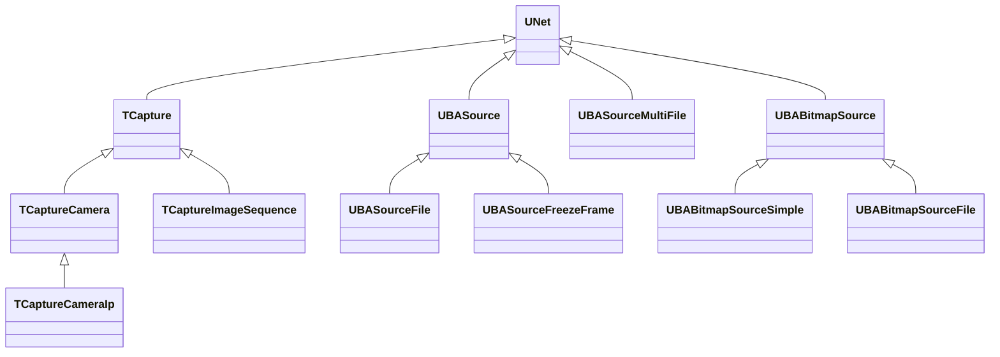
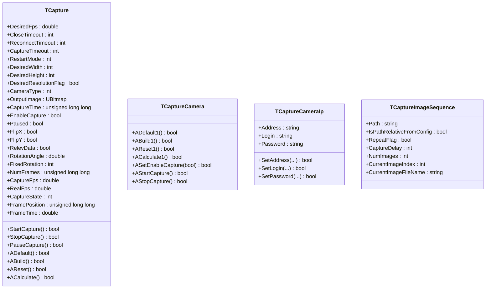
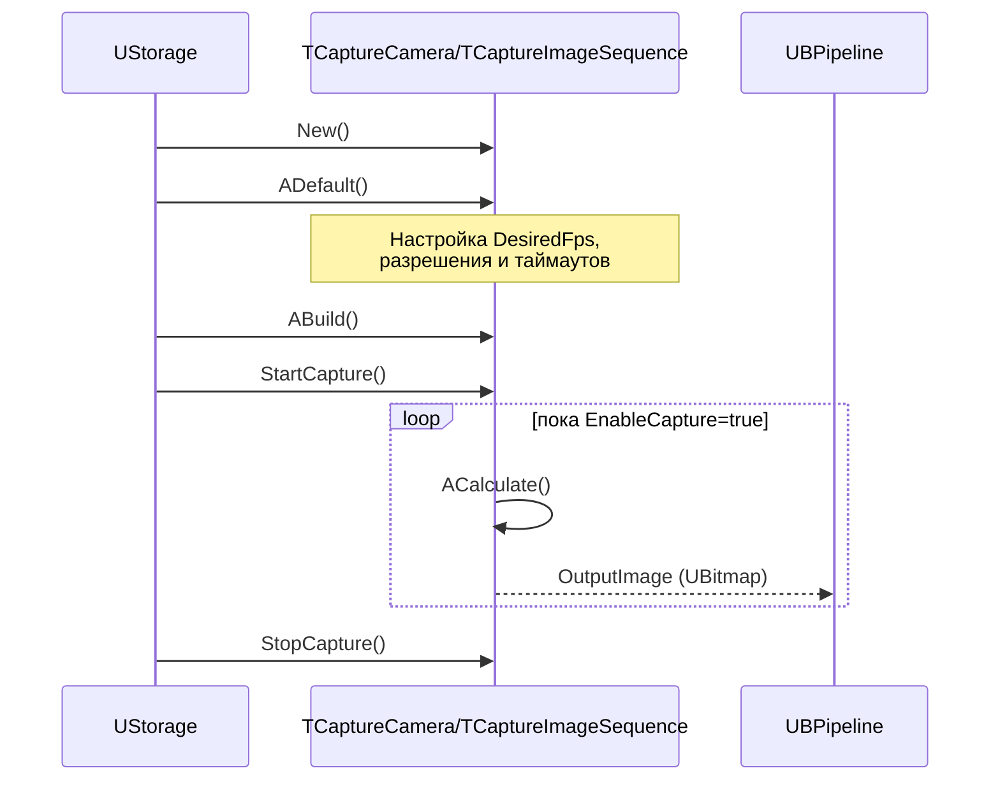
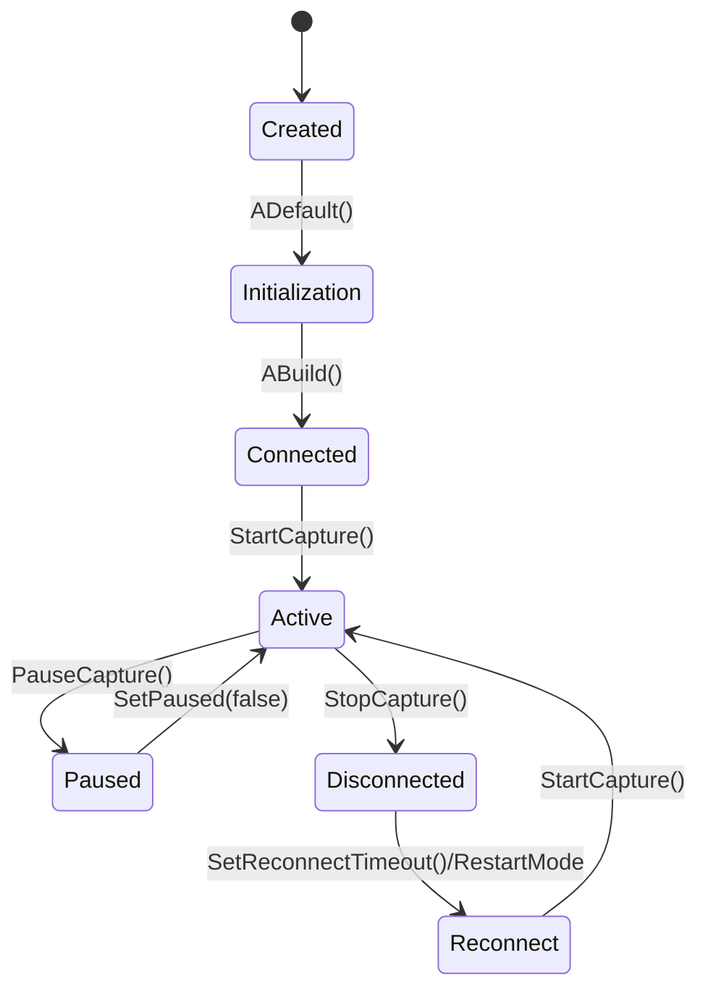
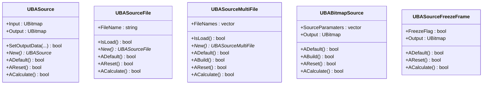
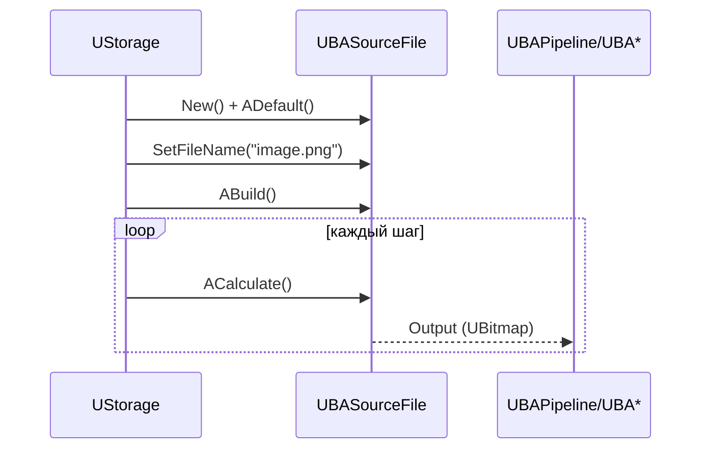
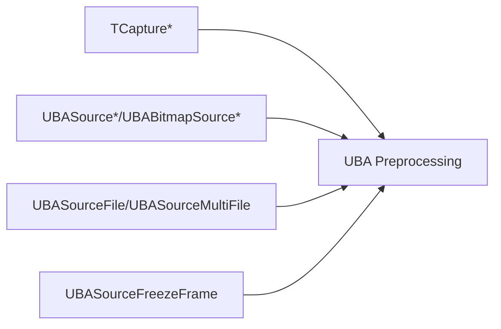

## RU

## Capture & Sources — захват и источники изображений (Rdk-CvBasicLib)

### Назначение

Компоненты семейства `TCapture*` и `UBA*Source*` обеспечивают захват изображений из внешних устройств (камеры, IP‑камеры), последовательностей файлов и внутренних bitmap‑источников, формируя единый поток `UBitmap` для дальнейшей обработки в UBA‑пайплайнах.

---

## EN

## Capture & Sources — capture and image sources (Rdk-CvBasicLib)

### Class diagram



**TCapture** — abstract base class for frame capture (cameras/files), managing states `Created / Initialization / Connected / Active / Paused / Disconnected`.

---

### TCapture / TCaptureCamera / TCaptureCameraIp / TCaptureImageSequence

#### UML (main properties and methods)



#### Sequence diagram (typical cycle captureа)



#### State diagram TCapture



#### Inputs/outputs and properties

- **Output**: `OutputImage` — current frame `UBitmap`.  
- **Main parameters**:
  - `DesiredFps`, `CaptureTimeout`, `CloseTimeout`, `ReconnectTimeout`, `RestartMode`.  
  - `DesiredWidth`, `DesiredHeight`, `DesiredResolutionFlag`.  
  - `EnableCapture`, `Paused`, `FlipX`, `FlipY`, `RotationAngle`, `FixedRotation`.
- **State**:
  - `CaptureState`, `NumFrames`, `CaptureFps`, `RealFps`, `FramePosition`, `FrameTime`.
- **TCaptureCameraIp**:
  - `Address`, `Login`, `Password` — IP camera connection parameters.
- **TCaptureImageSequence**:
  - `Path`, `IsPathRelativeFromConfig`, `RepeatFlag`, `CaptureDelay`.  

#### Usage example (C++)

```cpp
auto cap = storage->CreateComponent<RDK::TCaptureImageSequence>();
cap->Default();
cap->Path = "Data/Images/*.png";
cap->RepeatFlag = true;
cap->CaptureDelay = 40; // мс между кадрами
cap->Build();

cap->StartCapture();
while (cap->GetCaptureState() == RDK_CAPTURE_ACTIVE) {
    cap->Calculate();
    UBitmap frame = cap->OutputImage;
    // передаём frame дальше в UBPipeline
}
cap->StopCapture();
```

---

### UBASource / UBASourceFile / UBASourceMultiFile / UBABitmapSource* / UBASourceFreezeFrame

#### UML (main relationships)



#### Sequence diagram (example for UBASourceFile)



#### Inputs/outputs and properties

- **UBASource**
  - `Input` / `Output` (`UBitmap`) — base source that can forward or override data.
- **UBASourceFile**
  - `FileName` — path to a single file; `IsLoad()` — successful load indicator.
- **UBASourceMultiFile**
  - `FileNames` — path list; dynamically creates output properties `Output[i]` for each file.
- **UBABitmapSource / UBABitmapSourceSimple / UBABitmapSourceFile**
  - `SourceParamaters` — bitmap generation/storage parameters.  
  - `Output` — resulting frame.
- **UBASourceFreezeFrame**
  - `FreezeFlag` — when `true`, holds the last output frame even if the input changes.

#### XML configuration examples

```xml
<!-- Источник одного файла -->
<Component Id="SrcImage" Class="SourceFile">
    <Parameters>
        <FileName>Data/input.png</FileName>
    </Parameters>
</Component>

<!-- Источник списка файлов -->
<Component Id="SrcMulti" Class="SourceMultiFile">
    <Parameters>
        <FileNames>
            <elem>Data/frame_0001.png</elem>
            <elem>Data/frame_0002.png</elem>
        </FileNames>
    </Parameters>
</Component>
```

---

### Component diagram (capture and sources in pipeline)



Sources and capture components form the entry point of most configurations в `Bin/Configs/*`, feeding `UBitmap` frames into UBA pipelines (`ColorConvert`, `Crop`, `Reduce`, фон, binarization, detection, etc.).
