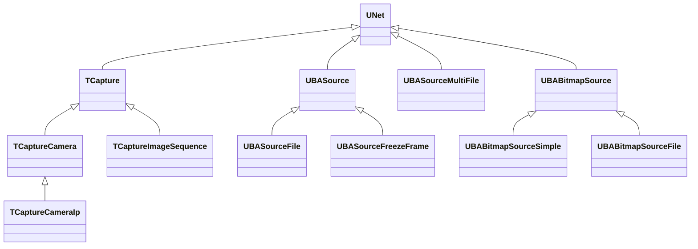
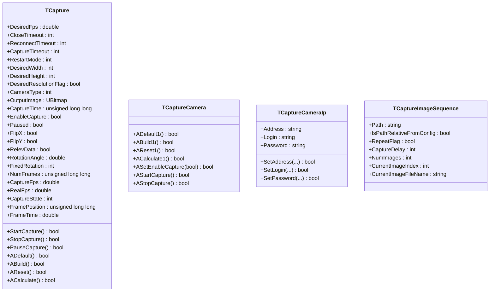
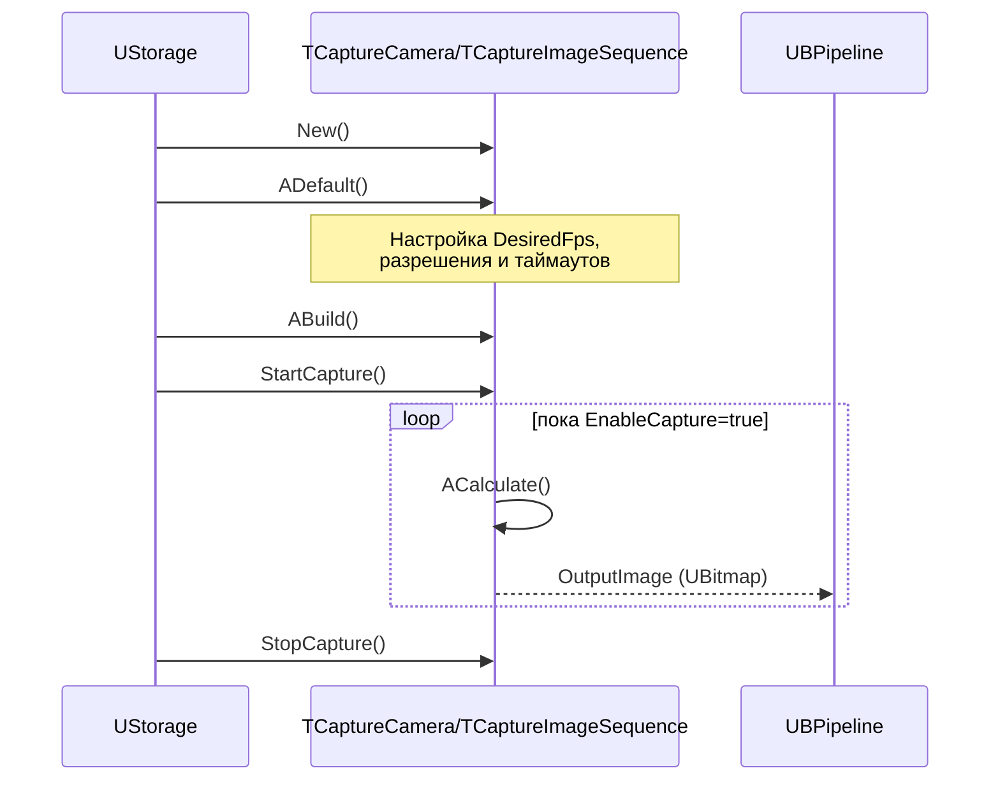
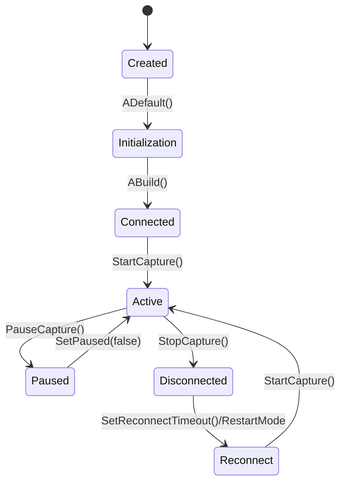
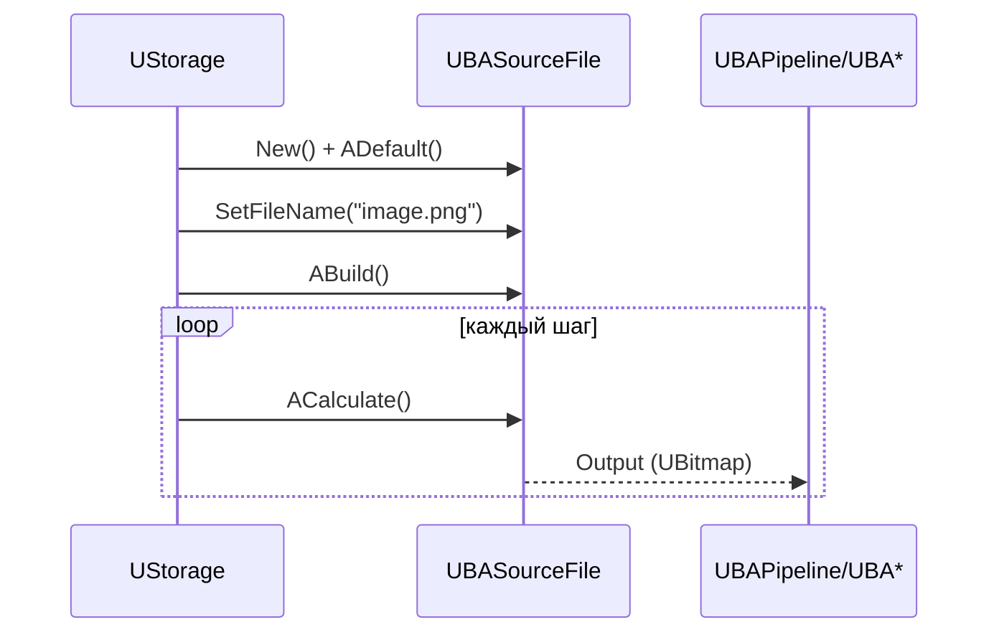
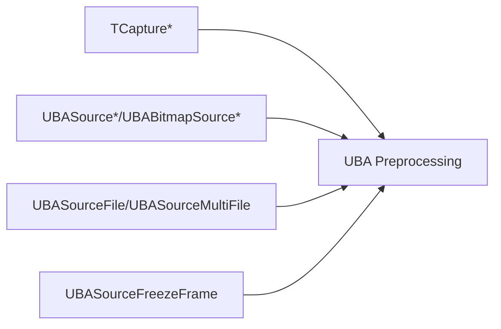

## Capture & Sources — захват и источники изображений (Rdk-CvBasicLib)

### Назначение

Компоненты семейства `TCapture*` и `UBA*Source*` обеспечивают захват изображений из внешних устройств (камеры, IP‑камеры), последовательностей файлов и внутренних bitmap‑источников, формируя единый поток `UBitmap` для дальнейшей обработки в UBA‑пайплайнах.

---

### UML-диаграмма классов



**TCapture** — абстрактный базовый класс захвата кадров (камеры/файлы), управляющий состояниями `Created / Initialization / Connected / Active / Paused / Disconnected`.

---

### TCapture / TCaptureCamera / TCaptureCameraIp / TCaptureImageSequence

#### UML (основные свойства и методы)



#### UML-диаграмма последовательности (типичный цикл захвата)



#### UML-диаграмма состояний TCapture



#### Входы/выходы и свойства

- **Выход**: `OutputImage` — текущий кадр `UBitmap`.  
- **Основные параметры**:
  - `DesiredFps`, `CaptureTimeout`, `CloseTimeout`, `ReconnectTimeout`, `RestartMode`.  
  - `DesiredWidth`, `DesiredHeight`, `DesiredResolutionFlag`.  
  - `EnableCapture`, `Paused`, `FlipX`, `FlipY`, `RotationAngle`, `FixedRotation`.
- **Состояние**:
  - `CaptureState`, `NumFrames`, `CaptureFps`, `RealFps`, `FramePosition`, `FrameTime`.
- **TCaptureCameraIp**:
  - `Address`, `Login`, `Password` — параметры подключения к IP‑камере.
- **TCaptureImageSequence**:
  - `Path`, `IsPathRelativeFromConfig`, `RepeatFlag`, `CaptureDelay`.  

#### Пример использования (C++)

```cpp
auto cap = storage->CreateComponent<RDK::TCaptureImageSequence>();
cap->Default();
cap->Path = "Data/Images/*.png";
cap->RepeatFlag = true;
cap->CaptureDelay = 40; // мс между кадрами
cap->Build();

cap->StartCapture();
while (cap->GetCaptureState() == RDK_CAPTURE_ACTIVE) {
    cap->Calculate();
    UBitmap frame = cap->OutputImage;
    // передаём frame дальше в UBPipeline
}
cap->StopCapture();
```

---

### UBASource / UBASourceFile / UBASourceMultiFile / UBABitmapSource* / UBASourceFreezeFrame

#### UML (основные связи)


#### UML-диаграмма последовательности (пример для UBASourceFile)



#### Входы/выходы и свойства

- **UBASource**
  - `Input` / `Output` (`UBitmap`) — базовый источник, который может пробрасывать или переопределять данные.
- **UBASourceFile**
  - `FileName` — путь к единичному файлу; `IsLoad()` — индикатор успешной загрузки.
- **UBASourceMultiFile**
  - `FileNames` — список путей; динамически создаёт выходные свойства `Output[i]` для каждого файла.
- **UBABitmapSource / UBABitmapSourceSimple / UBABitmapSourceFile**
  - `SourceParamaters` — параметры генерации/хранения bitmap‑данных.  
  - `Output` — результирующий кадр.
- **UBASourceFreezeFrame**
  - `FreezeFlag` — при `true` удерживает последний кадр на выходе, даже если вход меняется.

#### Примеры XML‑конфигурации

```xml
<!-- Источник одного файла -->
<Component Id="SrcImage" Class="SourceFile">
    <Parameters>
        <FileName>Data/input.png</FileName>
    </Parameters>
</Component>

<!-- Источник списка файлов -->
<Component Id="SrcMulti" Class="SourceMultiFile">
    <Parameters>
        <FileNames>
            <elem>Data/frame_0001.png</elem>
            <elem>Data/frame_0002.png</elem>
        </FileNames>
    </Parameters>
</Component>
```

---

### Компонентная диаграмма (захват и источники в пайплайне)



Источники и захваты образуют начальное звено большинства конфигураций в `Bin/Configs/*`, подавая `UBitmap` кадры в UBA‑конвейеры (`ColorConvert`, `Crop`, `Reduce`, фон, бинаризация, детекция и т.д.).

