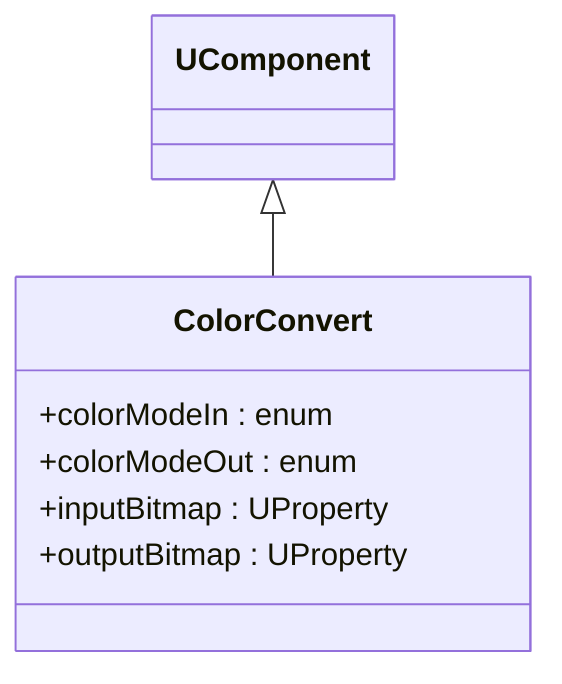
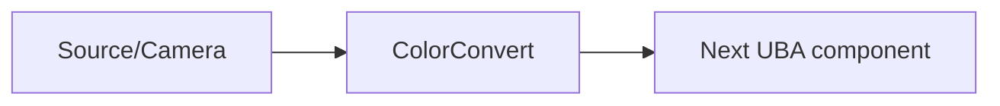
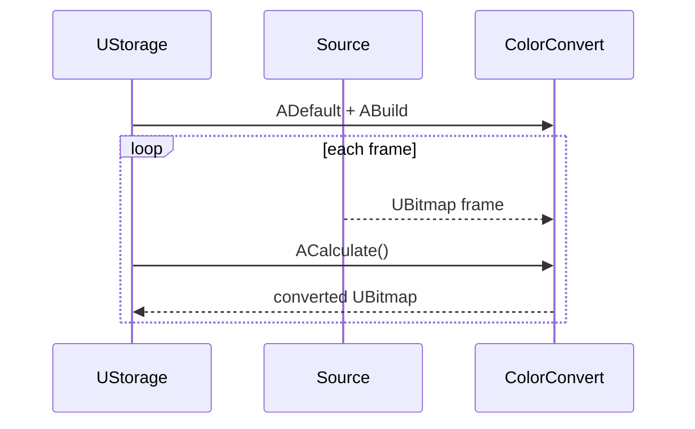

## ColorConvert — преобразование цветовых пространств (Rdk-CvBasicLib)

**Класс**: `ColorConvert` (реализация в `UBAColorConvert.cpp`) — преобразует изображения между цветовыми пространствами (BGR/RGB/GRAY и т.п.).  
**Storage-компоненты**: регистрируется через `UploadClass("ColorConvert", ...)` и используется в пайплайнах обработки.

### Регистрация и класс

### Входы/выходы
- Вход: `UBitmap` (изображение) в исходном цветовом пространстве.
- Выход: `UBitmap` в целевом цветовом пространстве.

### Storage-инстансы
- В `ClDesc`/`Configs`: `ClassName = "ColorConvert"`; параметры определяют режим (например, BGR→GRAY).

Пояснение: блок-схема показывает поток данных/сигналов (входы → компонент → выходы).

### Типовой сценарий (Sequence)

Пояснение: диаграмма последовательности показывает типовой сценарий взаимодействия и порядок вызовов.

---

## ColorConvert — color space converter (Rdk-CvBasicLib)

**Class**: `ColorConvert` — converts `UBitmap` between color spaces (e.g. BGR→GRAY) as part of UBA pipelines.

