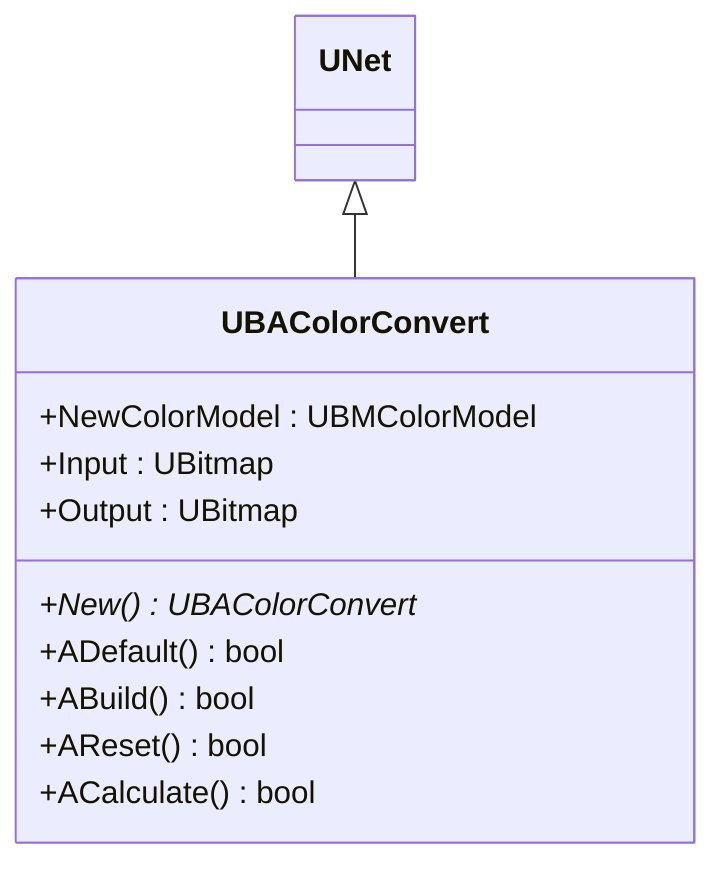
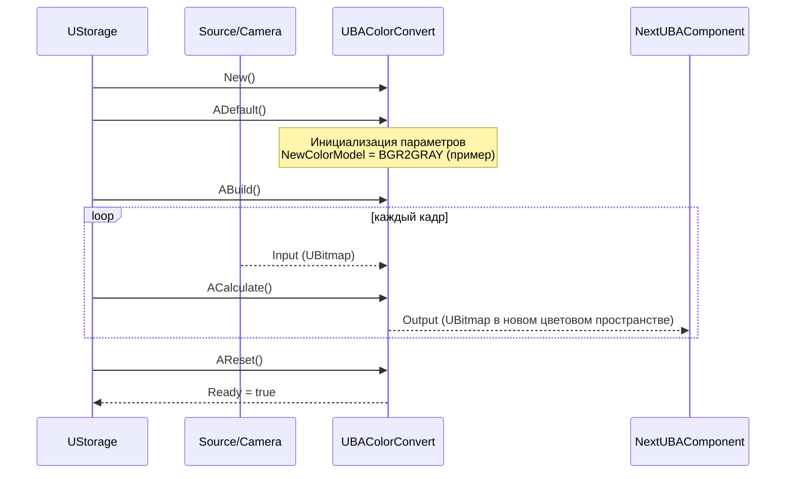
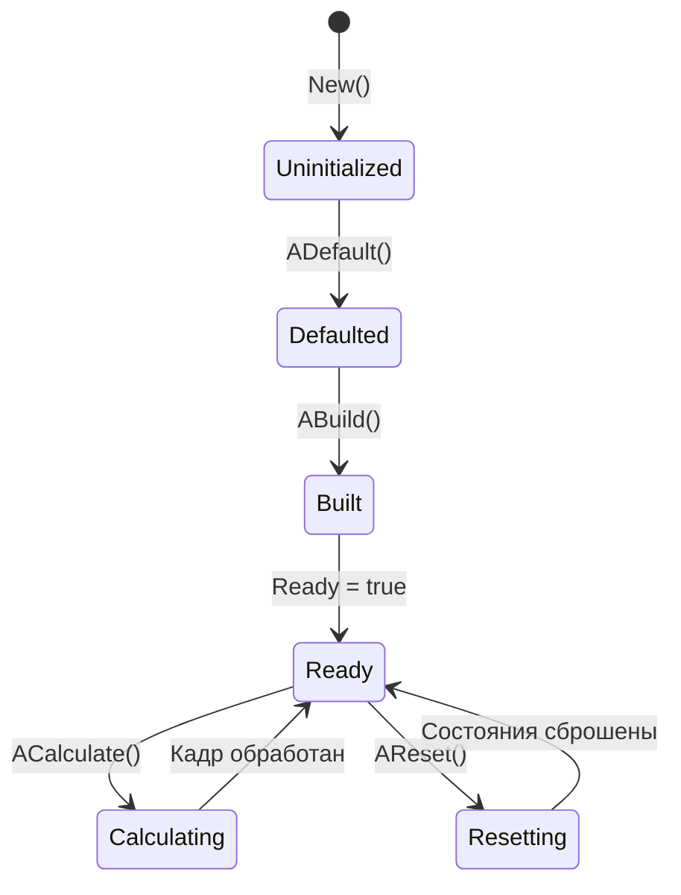
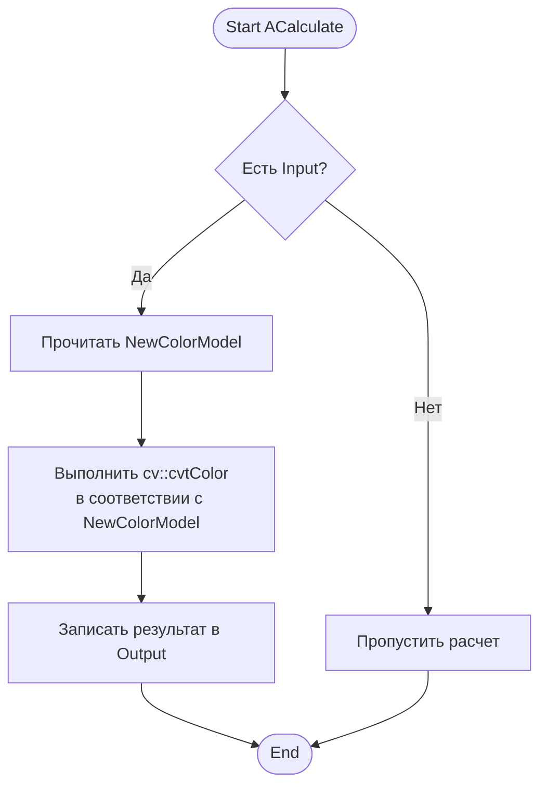
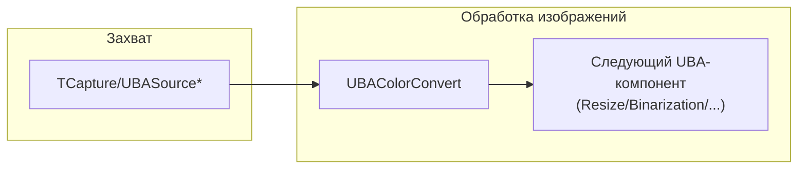
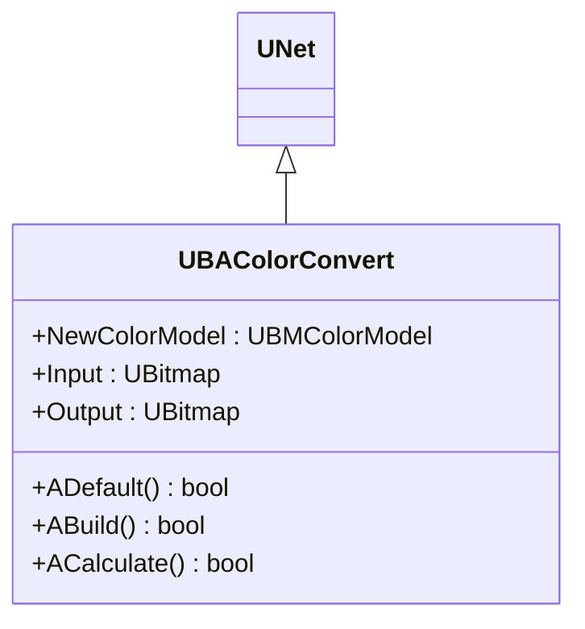

## ColorConvert — преобразование цветовых пространств (Rdk-CvBasicLib)

**Класс**: `UBAColorConvert` (реализация в `UBAColorConvert.cpp`) — компонент конвейера, который конвертирует изображения между цветовыми пространствами (BGR/RGB/GRAY и т.п.).  
**Storage-компоненты**: регистрируется через `UploadClass("ColorConvert", ...)` и используется в UBA‑пайплайнах обработки.

### UML-диаграмма классов



**Иерархия наследования:**
- `UNet` — базовый класс сетевого компонента
- `UBAColorConvert` — специализированный компонент конвертации цветового пространства

### UML-диаграмма последовательности (жизненный цикл)



### UML-диаграмма состояний



### UML-диаграмма активности (ACalculate)



### UML-диаграмма компонентов



### Входы/выходы

- **Вход**: `Input` — `UBitmap` в исходном цветовом пространстве (обычно BGR).  
- **Выход**: `Output` — `UBitmap` в целевом цветовом пространстве (GRAY, RGB, HSV и т.д.).  
- **Параметр**: `NewColorModel` — режим конвертации (тип `UBMColorModel`).

### Свойства (UProperty)

| Имя           | Тип            | Направление           | Описание                                              |
|--------------|----------------|-----------------------|-------------------------------------------------------|
| `NewColorModel` | `UBMColorModel` | `ptPubParameter`      | Целевое цветовое пространство / режим конвертации     |
| `Input`      | `UBitmap`      | `ptPubParameter`      | Входное изображение                                  |
| `Output`     | `UBitmap`      | `ptPubParameter`      | Выходное изображение после конвертации               |

### Методы

- **`UBAColorConvert* New()`** — фабричный метод создания экземпляра компонента.  
- **`bool ADefault()`** — инициализирует `NewColorModel` и базовые состояния по умолчанию.  
- **`bool ABuild()`** — подготавливает внутренний буфер и связывает свойства.  
- **`bool AReset()`** — сбрасывает внутренние состояния и буфер.  
- **`bool ACalculate()`** — выполняет конвертацию изображения, читая `Input` и записывая в `Output`.

### Примеры использования (C++)

```cpp
// Создание компонента
auto color = storage->CreateComponent<RDK::UBAColorConvert>();
color->SetName("ColorToGray");

// Инициализация значений по умолчанию
color->Default();

// Настройка режима конвертации
color->NewColorModel = RDK::cmBGR2GRAY; // пример перечисления UBMColorModel

// Сборка компонента
color->Build();

// В конвейере: передать входной кадр и выполнить расчет
color->Input = inputBitmap;
color->Calculate();
UBitmap gray = color->Output;
```

### Пример конфигурации XML

```xml
<Component Id="ColorToGray" Class="ColorConvert">
    <Parameters>
        <NewColorModel>BGR2GRAY</NewColorModel>
    </Parameters>
</Component>
```

### Связь с конфигурационными проектами (`Bin/Configs`)

- Компонент `ColorConvert` используется в пайплайнах предварительной обработки: после захвата (`TCapture*`, `UBASource*`) и перед детекторами/классификаторами.  
- В проектах `Bin/Configs/*` он, как правило, включён в `UBPipeline` с `Class="ColorConvert"` и настроенным `NewColorModel` в зависимости от требований модели.

---

## ColorConvert — color space converter (Rdk-CvBasicLib)

**Class**: `UBAColorConvert` — converts `UBitmap` between color spaces (e.g. BGR→GRAY) as part of UBA pipelines.  
**Storage**: registered as `ClassName = "ColorConvert"` and referenced from XML configs.



