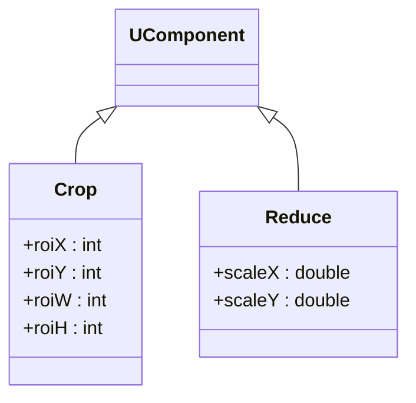
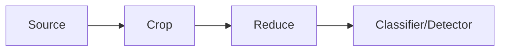

## Crop / Reduce — обрезка и уменьшение изображений (Rdk-CvBasicLib)

**Классы**: `Crop` (`UBACrop.cpp`), `Reduce` (`UBAReduce.cpp`) — пространственная обрезка и уменьшение размерности изображений.  
**Storage-компоненты**: регистрируются как `UploadClass("Crop", ...)` и `UploadClass("Reduce", ...)`.

### Классы

### Входы/выходы
- Вход: `UBitmap` изображение.
- Выход (`Crop`): кадр, ограниченный ROI.  
- Выход (`Reduce`): уменьшенное изображение (по масштабу или целевому размеру).

### Storage-инстансы
- В конфигурациях: `ClassName = "Crop"` / `"Reduce"`, с параметрами области/масштаба; часто используются перед детекцией/классификацией.

Пояснение: блок-схема показывает поток данных/сигналов (входы → компонент → выходы).

---

## Crop / Reduce — crop & downscale (Rdk-CvBasicLib)

**Classes**: `Crop`, `Reduce` — ROI cropping and image downscaling operators in CV pipelines.

