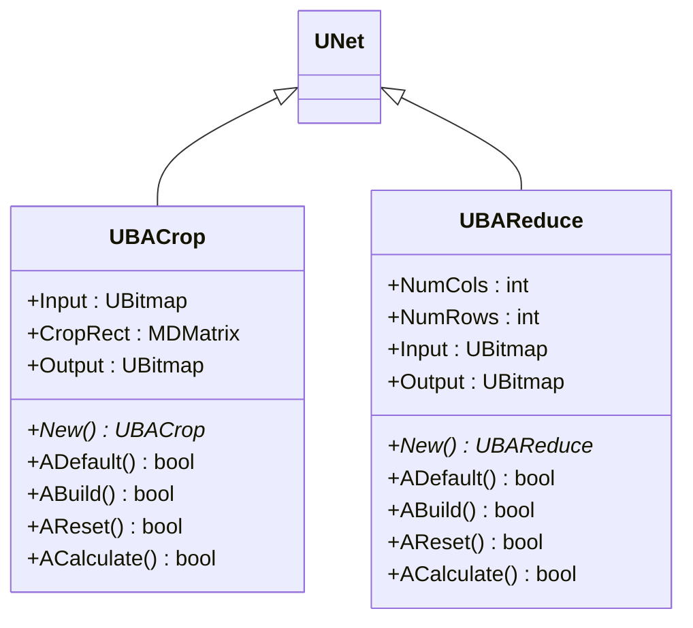
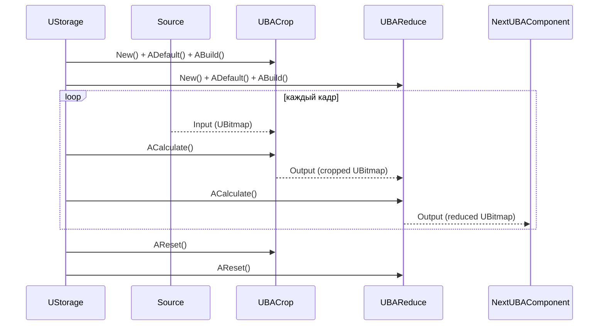
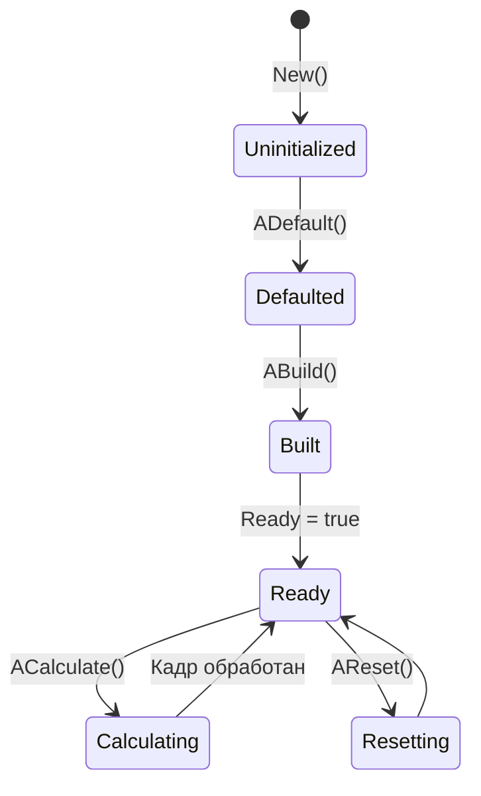
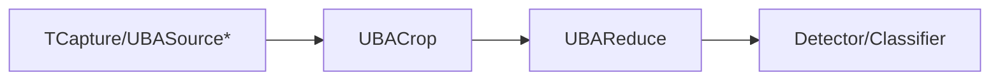

## RU

## Crop / Reduce — обрезка и уменьшение изображений (Rdk-CvBasicLib)

**Классы**: `UBACrop` (`UBACrop.cpp`), `UBAReduce` (`UBAReduce.cpp`) — компоненты конвейера для пространственной обрезки (ROI) и уменьшения размерности изображений.  
**Storage-компоненты**: регистрируются как `UploadClass("Crop", ...)` и `UploadClass("Reduce", ...)` и используются в UBA‑пайплайнах перед детекторами/классификаторами.

### UML-диаграмма классов



### UML-диаграмма последовательности



### UML-диаграмма состояний (общая для обоих компонентов)



### UML-диаграмма активности (Crop и Reduce)

```mermaid
flowchart TD
    subgraph CropPath["UBACrop::ACalculate"]
        CStart([Start]) --> CheckRect{CropRect задан?}
        CheckRect -->|Нет| CSkip[Выход = вход (копия/пусто)]
        CheckRect -->|Да| CRead[Прочитать ROI (left,top,right,bottom)]
        CRead --> CCrop[Вырезать ROI в Buffer]
        CCrop --> CWrite[Записать Buffer в Output]
        CWrite --> CEnd([End])
        CSkip --> CEnd
    end

    subgraph ReducePath["UBAReduce::ACalculate"]
        RStart([Start]) --> ReadSize[Прочитать NumCols/NumRows]
        ReadSize --> CheckSize{Размеры > 0?}
        CheckSize -->|Нет| RSkip[Выход 0x0]
        CheckSize -->|Да| RResize[Преобразовать Input к (NumCols,NumRows)]
        RResize --> RWrite[Записать в Output]
        RWrite --> REnd([End])
        RSkip --> REnd
    end
```

### UML-диаграмма компонентов



### Входы/выходы

- **UBACrop**
  - Вход: `Input` — исходное изображение (`UBitmap`).  
  - Параметр: `CropRect` (`MDMatrix<int>`) — матрица с координатами `[left, top, right, bottom]`.  
  - Выход: `Output` — обрезанное по ROI изображение.

- **UBAReduce**
  - Вход: `Input` — исходное или уже обрезанное изображение.  
  - Параметры: `NumCols`, `NumRows` — желаемое разрешение выходного кадра.  
  - Выход: `Output` — уменьшенное изображение.

### Свойства (UProperty)

#### UBACrop

| Имя        | Тип             | Направление                     | Назначение                                      |
|-----------|-----------------|----------------------------------|-------------------------------------------------|
| `Input`   | `UBitmap`       | `ptPubParameter`                | Входное изображение                             |
| `CropRect`| `MDMatrix<int>` | `ptPubInput \| ptParameter`     | Координаты прямоугольника обрезки               |
| `Output`  | `UBitmap`       | `ptPubParameter`                | Результирующее изображение после обрезки        |

#### UBAReduce

| Имя        | Тип       | Направление        | Назначение                                        |
|-----------|-----------|--------------------|---------------------------------------------------|
| `NumCols` | `int`     | `ptPubParameter`   | Число столбцов выходного изображения              |
| `NumRows` | `int`     | `ptPubParameter`   | Число строк выходного изображения                 |
| `Input`   | `UBitmap` | `ptPubParameter`   | Входное изображение                               |
| `Output`  | `UBitmap` | `ptPubParameter`   | Масштабированное изображение                      |

### Методы

- **UBACrop**
  - `UBACrop* New()` — создание экземпляра компонента.  
  - `bool ADefault()` — инициализация параметров по умолчанию.  
  - `bool ABuild()` — подготовка внутренних буферов.  
  - `bool AReset()` — сброс состояний и буфера.  
  - `bool ACalculate()` — вырезание ROI и запись результата в `Output`.

- **UBAReduce**
  - `UBAReduce* New()` — создание экземпляра.  
  - `bool ADefault()` — установка начальных значений `NumCols`/`NumRows`.  
  - `bool ABuild()` — подготовка внутренних структур.  
  - `bool AReset()` — сброс выходной матрицы.  
  - `bool ACalculate()` — изменение размера входного изображения.

### Примеры использования (C++)

```cpp
// Создание и настройка Crop
auto crop = storage->CreateComponent<RDK::UBACrop>();
crop->SetName("CropROI");
crop->Default();

MDMatrix<int> rect(1,4);
rect(0,0) = 50;  // left
rect(0,1) = 50;  // top
rect(0,2) = 250; // right
rect(0,3) = 250; // bottom
crop->CropRect = rect;
crop->Build();

// Создание и настройка Reduce
auto reduce = storage->CreateComponent<RDK::UBAReduce>();
reduce->SetName("ReduceTo128x128");
reduce->Default();
reduce->NumCols = 128;
reduce->NumRows = 128;
reduce->Build();

// Обработка кадра
crop->Input = inputBitmap;
crop->Calculate();
reduce->Input = crop->Output;
reduce->Calculate();
UBitmap small = reduce->Output;
```

### Пример конфигурации XML

```xml
<Component Id="CropROI" Class="Crop">
    <Parameters>
        <CropRect>
            <Row>50 50 250 250</Row>
        </CropRect>
    </Parameters>
</Component>

<Component Id="ReduceTo128" Class="Reduce">
    <Parameters>
        <NumCols>128</NumCols>
        <NumRows>128</NumRows>
    </Parameters>
</Component>
```

### Связь с конфигурационными проектами (`Bin/Configs`)

- Компоненты `Crop` и `Reduce` часто используются в конфигурациях для:
  - Обрезки рабочей области перед детекцией объектов.  
  - Приведения размера входных данных к формату, ожидаемому классификаторами/нейронными сетями.  
- В типичных пайплайнах `Crop`/`Reduce` включены в `UBPipeline` между источником (`TCapture*`, `UBASource*`) и блоками `UBAObjectDetector` / `UCR*`.

---

## EN

## Crop / Reduce — crop & downscale (Rdk-CvBasicLib)

**Classes**: `UBACrop`, `UBAReduce` — ROI cropping and image downscaling operators in CV pipelines.  
They operate on `UBitmap` frames, are registered as `Class="Crop"` / `Class="Reduce"` in XML configs, and are usually placed before detectors/classifiers.


```mermaid
flowchart TD
    subgraph CropPath["UBACrop::ACalculate"]
        CStart([Start]) --> CheckRect{CropRect задан?}
        CheckRect -->|Нет| CSkip[Выход = вход (копия/пусто)]
        CheckRect -->|Да| CRead[Прочитать ROI (left,top,right,bottom)]
        CRead --> CCrop[Вырезать ROI в Buffer]
        CCrop --> CWrite[Записать Buffer в Output]
        CWrite --> CEnd([End])
        CSkip --> CEnd
    end

    subgraph ReducePath["UBAReduce::ACalculate"]
        RStart([Start]) --> ReadSize[Прочитать NumCols/NumRows]
        ReadSize --> CheckSize{Размеры > 0?}
        CheckSize -->|Нет| RSkip[Выход 0x0]
        CheckSize -->|Да| RResize[Преобразовать Input к (NumCols,NumRows)]
        RResize --> RWrite[Записать в Output]
        RWrite --> REnd([End])
        RSkip --> REnd
    end
```


