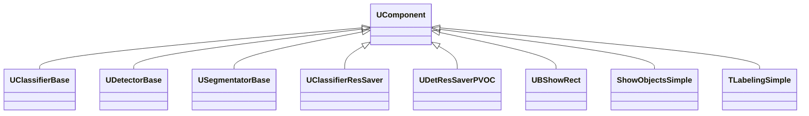
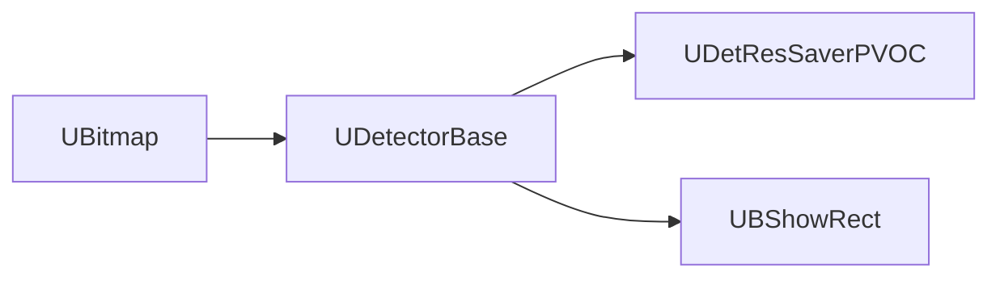

## Detectors / Segmentators / Savers — детекторы, сегментаторы и сохранение результатов (Rdk-CvBasicLib)

**Классы**: `UDetectorBase`, `UDetResSaverPVOC`, `USegmentatorBase`, `UClassifierBase`, `UClassifierResSaver` и связанные UBA-компоненты визуализации (`UBShowRect`, `ShowObjectsSimple`, `TLabelingSimple`).  
Они реализуют базовые интерфейсы детекции/сегментации и сохранение/отображение результатов.

### Классы

### Входы/выходы
- `UDetectorBase` / `USegmentatorBase`: вход — изображения/признаки; выход — bounding boxes, маски, классы.
- `UClassifierResSaver` / `UDetResSaverPVOC`: вход — результаты; выход — файлы результатов (например, формат PASCAL VOC).
- Визуализация: вход — объекты/маски; выход — размеченное изображение.

### Storage-инстансы
- Конфигурируются путями к файлам результатов, параметрами визуализации и типами детектируемых объектов.

Пояснение: блок-схема показывает поток данных/сигналов (входы → компонент → выходы).

---

## Detectors / Segmentators / Savers (Rdk-CvBasicLib)

**Classes**: base detector/segmentator/classifier and result saver components forming the output end of CV pipelines.

