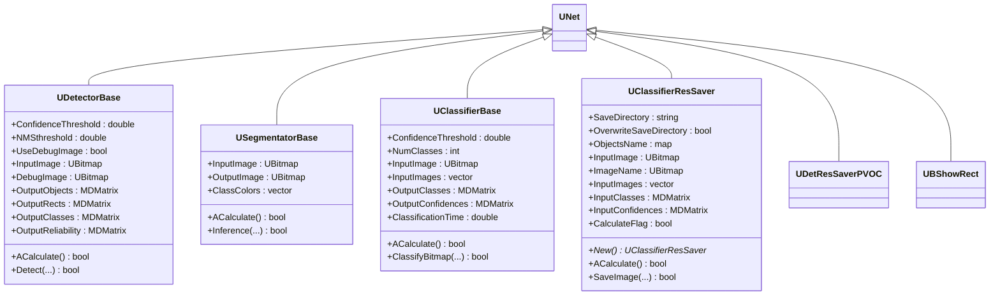
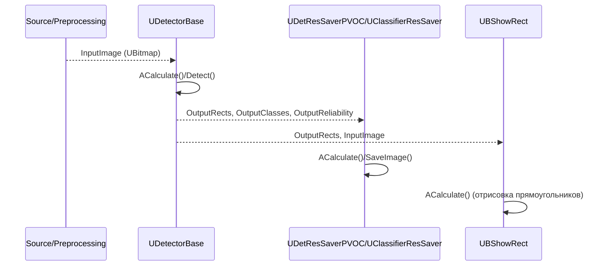
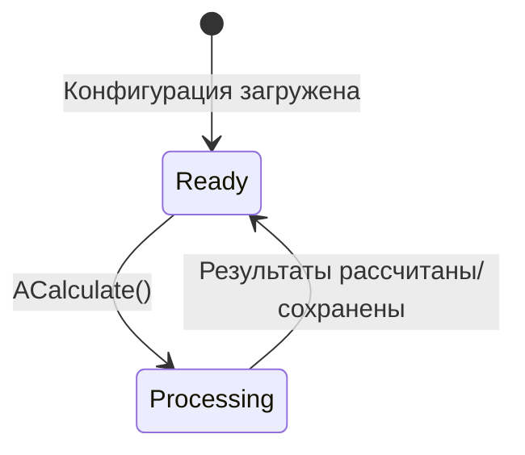
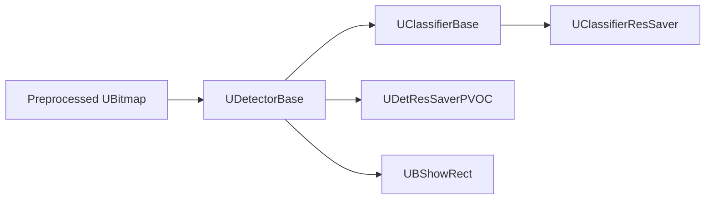

## Detectors / Segmentators / Savers — детекторы, сегментаторы и сохранение результатов (Rdk-CvBasicLib)

**Классы**: `UDetectorBase`, `USegmentatorBase`, `UClassifierBase`, `UClassifierResSaver`, `UDetResSaverPVOC` и связанные компоненты визуализации (`UBShowRect`, `UBAShowObjects`, `UBALabeling`).  
Они реализуют базовые интерфейсы детекции/сегментации/классификации и блоки сохранения/отображения результатов.

### UML-диаграмма классов



### UML-диаграмма последовательности (детекция + сохранение/визуализация)



### UML-диаграмма состояний (базовые компоненты)



### UML-диаграмма активности (UDetectorBase::ACalculate)

```mermaid
flowchart TD
    Start([Start ACalculate]) --> CheckInput{Есть InputImage?}
    CheckInput -->|Нет| Skip[Вернуть true без детекции]
    CheckInput -->|Да| Preprocess[Подготовка ProcessedBmp]
    Preprocess --> CallDetect[Вызов Detect(bmp,...)]
    CallDetect --> FillOutputs[Заполнить OutputRects,<br/>OutputClasses,OutputReliability]
    FillOutputs --> OptionalDebug[При UseDebugImage<br/>заполнить DebugImage]
    OptionalDebug --> End([End])
    Skip --> End
```

### UML-диаграмма компонентов



### Входы/выходы

- **UDetectorBase**
  - Вход: `InputImage` — изображение для детекции.  
  - Выходы: `OutputRects`, `OutputClasses`, `OutputReliability`, `OutputObjects`; опционально `DebugImage`.

- **USegmentatorBase**
  - Вход: `InputImage` — изображение.  
  - Выход: `OutputImage` — маска/картинка сегментации; `ClassColors` задаёт цвета классов.

- **UClassifierBase**
  - Вход: `InputImage` / `InputImages`.  
  - Выходы: `OutputClasses`, `OutputConfidences`, `ClassificationTime`.

- **UClassifierResSaver / UDetResSaverPVOC**
  - Вход: изображения и результаты (`InputClasses`, `InputConfidences` или детекторные выходы).  
  - Выход: файлы результатов (PASCAL VOC, папки с изображениями и метками).

### Свойства (основные)

| Компонент          | Свойство               | Тип                    | Назначение                                         |
|--------------------|------------------------|------------------------|----------------------------------------------------|
| `UDetectorBase`    | `ConfidenceThreshold`  | `double`               | Порог уверенности для отбора объектов              |
| `UDetectorBase`    | `NMSthreshold`         | `double`               | Порог для non‑max suppression                      |
| `UDetectorBase`    | `UseDebugImage`        | `bool`                 | Включить формирование `DebugImage`                 |
| `UDetectorBase`    | `InputImage`           | `UBitmap`              | Входное изображение                                |
| `UDetectorBase`    | `OutputRects`          | `MDMatrix<double>`     | Прямоугольники обнаруженных объектов               |
| `UDetectorBase`    | `OutputClasses`        | `MDMatrix<int>`        | Классы объектов                                    |
| `UDetectorBase`    | `OutputReliability`    | `MDMatrix<double>`     | Доверительные оценки                               |
| `USegmentatorBase` | `InputImage`           | `UBitmap`              | Входное изображение                                |
| `USegmentatorBase` | `OutputImage`          | `UBitmap`              | Маска/картинка сегментации                         |
| `USegmentatorBase` | `ClassColors`          | `vector<UColorT>`      | Цвета для классов                                  |
| `UClassifierBase`  | `NumClasses`           | `int`                  | Число классов                                      |
| `UClassifierBase`  | `OutputClasses`        | `MDMatrix<int>`        | Предсказанные классы                               |
| `UClassifierBase`  | `OutputConfidences`    | `MDMatrix<double>`     | Оценки уверенности                                 |
| `UClassifierResSaver` | `SaveDirectory`     | `std::string`          | Каталог сохранения результатов                     |
| `UClassifierResSaver` | `OverwriteSaveDirectory` | `bool`           | Перезаписывать ли каталог                          |
| `UClassifierResSaver` | `ObjectsName`       | `map<int,string>`      | Человекочитаемые имена классов                     |

### Методы (базовые)

- `bool ACalculate()` — точка входа фреймворка для обработки очередного кадра/набора данных.  
- `bool Detect(...)` / `bool Inference(...)` / `bool ClassifyBitmap(...)` — виртуальные методы, реализуемые конкретными детекторами/классификаторами/сегментаторами.  
- `bool SaveImage(UBitmap& img, int class_id, MDMatrix<double>& confidences)` — сохранение результатов классификации в `UClassifierResSaver`.

### Пример использования (C++)

```cpp
auto detector = storage->CreateComponent<RDK::UDetectorBase>(); // обычно конкретный наследник
detector->Default();
detector->ConfidenceThreshold = 0.5;
detector->NMSthreshold = 0.45;
detector->Build();

auto saver = storage->CreateComponent<RDK::UClassifierResSaver>();
saver->Default();
saver->SaveDirectory = "DetResults";
saver->Build();

// цикл обработки
detector->InputImage = frame;
detector->Calculate();

saver->InputImage = frame;
saver->InputClasses = detector->OutputClasses;
saver->InputConfidences = detector->OutputReliability;
saver->Calculate();
```

### Пример конфигурации XML

```xml
<Component Id="Detector" Class="SomeYoloDetector">
    <Parameters>
        <ConfidenceThreshold>0.5</ConfidenceThreshold>
        <NMSthreshold>0.45</NMSthreshold>
        <UseDebugImage>true</UseDebugImage>
    </Parameters>
</Component>

<Component Id="DetSaver" Class="DetResSaverPVOC">
    <Parameters>
        <SaveDirectory>DetResults</SaveDirectory>
        <OverwriteSaveDirectory>false</OverwriteSaveDirectory>
    </Parameters>
</Component>
```

### Связь с конфигурационными проектами (`Bin/Configs`)

- Финальная часть большинства пайплайнов в `Bin/Configs/*` построена на компонентах `UDetectorBase`/`USegmentatorBase`/`UClassifierBase` и соответствующих `*Saver`/визуализаторах.  
- Именно здесь формируются артефакты для сравнения с эталонными результатами (PASCAL VOC, PNG‑маски, логи).

---

## Detectors / Segmentators / Savers (Rdk-CvBasicLib)

**Classes**: base detector/segmentator/classifier and result saver components forming the output end of CV pipelines.  
They consume preprocessed images/features and produce bounding boxes, masks, class labels and saved results on disk.

