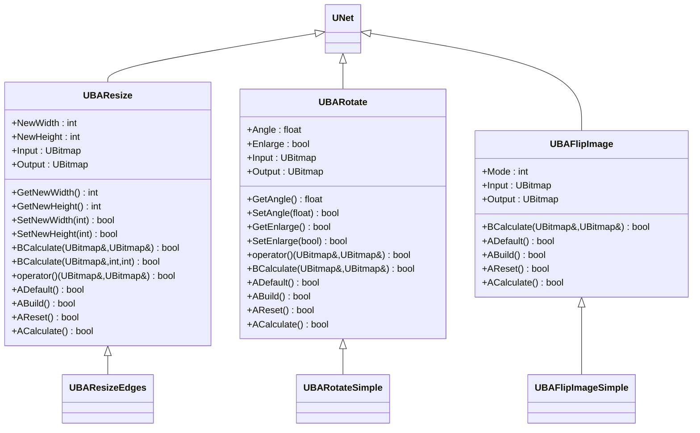
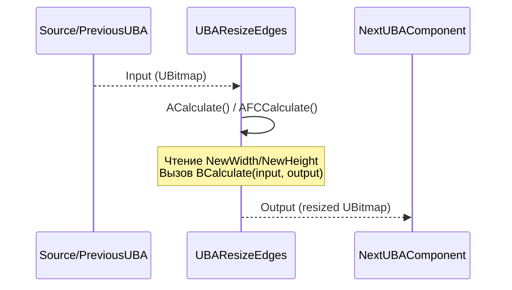
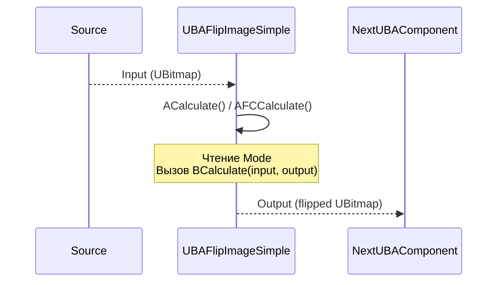
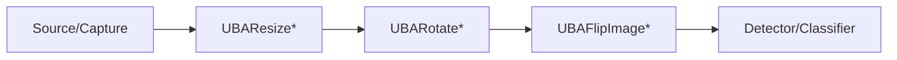

## Geometric Transformations — геометрические преобразования (Rdk-CvBasicLib)

### Назначение

Компоненты `UBAResize*`, `UBARotate*`, `UBAFlipImage*` выполняют геометрические преобразования изображений: изменение размера, поворот и отражение. Используются в пайплайнах предобработки перед детекцией/классификацией.

---

### UML-диаграмма классов



---

### UBAResize / UBAResizeEdges — изменение размера

#### UML-диаграмма последовательности



#### UML-диаграмма активности (UBAResizeEdges::BCalculate)


#### Свойства и методы

| Свойство/Метод | Тип | Назначение |
|----------------|-----|------------|
| `NewWidth` | `int` | Желаемая ширина выходного изображения |
| `NewHeight` | `int` | Желаемая высота выходного изображения |
| `Input` | `UBitmap` | Входное изображение |
| `Output` | `UBitmap` | Изменённое по размеру изображение |
| `BCalculate(UBitmap&, UBitmap&)` | `bool` | Виртуальный метод, реализуемый в `UBAResizeEdges` |

---

### UBARotate / UBARotateSimple — поворот изображения

#### UML-диаграмма последовательности


#### UML-диаграмма активности (UBARotateSimple::BCalculate)


#### Свойства и методы

| Свойство/Метод | Тип | Назначение |
|----------------|-----|------------|
| `Angle` | `float` | Угол поворота в градусах |
| `Enlarge` | `bool` | Увеличивать ли размер изображения, чтобы вместить повёрнутое |
| `Input` | `UBitmap` | Входное изображение |
| `Output` | `UBitmap` | Повёрнутое изображение |
| `BCalculate(UBitmap&, UBitmap&)` | `bool` | Виртуальный метод, реализуемый в `UBARotateSimple` |

---

### UBAFlipImage / UBAFlipImageSimple — отражение изображения

#### UML-диаграмма последовательности



#### UML-диаграмма активности (UBAFlipImageSimple::BCalculate)

```mermaid
flowchart TD
    Start([Start]) --> ReadMode[Прочитать Mode]
    ReadMode --> SwitchMode{Mode?}
    SwitchMode -->|0 (горизонтально)| FlipH[Выполнить cv::flip<br/>с флагом 1]
    SwitchMode -->|1 (вертикально)| FlipV[Выполнить cv::flip<br/>с флагом 0]
    SwitchMode -->|2 (оба)| FlipBoth[Выполнить cv::flip<br/>с флагом -1]
    FlipH --> WriteOut
    FlipV --> WriteOut
    FlipBoth --> WriteOut
    WriteOut[Записать в Output] --> End([End])
```

#### Свойства и методы

| Свойство/Метод | Тип | Назначение |
|----------------|-----|------------|
| `Mode` | `int` | Режим отражения: `0` — горизонтально, `1` — вертикально, `2` — оба |
| `Input` | `UBitmap` | Входное изображение |
| `Output` | `UBitmap` | Отражённое изображение |
| `BCalculate(UBitmap&, UBitmap&)` | `bool` | Виртуальный метод, реализуемый в `UBAFlipImageSimple` |

---

### UML-диаграмма компонентов



---

### Примеры использования (C++)

```cpp
// Изменение размера
auto resize = storage->CreateComponent<RDK::UBAResizeEdges>();
resize->Default();
resize->NewWidth = 640;
resize->NewHeight = 480;
resize->Build();
resize->Input = inputBitmap;
resize->Calculate();
UBitmap resized = resize->Output;

// Поворот
auto rotate = storage->CreateComponent<RDK::UBARotateSimple>();
rotate->Default();
rotate->Angle = 90.0f;
rotate->Enlarge = true;
rotate->Build();
rotate->Input = inputBitmap;
rotate->Calculate();
UBitmap rotated = rotate->Output;

// Отражение
auto flip = storage->CreateComponent<RDK::UBAFlipImageSimple>();
flip->Default();
flip->Mode = 0; // горизонтально
flip->Build();
flip->Input = inputBitmap;
flip->Calculate();
UBitmap flipped = flip->Output;
```

---

### Примеры конфигурации XML

```xml
<Component Id="Resize" Class="ResizeEdges">
    <Parameters>
        <NewWidth>640</NewWidth>
        <NewHeight>480</NewHeight>
    </Parameters>
</Component>

<Component Id="Rotate" Class="RotateSimple">
    <Parameters>
        <Angle>90.0</Angle>
        <Enlarge>true</Enlarge>
    </Parameters>
</Component>

<Component Id="Flip" Class="FlipImageSimple">
    <Parameters>
        <Mode>0</Mode> <!-- 0=horizontal, 1=vertical, 2=both -->
    </Parameters>
</Component>
```

---

### Связь с конфигурационными проектами (`Bin/Configs`)

Компоненты геометрических преобразований часто используются в пайплайнах предобработки:
- **UBAResize** — приведение входных кадров к фиксированному разрешению, требуемому детекторами/классификаторами.
- **UBARotate** — коррекция ориентации камеры или подготовка данных для обучения с аугментацией.
- **UBAFlipImage** — аугментация данных или коррекция зеркального отражения камеры.

Они обычно размещаются между источниками (`TCapture*`, `UBASource*`) и блоками детекции/классификации в конфигурациях `Bin/Configs/*`.

---

## Geometric Transformations — image transformations (Rdk-CvBasicLib)

**Classes**: `UBAResize*`, `UBARotate*`, `UBAFlipImage*` — geometric image transformations (resize, rotation, flipping) used in preprocessing pipelines before detection/classification.
