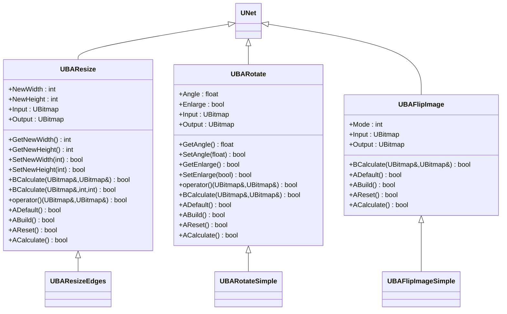
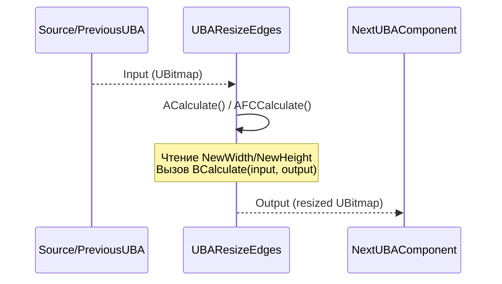
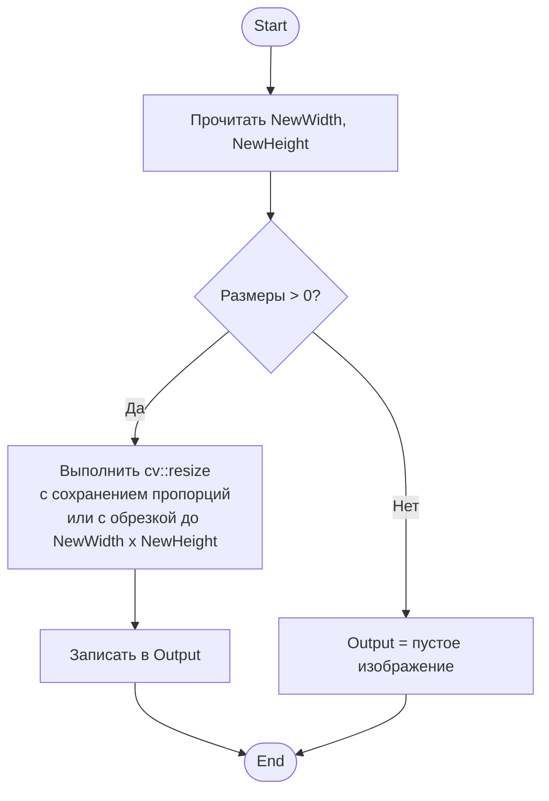
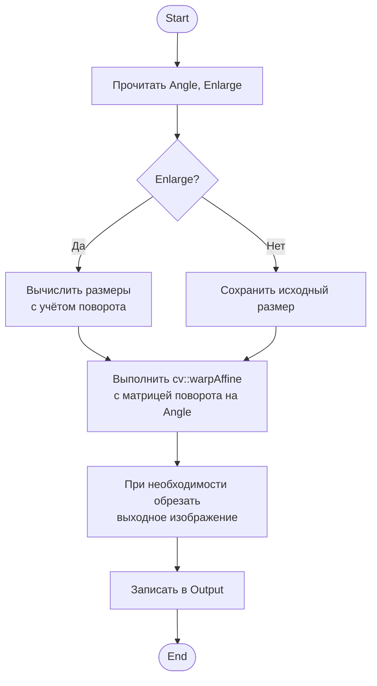
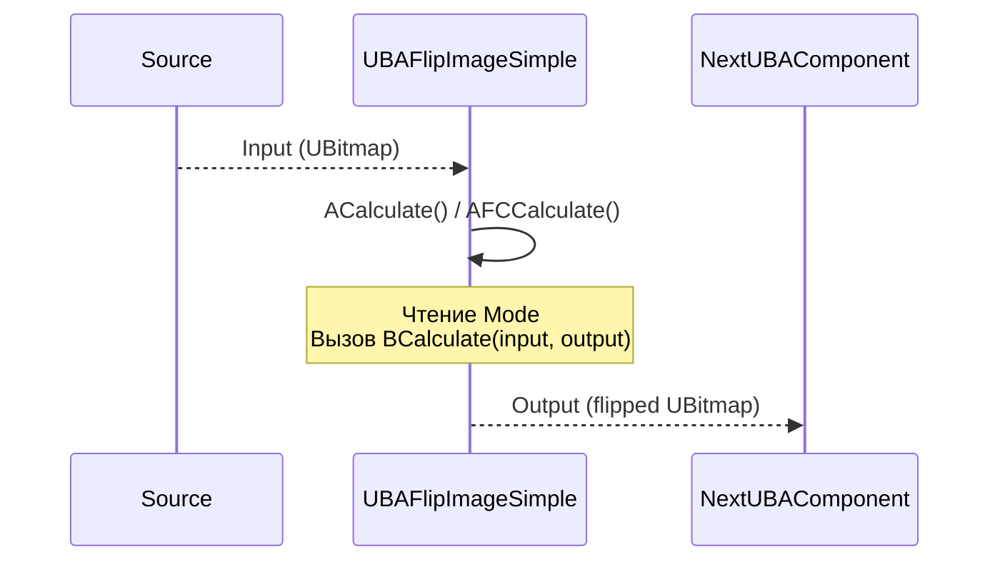
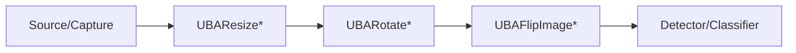

## RU

## Geometric Transformations — геометрические преобразования (Rdk-CvBasicLib)

### Назначение

Компоненты `UBAResize*`, `UBARotate*`, `UBAFlipImage*` выполняют геометрические преобразования изображений: изменение размера, поворот и отражение. Используются в пайплайнах предобработки перед детекцией/классификацией.

---

## EN

## Geometric Transformations — geometric transformations (Rdk-CvBasicLib)

### Class diagram



---

### UBAResize / UBAResizeEdges — change size

#### Sequence diagram



#### Activity diagram (UBAResizeEdges::BCalculate)



#### Properties and methods

| Property/Method | Тип | Purpose |
|----------------|-----|------------|
| `NewWidth` | `int` | Desired width output images |
| `NewHeight` | `int` | Desired height output images |
| `Input` | `UBitmap` | Input image |
| `Output` | `UBitmap` | Resized image |
| `BCalculate(UBitmap&, UBitmap&)` | `bool` | Virtual method, implemented в `UBAResizeEdges` |

---

### UBARotate / UBARotateSimple — rotation images

#### Sequence diagram


#### Activity diagram (UBARotateSimple::BCalculate)



#### Properties and methods

| Property/Method | Тип | Purpose |
|----------------|-----|------------|
| `Angle` | `float` | Rotation angle в degrees |
| `Enlarge` | `bool` | Enlarge ли size images, whatбы fit rotated |
| `Input` | `UBitmap` | Input image |
| `Output` | `UBitmap` | Rotated image |
| `BCalculate(UBitmap&, UBitmap&)` | `bool` | Virtual method, implemented в `UBARotateSimple` |

---

### UBAFlipImage / UBAFlipImageSimple — reflection images

#### Sequence diagram



#### Activity diagram (UBAFlipImageSimple::BCalculate)

```mermaid
flowchart TD
    Start([Start]) --> ReadMode[Прочитать Mode]
    ReadMode --> SwitchMode{Mode?}
    SwitchMode -->|0 (горизонтально)| FlipH["Выполнить cv::flip<br/>с флагом 1"]
    SwitchMode -->|1 (вертикально)| FlipV["Выполнить cv::flip<br/>с флагом 0"]
    SwitchMode -->|2 (оба)| FlipBoth["Выполнить cv::flip<br/>с флагом -1"]
    FlipH --> WriteOut
    FlipV --> WriteOut
    FlipBoth --> WriteOut
    WriteOut[Записать в Output] --> End([End])
```

#### Properties and methods

| Property/Method | Тип | Purpose |
|----------------|-----|------------|
| `Mode` | `int` | Mode reflection: `0` — horizontally, `1` — vertically, `2` — оба |
| `Input` | `UBitmap` | Input image |
| `Output` | `UBitmap` | Reflected image |
| `BCalculate(UBitmap&, UBitmap&)` | `bool` | Virtual method, implemented в `UBAFlipImageSimple` |

---

### Component diagram



---

### Usage Examples (C++)

```cpp
// Изменение размера
auto resize = storage->CreateComponent<RDK::UBAResizeEdges>();
resize->Default();
resize->NewWidth = 640;
resize->NewHeight = 480;
resize->Build();
resize->Input = inputBitmap;
resize->Calculate();
UBitmap resized = resize->Output;

// Поворот
auto rotate = storage->CreateComponent<RDK::UBARotateSimple>();
rotate->Default();
rotate->Angle = 90.0f;
rotate->Enlarge = true;
rotate->Build();
rotate->Input = inputBitmap;
rotate->Calculate();
UBitmap rotated = rotate->Output;

// Отражение
auto flip = storage->CreateComponent<RDK::UBAFlipImageSimple>();
flip->Default();
flip->Mode = 0; // горизонтально
flip->Build();
flip->Input = inputBitmap;
flip->Calculate();
UBitmap flipped = flip->Output;
```

---

### XML configuration examples

```xml
<Component Id="Resize" Class="ResizeEdges">
    <Parameters>
        <NewWidth>640</NewWidth>
        <NewHeight>480</NewHeight>
    </Parameters>
</Component>

<Component Id="Rotate" Class="RotateSimple">
    <Parameters>
        <Angle>90.0</Angle>
        <Enlarge>true</Enlarge>
    </Parameters>
</Component>

<Component Id="Flip" Class="FlipImageSimple">
    <Parameters>
        <Mode>0</Mode> <!-- 0=horizontal, 1=vertical, 2=both -->
    </Parameters>
</Component>
```

---

### Link с configuration projectми (`Bin/Configs`)

Components geometric transformations often are used в pipelines preprocessing:
- **UBAResize** — bring input frames to fixed resolution, required by detectors/classifiers.
- **UBARotate** — correction orientation cameras или preparation data для training с augmentation.
- **UBAFlipImage** — augmentation data или correction mirror reflection cameras.

Они usually are placed between sources (`TCapture*`, `UBASource*`) и blockами detection/classification в configurations `Bin/Configs/*`.

---
