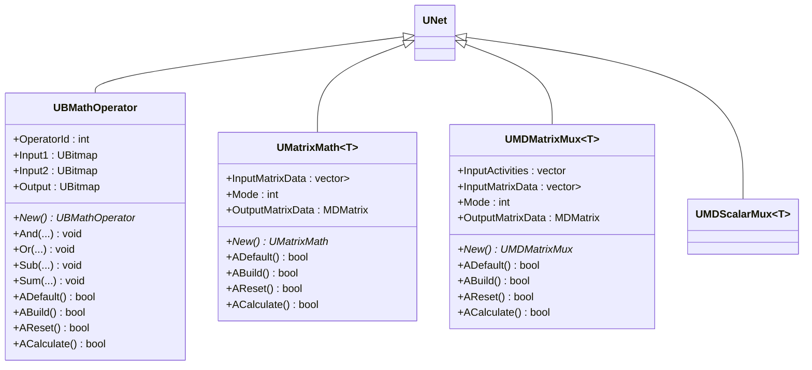
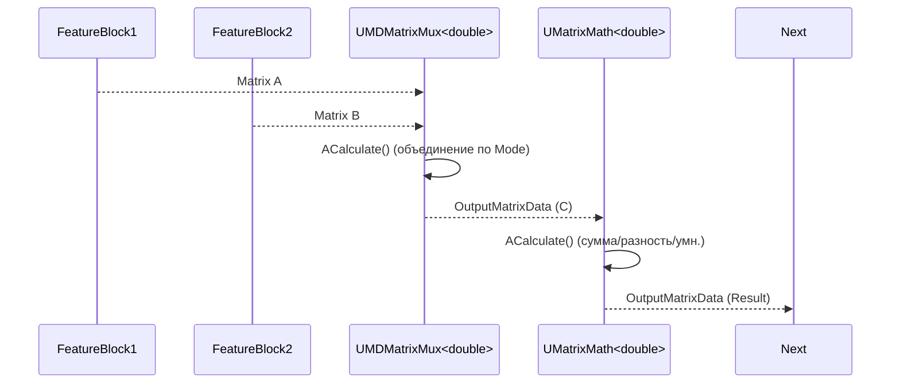
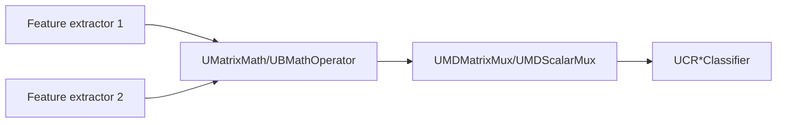

## RU

## Matrix/Scalar Math & Mux — математика и мультиплексоры (Rdk-CvBasicLib)

**Классы**: `UBMathOperator`, `UMatrixMath<T>`, `UMDMatrixMux<T>`, `UMDScalarMux<T>` — выполняют арифметику над матрицами/скалярами и объединение/разделение потоков данных.

### UML-диаграмма классов



### UML-диаграмма последовательности (пример)



### UML-диаграмма активности (UMatrixMath::ACalculate)

```mermaid
flowchart TD
    Start([Start]) --> CheckInput{InputMatrixData пуст?}
    CheckInput -->|Да| ZeroOut[Output 0x0] --> End([End])
    CheckInput -->|Нет| SwitchMode{Mode}
    SwitchMode -->|0 (Sum)| DoSum[Покомпонентная сумма матриц]
    SwitchMode -->|1 (Sub)| DoSub[Покомпонентная разность]
    SwitchMode -->|2 (Mul)| DoMul[Последовательное матричное умножение]
    SwitchMode -->|10 (Neg)| DoNeg[Умножение на -1]
    SwitchMode -->|11 (Transpose)| DoTr[Транспонирование первой матрицы]
    DoSum --> WriteOut
    DoSub --> WriteOut
    DoMul --> WriteOut
    DoNeg --> WriteOut
    DoTr --> WriteOut
    WriteOut[Записать в OutputMatrixData] --> End
```

### UML-диаграмма компонентов



### Входы/выходы

- **UBMathOperator**
  - Вход: `Input1`, `Input2` — изображения/матрицы признаков.  
  - Выход: `Output` — результат по оператору `OperatorId` (`ubmAnd`, `ubmOr`, `ubmSum`, `ubmSub` и т.п.).

- **UMatrixMath<T>**
  - Вход: `InputMatrixData` — вектор матриц одинакового размера.  
  - Выход: `OutputMatrixData` — результат суммирования/вычитания/умножения/негирования/транспонирования.

- **UMDMatrixMux<T> / UMDScalarMux<T>**
  - Вход: `InputMatrixData` / вектор скаляров и `InputActivities`.  
  - Выход: `OutputMatrixData` — собранная матрица из активных входов (по строкам/столбцам или по блокам, в зависимости от `Mode`).

### Свойства (основные)

| Компонент         | Свойство           | Тип                          | Назначение                                         |
|-------------------|--------------------|------------------------------|----------------------------------------------------|
| `UBMathOperator`  | `OperatorId`       | `int`                        | Идентификатор операции (AND/OR/XOR/SUM/SUB/...)    |
| `UBMathOperator`  | `Input1`, `Input2` | `UBitmap`                    | Входные изображения                                |
| `UMatrixMath<T>`  | `InputMatrixData`  | `vector<MDMatrix<T>>`        | Входные матрицы                                    |
| `UMatrixMath<T>`  | `Mode`             | `int`                        | Режим операции (0,1,2,10,11)                       |
| `UMatrixMath<T>`  | `OutputMatrixData` | `MDMatrix<T>`                | Результат операции                                 |
| `UMDMatrixMux<T>` | `InputActivities`  | `vector<bool>`               | Маска активных входов                              |
| `UMDMatrixMux<T>` | `Mode`             | `int`                        | Режим мультиплексора (по строкам/столбцам/блокам)  |
| `UMDMatrixMux<T>` | `OutputMatrixData` | `MDMatrix<T>`                | Объединённая матрица                               |

### Примеры использования (C++)

```cpp
// Пример: суммирование матриц признаков
auto math = storage->CreateComponent<RDK::UMatrixMath<double>>();
math->Default();
math->Mode = 0; // Sum
math->Build();
math->InputMatrixData = {feat1, feat2, feat3};
math->Calculate();
auto sum = math->OutputMatrixData;

// Пример: конкатенация матриц по строкам
auto mux = storage->CreateComponent<RDK::UMDMatrixMux<double>>();
mux->Default();
mux->Mode = 0; // вертикальное объединение
mux->InputActivities = std::vector<bool>(3, true);
mux->InputMatrixData = {featA, featB, featC};
mux->Build();
mux->Calculate();
auto concat = mux->OutputMatrixData;
```

### Пример конфигурации XML

```xml
<Component Id="FeatSum" Class="UMatrixDoubleMath">
    <Parameters>
        <Mode>0</Mode> <!-- sum -->
    </Parameters>
</Component>

<Component Id="FeatMux" Class="UMDMatrixDoubleMux">
    <Parameters>
        <Mode>0</Mode> <!-- concat rows -->
        <!-- InputActivities задаются через свойства или код -->
    </Parameters>
</Component>
```

### Связь с конфигурационными проектами (`Bin/Configs`)

- Компоненты математики/мультиплексоров используются в сложных пайплайнах признаков перед подачей данных в `UCR*`‑классификаторы.  
- Позволяют гибко комбинировать признаки из разных веток, нормализовывать и преобразовывать их, не меняя код классификаторов.

---

## EN

## Matrix/Scalar Math & Mux — math operators and multiplexers (Rdk-CvBasicLib)

**Classes**: matrix/scalar operations and mux components used to build complex feature pipelines.  
They are configured via `ClassName = "UMatrix*"` / `"UMD*"` entries and provide reusable building blocks for feature engineering.


```mermaid
flowchart TD
    Start([Start]) --> CheckInput{InputMatrixData пуст?}
    CheckInput -->|Да| ZeroOut[Output 0x0] --> End([End])
    CheckInput -->|Нет| SwitchMode{Mode}
    SwitchMode -->|0 (Sum)| DoSum[Покомпонентная сумма матриц]
    SwitchMode -->|1 (Sub)| DoSub[Покомпонентная разность]
    SwitchMode -->|2 (Mul)| DoMul[Последовательное матричное умножение]
    SwitchMode -->|10 (Neg)| DoNeg[Умножение на -1]
    SwitchMode -->|11 (Transpose)| DoTr[Транспонирование первой матрицы]
    DoSum --> WriteOut
    DoSub --> WriteOut
    DoMul --> WriteOut
    DoNeg --> WriteOut
    DoTr --> WriteOut
    WriteOut[Записать в OutputMatrixData] --> End
```


