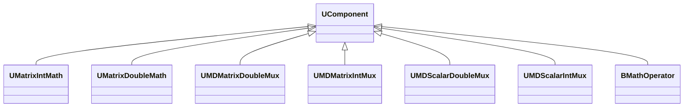

## Matrix/Scalar Math & Mux — математика и мультиплексоры (Rdk-CvBasicLib)

**Классы**: `UMatrixIntMath`, `UMatrixDoubleMath`, `UMDMatrixDoubleMux`, `UMDMatrixIntMux`, `UMDScalarDoubleMux`, `UMDScalarIntMux`, `BMathOperator`.  
Они отвечают за арифметику над матрицами/скалярами и за объединение/разделение потоков данных.

### Классы

### Входы/выходы
- Math: вход — одна или несколько матриц/скаляров; выход — результат арифметической операции.
- Mux: вход — несколько сигналов; выход — объединённый/выбранный поток.

### Storage-инстансы
- `ClassName = "UMatrixIntMath"` и т.п., параметры описывают тип операции (сложение, умножение, нормализация) и поведение мультиплексора.

---

## Matrix/Scalar Math & Mux — math operators and multiplexers (Rdk-CvBasicLib)

**Classes**: matrix/scalar operations and mux components used to build complex feature pipelines.

