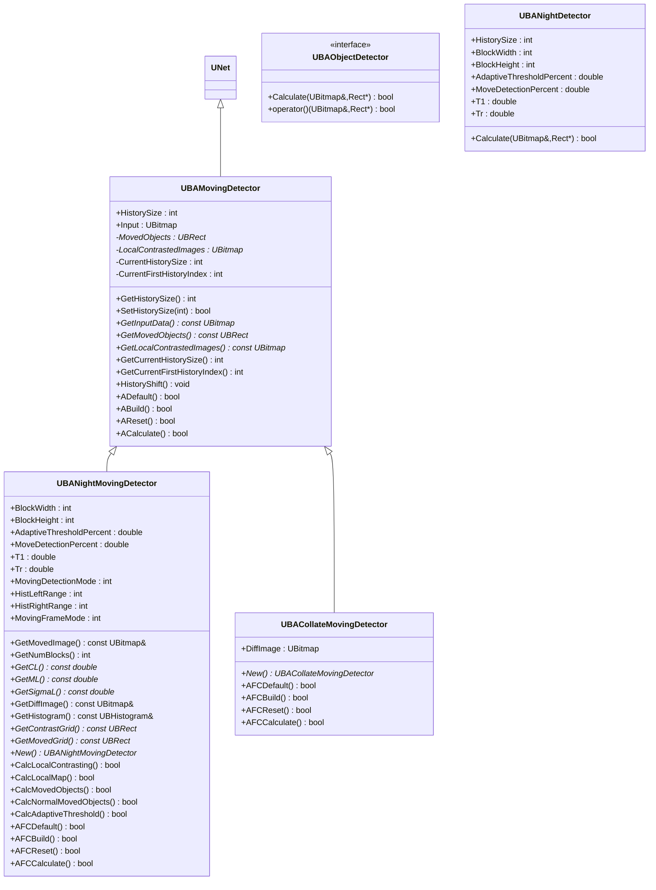
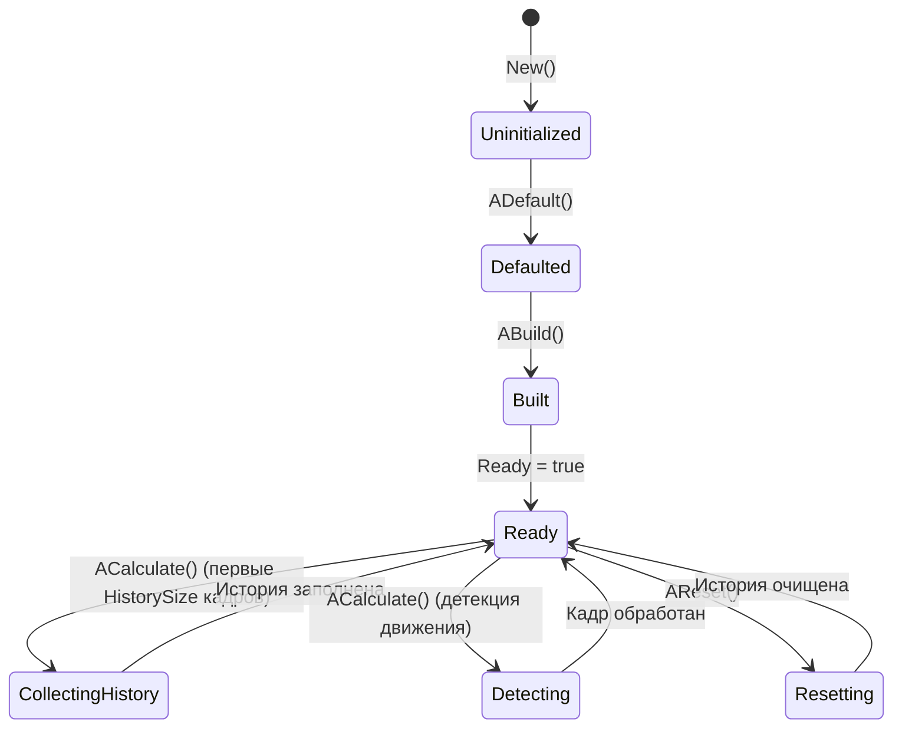
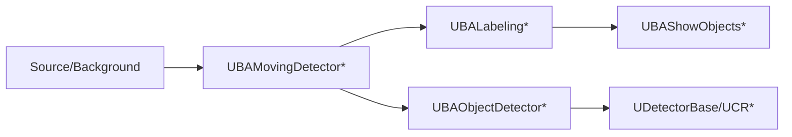

## RU

## Moving Detectors — детекторы движения (Rdk-CvBasicLib)

### Назначение

Компоненты `UBAMovingDetector*` и `UBAObjectDetector*` реализуют алгоритмы детекции движущихся объектов и базовые интерфейсы детекции объектов. Используются в пайплайнах видеонаблюдения и анализа движения.

---

## EN

### UML-диаграмма классов



---

### UBAMovingDetector — базовый детектор движения

#### UML-диаграмма последовательности


#### UML-диаграмма состояний



#### UML-диаграмма активности (UBANightMovingDetector::AFCCalculate)


#### Свойства и методы

| Свойство/Метод | Тип | Назначение |
|----------------|-----|------------|
| `HistorySize` | `int` | Размер истории кадров для анализа движения |
| `Input` | `UBitmap` | Входное изображение |
| `MovedObjects` | `UBRect*` | Массив обнаруженных движущихся объектов (защищённое поле) |
| `LocalContrastedImages` | `UBitmap*` | Буфер изображений с локальным контрастом |
| `GetMovedObjects()` | `const UBRect*` | Получить массив обнаруженных объектов |
| `HistoryShift()` | `void` | Сдвиг буфера истории |

---

### UBANightMovingDetector — детектор движения для ночных условий

#### Алгоритм

Реализует алгоритм из статьи "A real-time object detecting and tracking system for outdoor night surveillance" (Kaiqi Huang et al.):

1. **Локальный контраст** — вычисление контраста в блоках изображения.
2. **Карта локальной зависимости** — построение карты изменений между кадрами.
3. **Адаптивный порог** — динамический порог для выделения движущихся объектов.
4. **Обнаружение движения** — идентификация блоков с движением выше порога.

#### Свойства и методы

| Свойство/Метод | Тип | Назначение |
|----------------|-----|------------|
| `BlockWidth`, `BlockHeight` | `int` | Размер блока для анализа локального контраста |
| `AdaptiveThresholdPercent` | `double` | Процент для вычисления адаптивного порога |
| `MoveDetectionPercent` | `double` | Процент пикселей, преодолевших порог, для обнаружения |
| `T1`, `Tr` | `double` | Пороги для фильтрации ложных срабатываний |
| `MovingDetectionMode` | `int` | Режим детекции движения (`0` — стандартный, `1` — нормализованный) |
| `HistLeftRange`, `HistRightRange` | `int` | Диапазон гистограммы для анализа |
| `MovingFrameMode` | `int` | Режим обработки кадров (`0` — стандартный, `1` — альтернативный) |
| `GetMovedImage()` | `const UBitmap&` | Получить изображение с выделенными движущимися объектами |
| `GetContrastGrid()` | `const UBRect*` | Получить сетку контрастных объектов |
| `GetMovedGrid()` | `const UBRect*` | Получить сетку движущихся объектов |

---

### UBACollateMovingDetector — упрощённый детектор движения

#### Особенности

- Более простая реализация детекции движения на основе разностного кадра.
- Публичное поле `DiffImage` для визуализации разности.
- Используется в случаях, когда не требуется сложный анализ локального контраста.

---

### UBAObjectDetector / UBANightDetector — интерфейс детекции объектов

#### UML-диаграмма компонентов



---

### Примеры использования (C++)

```cpp
// Ночной детектор движения
auto nightDet = storage->CreateComponent<RDK::UBANightMovingDetector>();
nightDet->Default();
nightDet->HistorySize = 30;
nightDet->BlockWidth = 16;
nightDet->BlockHeight = 16;
nightDet->AdaptiveThresholdPercent = 0.1;
nightDet->MoveDetectionPercent = 0.3;
nightDet->Build();

for (int step = 0; step < 1000; ++step) {
    nightDet->Input = frame;
    nightDet->Calculate();
    const UBRect* objects = nightDet->GetMovedObjects();
    const UBitmap& movedImg = nightDet->GetMovedImage();
    // обработка объектов
}
```

---

### Примеры конфигурации XML

```xml
<Component Id="NightMovingDet" Class="NightMovingDetector">
    <Parameters>
        <HistorySize>30</HistorySize>
        <BlockWidth>16</BlockWidth>
        <BlockHeight>16</BlockHeight>
        <AdaptiveThresholdPercent>0.1</AdaptiveThresholdPercent>
        <MoveDetectionPercent>0.3</MoveDetectionPercent>
        <T1>0.5</T1>
        <Tr>0.3</Tr>
        <MovingDetectionMode>0</MovingDetectionMode>
        <MovingFrameMode>0</MovingFrameMode>
    </Parameters>
</Component>
```

---

### Связь с конфигурационными проектами (`Bin/Configs`)

Компоненты детекции движения используются в пайплайнах видеонаблюдения:
- **UBAMovingDetector** — базовый класс для различных алгоритмов детекции движения.
- **UBANightMovingDetector** — специализированный алгоритм для ночных условий с анализом локального контраста.
- **UBACollateMovingDetector** — упрощённая реализация для быстрой детекции движения.

Они обычно размещаются после компонентов фона (`UBABackground*`) и разностных кадров (`UBADifferenceFrame*`) в конфигурациях `Bin/Configs/*`.

---

## Moving Detectors — motion detection components (Rdk-CvBasicLib)

**Classes**: `UBAMovingDetector*`, `UBAObjectDetector*`, `UBANightDetector` — motion detection algorithms for video surveillance pipelines, including specialized night-time detection with local contrast analysis.
