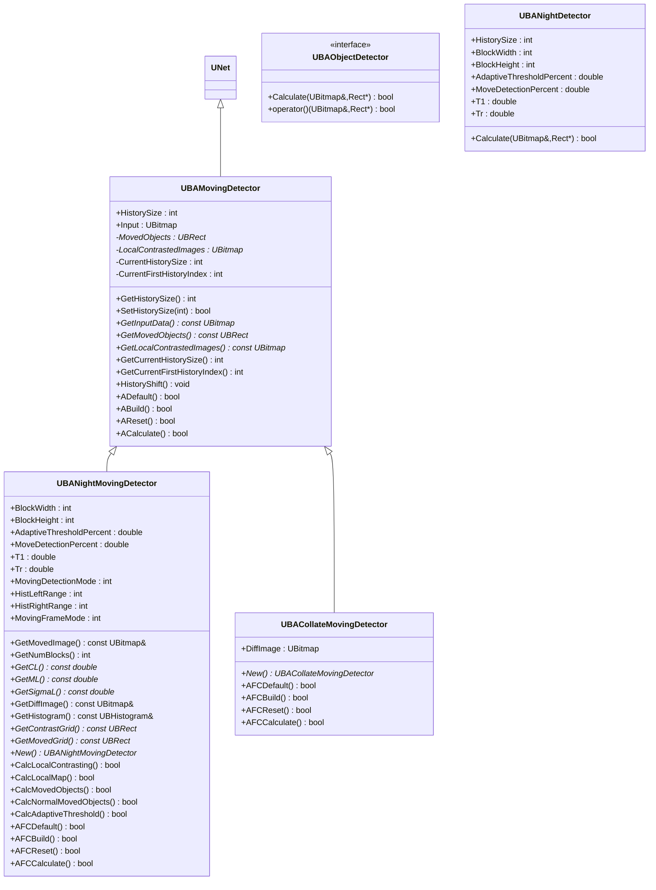
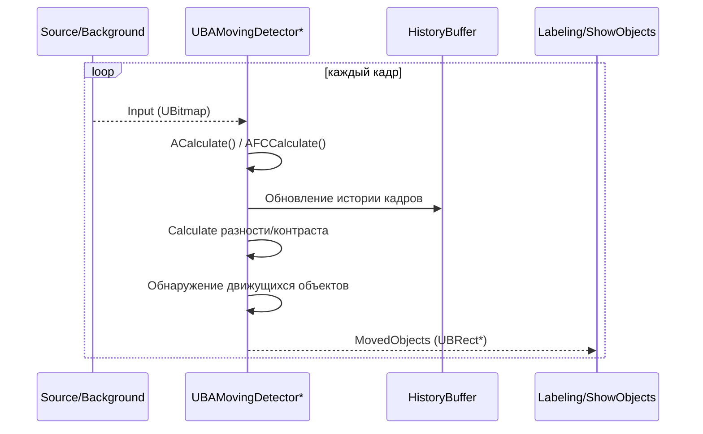
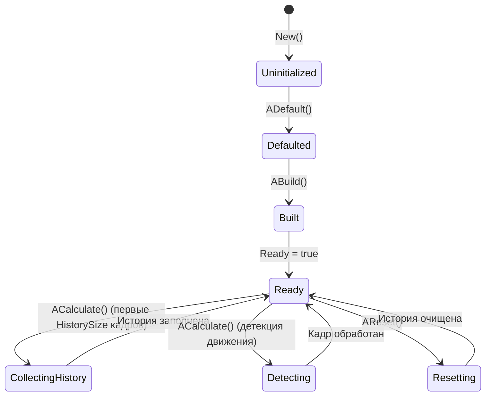
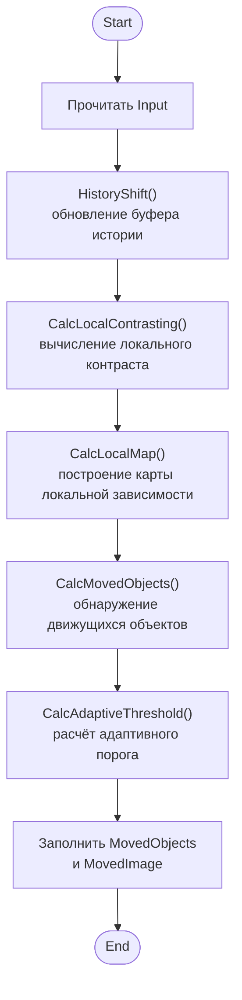
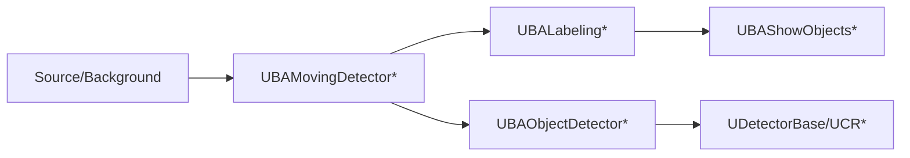

## RU

## Moving Detectors — детекторы движения (Rdk-CvBasicLib)

### Назначение

Компоненты `UBAMovingDetector*` и `UBAObjectDetector*` реализуют алгоритмы детекции движущихся объектов и базовые интерфейсы детекции объектов. Используются в пайплайнах видеонаблюдения и анализа движения.

---

## EN

## Moving Detectors — motion detectors (Rdk-CvBasicLib)

### Class diagram



---

### UBAMovingDetector — base motion detector

#### Sequence diagram



#### State diagram



#### Activity diagram (UBANightMovingDetector::AFCCalculate)



#### Properties and methods

| Property/Method | Тип | Purpose |
|----------------|-----|------------|
| `HistorySize` | `int` | Size history frames для analysis motion |
| `Input` | `UBitmap` | Input image |
| `MovedObjects` | `UBRect*` | Array detected moving objects (protected field) |
| `LocalContrastedImages` | `UBitmap*` | Buffer images с local contrast |
| `GetMovedObjects()` | `const UBRect*` | Get array detected objects |
| `HistoryShift()` | `void` | Shift history buffer |

---

### UBANightMovingDetector — motion detector для night conditions

#### Algorithm

Implements algorithm из paper "A real-time object detecting and tracking system for outdoor night surveillance" (Kaiqi Huang et al.):

1. **Local contrast** — computation contrast в blockах images.
2. **Local dependency map** — building map changes between frames.
3. **Adaptive threshold** — dynamicallyй threshold для highlighting moving objects.
4. **Detection motion** — identification blockов с motion above threshold.

#### Properties and methods

| Property/Method | Тип | Purpose |
|----------------|-----|------------|
| `BlockWidth`, `BlockHeight` | `int` | Size blockа для analysis local contrast |
| `AdaptiveThresholdPercent` | `double` | Percent для computation adaptive threshold |
| `MoveDetectionPercent` | `double` | Percent pixels, exceeding threshold, для detection |
| `T1`, `Tr` | `double` | Thresholds for false-positive filtering |
| `MovingDetectionMode` | `int` | Mode detection motion (`0` — standard, `1` — normalized) |
| `HistLeftRange`, `HistRightRange` | `int` | Histogram range for analysis |
| `MovingFrameMode` | `int` | Mode processing frames (`0` — standard, `1` — alternative) |
| `GetMovedImage()` | `const UBitmap&` | Get image с highlighted moving objects |
| `GetContrastGrid()` | `const UBRect*` | Get grid contrast objects |
| `GetMovedGrid()` | `const UBRect*` | Get grid moving objects |

---

### UBACollateMovingDetector — simplified motion detector

#### Features

- More simple implementation detection motion на basis difference frame.
- Public field `DiffImage` для visualization difference.
- Used в cases, when complex local contrast analysis is not required.

---

### UBAObjectDetector / UBANightDetector — interface detection objects

#### Component diagram



---

### Usage Examples (C++)

```cpp
// Ночной детектор движения
auto nightDet = storage->CreateComponent<RDK::UBANightMovingDetector>();
nightDet->Default();
nightDet->HistorySize = 30;
nightDet->BlockWidth = 16;
nightDet->BlockHeight = 16;
nightDet->AdaptiveThresholdPercent = 0.1;
nightDet->MoveDetectionPercent = 0.3;
nightDet->Build();

for (int step = 0; step < 1000; ++step) {
    nightDet->Input = frame;
    nightDet->Calculate();
    const UBRect* objects = nightDet->GetMovedObjects();
    const UBitmap& movedImg = nightDet->GetMovedImage();
    // обработка объектов
}
```

---

### XML configuration examples

```xml
<Component Id="NightMovingDet" Class="NightMovingDetector">
    <Parameters>
        <HistorySize>30</HistorySize>
        <BlockWidth>16</BlockWidth>
        <BlockHeight>16</BlockHeight>
        <AdaptiveThresholdPercent>0.1</AdaptiveThresholdPercent>
        <MoveDetectionPercent>0.3</MoveDetectionPercent>
        <T1>0.5</T1>
        <Tr>0.3</Tr>
        <MovingDetectionMode>0</MovingDetectionMode>
        <MovingFrameMode>0</MovingFrameMode>
    </Parameters>
</Component>
```

---

### Link с configuration projectми (`Bin/Configs`)

Components detection motion used in video surveillance pipelines:
- **UBAMovingDetector** — base class для various algorithms detection motion.
- **UBANightMovingDetector** — specialized algorithm for night conditions with local contrast analysis.
- **UBACollateMovingDetector** — simplified implementation для fast detection motion.

They are usually placed after background components (`UBABackground*`) и difference frames (`UBADifferenceFrame*`) в configurations `Bin/Configs/*`.

---
