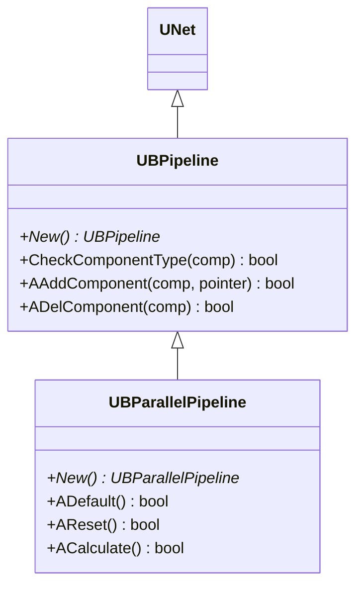
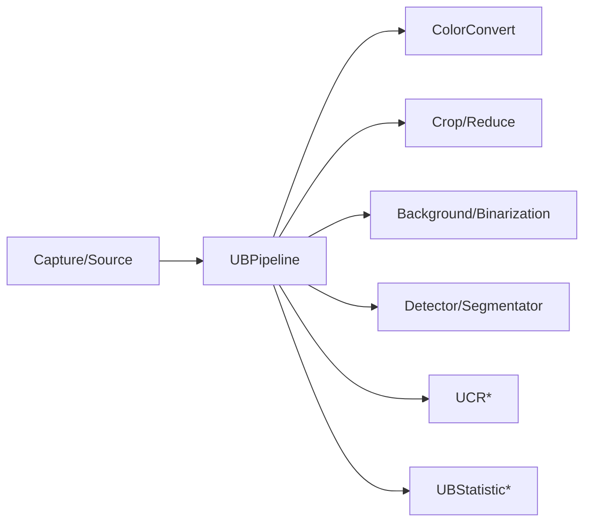
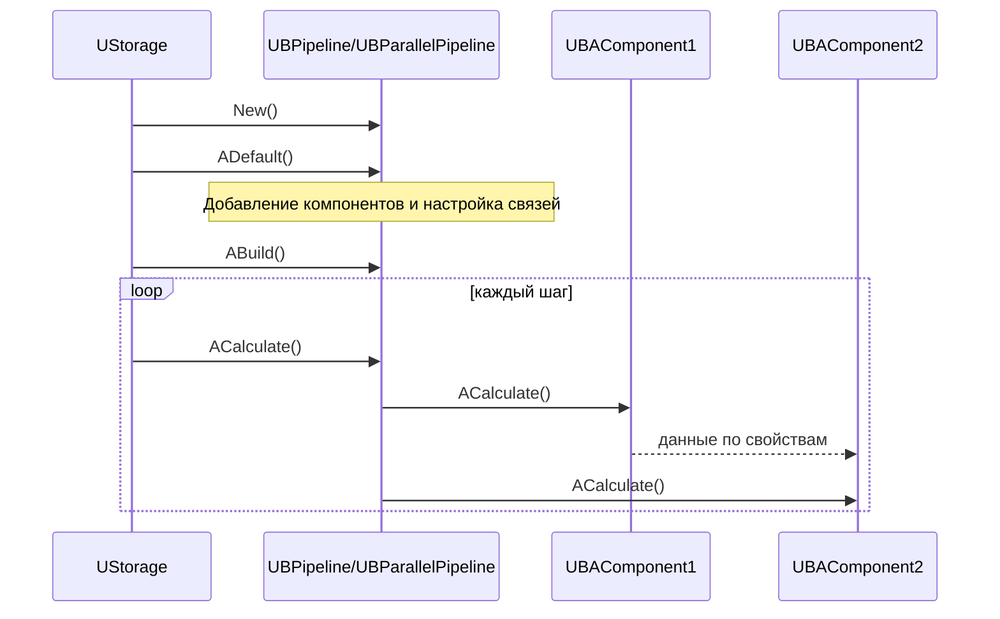
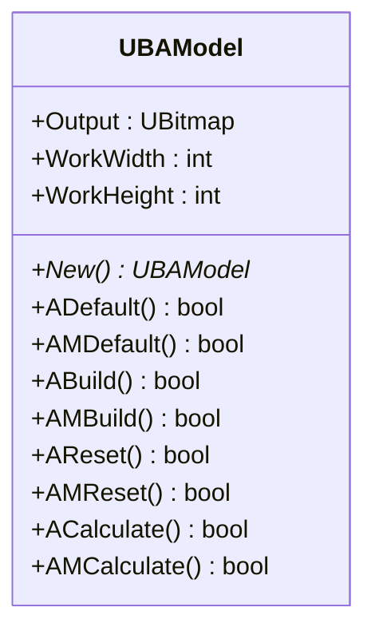
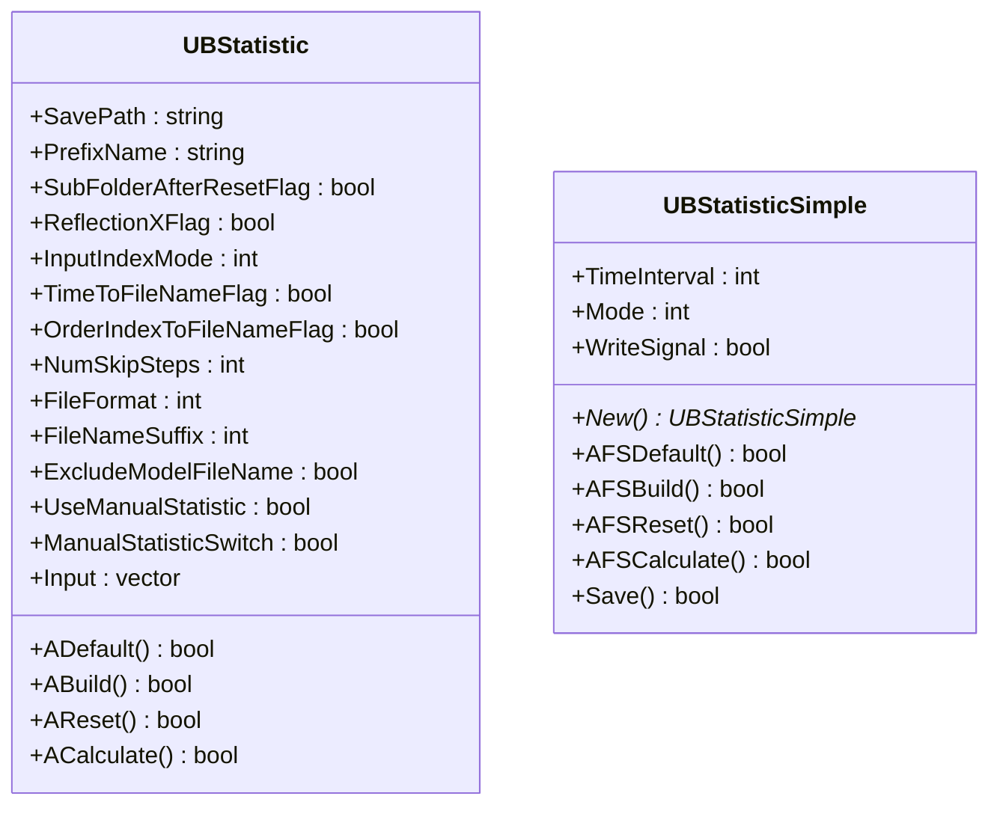
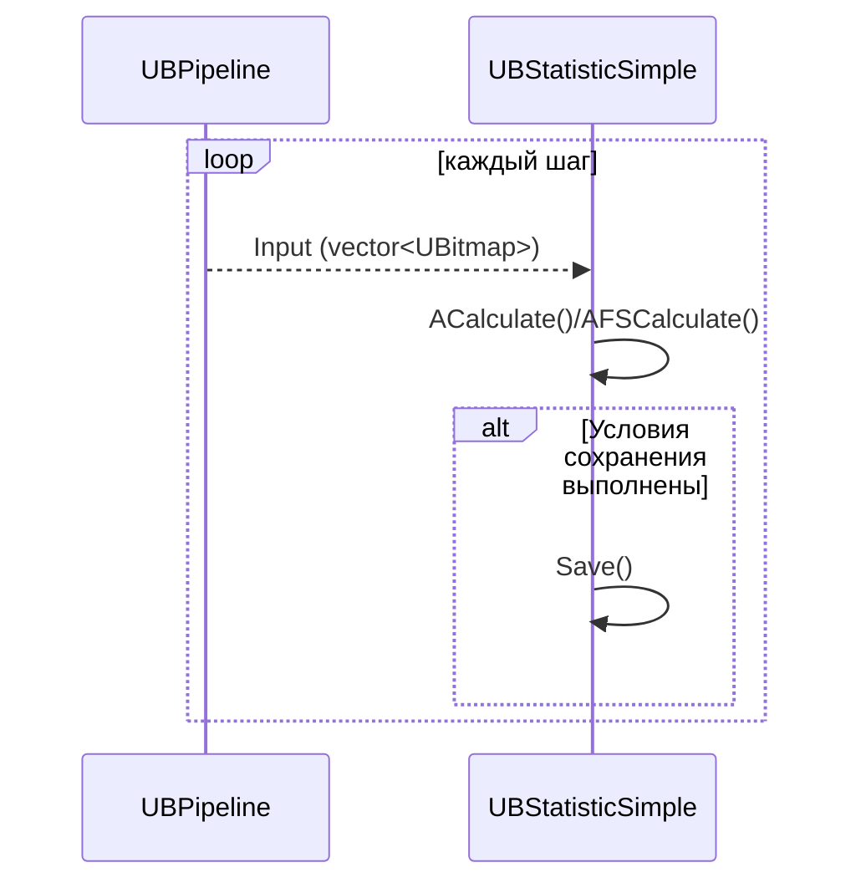
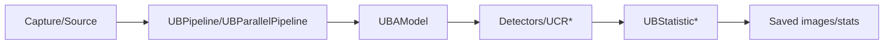

## Pipelines, Models & Statistics — пайплайны, модели и статистика (Rdk-CvBasicLib)

### Назначение

Компоненты `UBPipeline*`, `UBAModel` и `UBStatistic*` описывают:
- конвейер обработки изображений (последовательное/параллельное выполнение UBA‑компонентов);
- обёртку модели обработки (`UBAModel`);
- сбор и сохранение статистики и промежуточных результатов (`UBStatistic*`).

---

### UBPipeline / UBParallelPipeline — конвейеры обработки

#### UML-диаграмма классов



`UBPipeline` управляет набором дочерних компонентов `UNet` и определяет, какие типы разрешено включать в конвейер. `UBParallelPipeline` реализует параллельную схему исполнения.

#### UML-диаграмма компонентов



#### Жизненный цикл

Конкретные методы `ADefault/ABuild/ACalculate` зависят от реализации `UNet`, но типичный жизненный цикл пайплайна:



---

### UBAModel — модель обработки



`UBAModel` служит контейнером для составных моделей обработки (например, совокупность нескольких пайплайнов/веток), предоставляя единый выход `Output` и рабочее разрешение (`WorkWidth`, `WorkHeight`).

---

### UBStatistic / UBStatisticSimple — статистика и сохранение кадров

#### UML-диаграмма классов



#### Входы/выходы и поведение

- **Вход**: `Input` — вектор изображений (`UBitmap`), которые нужно сохранять/анализировать.  
- **Параметры сохранения**:
  - `SavePath`, `PrefixName`, `FileFormat` (`0` — bmp, `1` — jpeg), `FileNameSuffix`.  
  - `TimeToFileNameFlag`, `OrderIndexToFileNameFlag` — добавление времени/индекса в имя файла.  
  - `NumSkipSteps` — пропуск шагов между сохранениями.  
  - `UseManualStatistic` + `ManualStatisticSwitch` — ручкое включение/выключение сбора.
- **UBStatisticSimple**:
  - `TimeInterval` — минимальный интервал между сохранениями (или число шагов).  
  - `Mode` — режим работы (автоматический/ручной).  
  - `WriteSignal` — флаг разового сохранения в момент вызова `Calculate`.

#### UML-диаграмма последовательности



---

### Примеры использования (C++)

```cpp
// Пайплайн
auto pipe = storage->CreateComponent<RDK::UBPipeline>();
pipe->Default();
// ... добавить компоненты в pipe ...
pipe->Build();

// Статистика
auto stat = storage->CreateComponent<RDK::UBStatisticSimple>();
stat->Default();
stat->SavePath = "Stats/Run1";
stat->PrefixName = "Frame";
stat->FileFormat = 1;       // jpeg
stat->TimeInterval = 5;     // условный интервал
stat->Build();

for (int step = 0; step < 1000; ++step) {
    pipe->Calculate();
    // заполняем stat->Input где-то в конфиге/коде
    stat->Calculate();
}
```

---

### Пример конфигурации XML

```xml
<Component Id="MainPipeline" Class="UBPipeline">
    <Parameters/>
</Component>

<Component Id="ParallelPipeline" Class="UBParallelPipeline">
    <Parameters/>
</Component>

<Component Id="StatFrames" Class="UBStatisticSimple">
    <Parameters>
        <SavePath>Results/Frames</SavePath>
        <PrefixName>Frame</PrefixName>
        <FileFormat>1</FileFormat> <!-- jpeg -->
        <TimeInterval>10</TimeInterval>
        <Mode>0</Mode>
    </Parameters>
</Component>
```

---

### Поток данных высокого уровня



Эти компоненты связывают вместе цепочки обработки, логически оформляя “модель обработки” и обеспечивая сохранение промежуточных и финальных результатов в проектах `Bin/Configs/*`.

