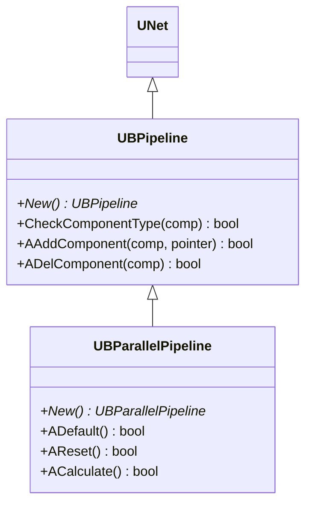
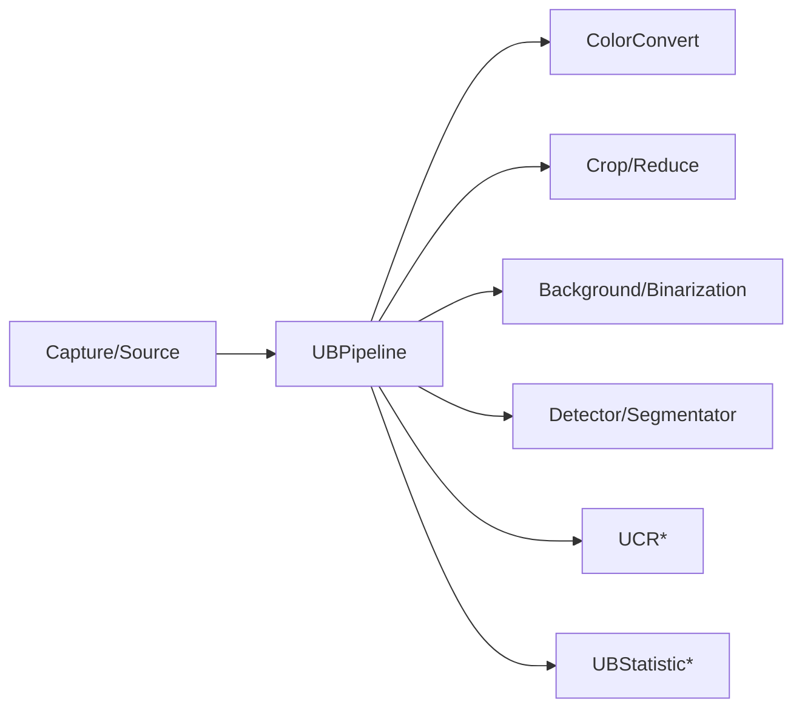
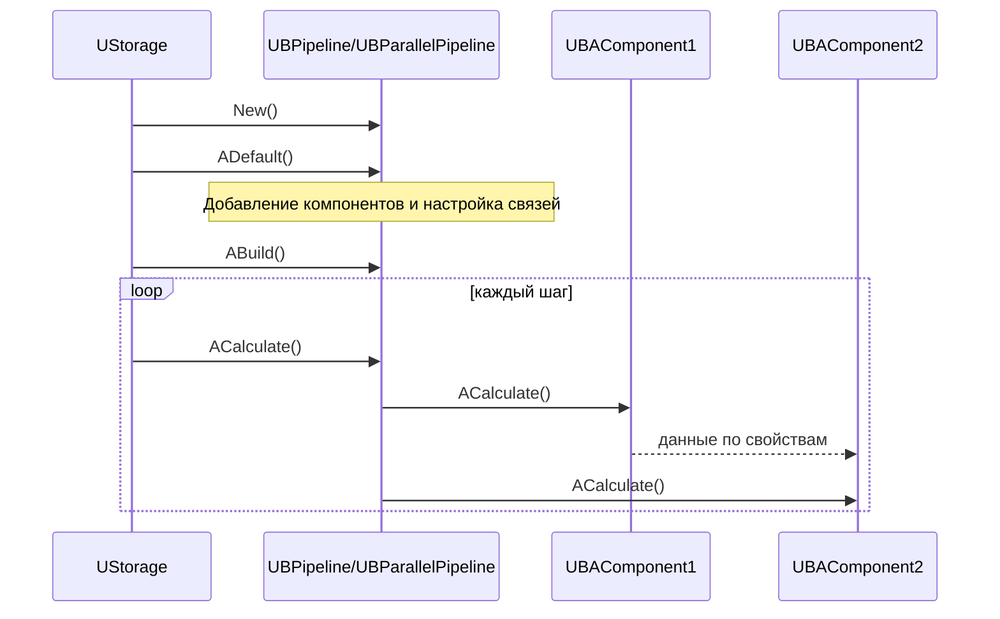
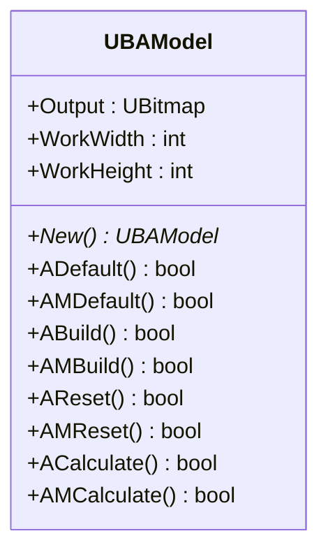
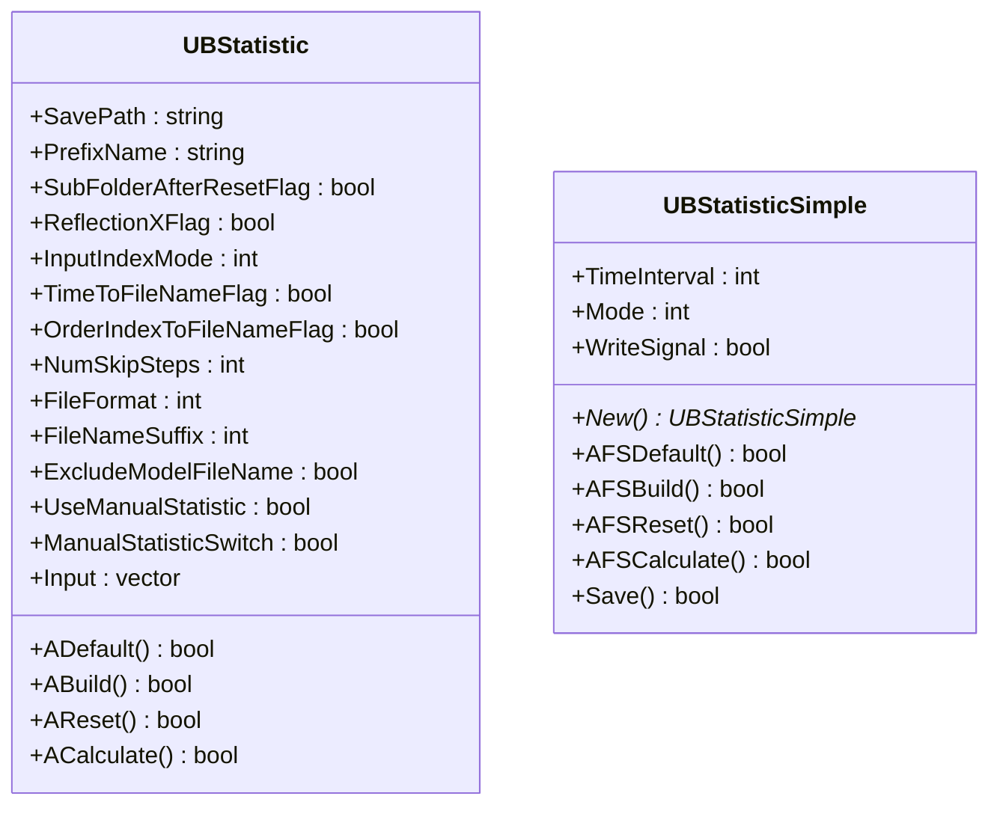
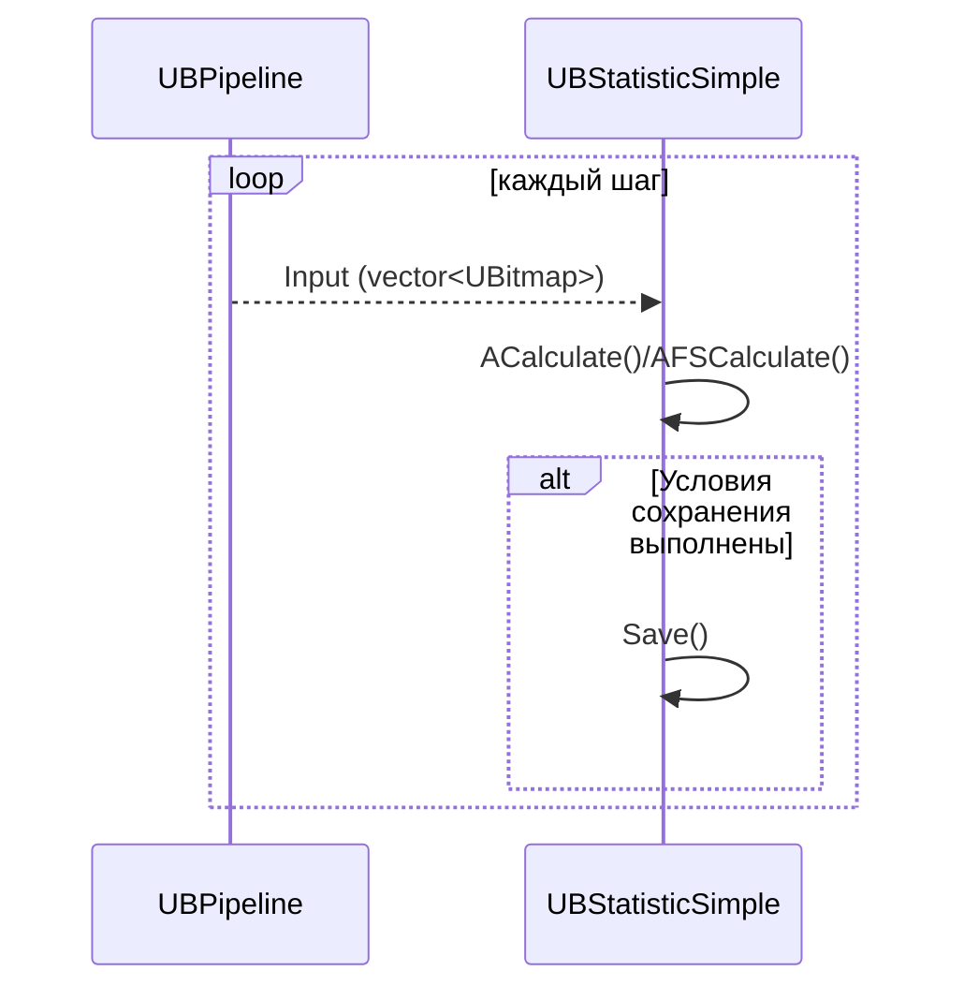
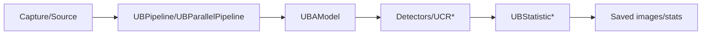

## RU

## Pipelines, Models & Statistics — пайплайны, модели и статистика (Rdk-CvBasicLib)

### Назначение

Компоненты `UBPipeline*`, `UBAModel` и `UBStatistic*` описывают:
- конвейер обработки изображений (последовательное/параллельное выполнение UBA‑компонентов);
- обёртку модели обработки (`UBAModel`);
- сбор и сохранение статистики и промежуточных результатов (`UBStatistic*`).

---

## EN

## Pipelines, Models & Statistics — pipelines, models, and statistics (Rdk-CvBasicLib)

### UBPipeline / UBParallelPipeline — pipelines processing

#### Class diagram



`UBPipeline` manages set child components `UNet` и defines, which types allowed include в pipeline. `UBParallelPipeline` implements parallel execution scheme.

#### Component diagram



#### Lifecycle cycle

Specific methods `ADefault/ABuild/ACalculate` depend от implementation `UNet`, но typical lifecycle cycle pipeline:



---

### UBAModel — model processing



`UBAModel` serves as a container for composite model processing (for example, a collection of several pipelines/branches), providing a single output `Output` and working resolution (`WorkWidth`, `WorkHeight`).

---

### UBStatistic / UBStatisticSimple — statistics и saving frames

#### Class diagram



#### Inputs/outputs и behavior

- **Input**: `Input` — vector images (`UBitmap`), which need save/analyze.  
- **Parameters saves**:
  - `SavePath`, `PrefixName`, `FileFormat` (`0` — bmp, `1` — jpeg), `FileNameSuffix`.  
  - `TimeToFileNameFlag`, `OrderIndexToFileNameFlag` — addition time/index в имя file.  
  - `NumSkipSteps` — skip steps between saves.  
  - `UseManualStatistic` + `ManualStatisticSwitch` — manual enable/disable collection.
- **UBStatisticSimple**:
  - `TimeInterval` — minimum interval between saves (или number steps).  
  - `Mode` — mode work (automatic/manual).  
  - `WriteSignal` — one-shot save flag at the moment `Calculate` is called.

#### Sequence diagram



---

### Usage Examples (C++)

```cpp
// Пайплайн
auto pipe = storage->CreateComponent<RDK::UBPipeline>();
pipe->Default();
// ... добавить компоненты в pipe ...
pipe->Build();

// Статистика
auto stat = storage->CreateComponent<RDK::UBStatisticSimple>();
stat->Default();
stat->SavePath = "Stats/Run1";
stat->PrefixName = "Frame";
stat->FileFormat = 1;       // jpeg
stat->TimeInterval = 5;     // условный интервал
stat->Build();

for (int step = 0; step < 1000; ++step) {
    pipe->Calculate();
    // заполняем stat->Input где-то в конфиге/коде
    stat->Calculate();
}
```

---

### Example configuration XML

```xml
<Component Id="MainPipeline" Class="UBPipeline">
    <Parameters/>
</Component>

<Component Id="ParallelPipeline" Class="UBParallelPipeline">
    <Parameters/>
</Component>

<Component Id="StatFrames" Class="UBStatisticSimple">
    <Parameters>
        <SavePath>Results/Frames</SavePath>
        <PrefixName>Frame</PrefixName>
        <FileFormat>1</FileFormat> <!-- jpeg -->
        <TimeInterval>10</TimeInterval>
        <Mode>0</Mode>
    </Parameters>
</Component>
```

---

### Flow data high level



Эти components link together chain processing, logically structuring “model processing” и ensuring saving intermediate и final results в projectх `Bin/Configs/*`.
