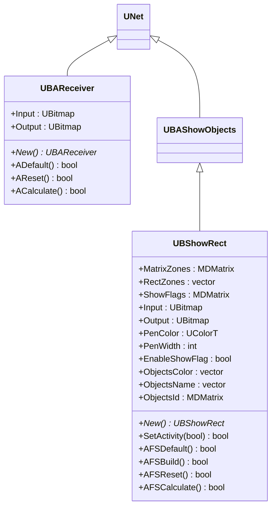
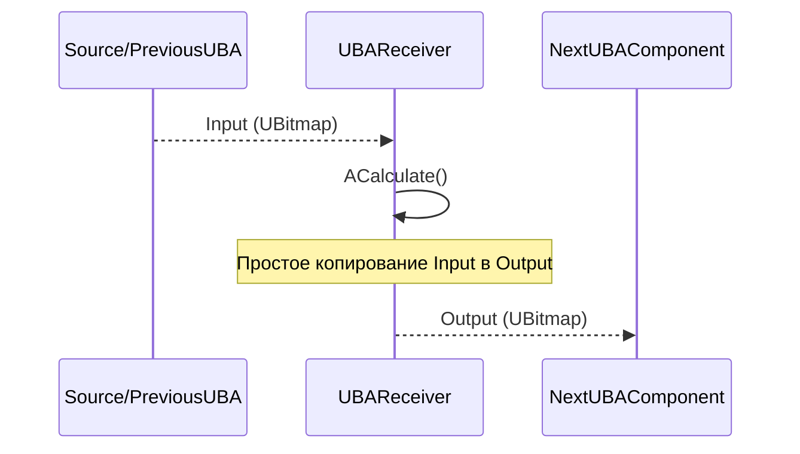
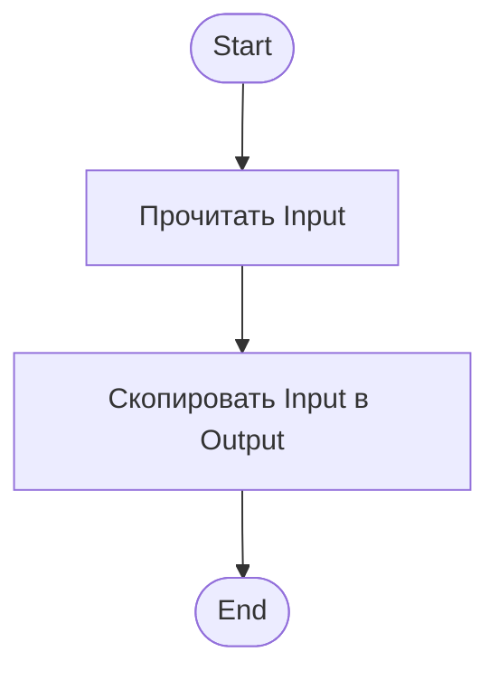
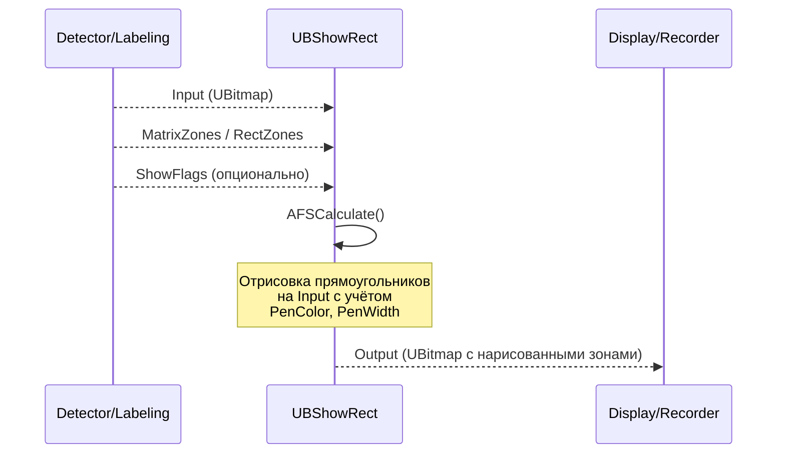
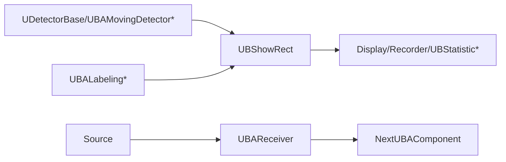

## RU

## Receiver & ShowRect — приёмник и визуализация прямоугольников (Rdk-CvBasicLib)

### Назначение

Компоненты `UBAReceiver` и `UBShowRect` обеспечивают:
- **UBAReceiver** — простой приёмник/проброс изображений в пайплайнах.
- **UBShowRect** — визуализацию прямоугольных зон (bounding boxes) поверх изображения, используемую для отображения результатов детекции.

---

## EN

## Receiver & ShowRect — receiver and rectangle visualization (Rdk-CvBasicLib)

### Class diagram



**Inheritance hierarchy:**
- `UBShowRect` inherits от `UBAShowObjects`, which provides basic functionality rendering objects.

---

### UBAReceiver — receiver images

#### Sequence diagram



#### Activity diagram



#### Properties and methods

| Property/Method | Тип | Purpose |
|----------------|-----|------------|
| `Input` | `UBitmap` | Input image |
| `Output` | `UBitmap` | Outputное image (copy Input) |
| `ADefault()` | `bool` | Initialization default |
| `AReset()` | `bool` | Reset states |
| `ACalculate()` | `bool` | Copying Input в Output |

**Purpose:** Simple component для forwarding images в pipelines, when is required explicit separation stages processing или synchronization flows data.

---

### UBShowRect — visualization rectangular зон

#### Sequence diagram



#### Activity diagram (UBShowRect::AFSCalculate)

```mermaid
flowchart TD
    Start([Start]) --> CheckEnable{EnableShowFlag?}
    CheckEnable -->|Нет| Skip[Output = Input (копия)]
    CheckEnable -->|Да| ReadInput[Прочитать Input]
    ReadInput --> ReadZones["Прочитать MatrixZones<br/>или RectZones"]
    ReadZones --> ReadParams["Прочитать PenColor, PenWidth<br/>ObjectsColor, ObjectsName"]
    ReadParams --> InitCanvas[Инициализировать Canvas = Input]
    InitCanvas --> LoopZones[Цикл по зонам]
    LoopZones --> CheckFlag{ShowFlags задан?}
    CheckFlag -->|Да| CheckShow{ShowFlags[i] > 0?}
    CheckFlag -->|Нет| DrawRect["Отрисовать прямоугольник<br/>с цветом из ObjectsColor<br/>или PenColor"]
    CheckShow -->|Да| DrawRect
    CheckShow -->|Нет| SkipRect[Пропустить зону]
    DrawRect --> DrawLabel{ObjectsName задан?}
    DrawLabel -->|Да| DrawText[Отрисовать текст метки]
    DrawLabel -->|Нет| NextZone
    DrawText --> NextZone[Следующая зона]
    SkipRect --> NextZone
    NextZone --> MoreZones{Ещё зоны?}
    MoreZones -->|Да| LoopZones
    MoreZones -->|Нет| WriteOut[Записать Canvas в Output]
    WriteOut --> End([End])
    Skip --> End
```

#### Properties and methods

| Property/Method | Тип | Purpose |
|----------------|-----|------------|
| `Input` | `UBitmap` | Input image, на which are drawn zones |
| `Output` | `UBitmap` | Resulting image с drawn rectangles |
| `MatrixZones` | `MDMatrix<double>` | Matrix зон (each row: x, y, width, height или left, top, right, bottom) |
| `RectZones` | `vector<UBRect>` | Vector rectangular зон |
| `ShowFlags` | `MDMatrix<int>` | Flags visibility для each zones (optionally) |
| `PenColor` | `UColorT` | Color lines rectangles (default) |
| `PenWidth` | `int` | Thickness lines |
| `EnableShowFlag` | `bool` | Enable/disable rendering |
| `ObjectsColor` | `vector<UColorT>` | Colors для each zones (if specified, overrides PenColor) |
| `ObjectsName` | `vector<string>` | Text labels для зон |
| `ObjectsId` | `MDMatrix<int>` | Identifiers objects (для relationships с labels) |
| `SetActivity(bool)` | `bool` | Set activity flag (analog of EnableShowFlag) |

---

### Component diagram



---

### Usage Examples (C++)

```cpp
// Приёмник
auto recv = storage->CreateComponent<RDK::UBAReceiver>();
recv->Default();
recv->Build();
recv->Input = inputBitmap;
recv->Calculate();
UBitmap output = recv->Output;

// Визуализация прямоугольников
auto show = storage->CreateComponent<RDK::UBShowRect>();
show->Default();
show->PenColor = UColorT(0, 255, 0); // зелёный
show->PenWidth = 2;
show->EnableShowFlag = true;
show->Build();

// Заполнение зон из детектора
std::vector<UBRect> zones;
// ... заполнение zones из детектора ...
show->RectZones = zones;

show->Input = inputBitmap;
show->Calculate();
UBitmap annotated = show->Output;
```

---

### XML configuration examples

```xml
<!-- Приёмник -->
<Component Id="Receiver" Class="UBAReceiver">
    <Parameters/>
</Component>

<!-- Визуализация прямоугольников -->
<Component Id="ShowRects" Class="UBShowRect">
    <Parameters>
        <PenColor>#00FF00</PenColor>
        <PenWidth>2</PenWidth>
        <EnableShowFlag>true</EnableShowFlag>
    </Parameters>
</Component>
```

---

### Link с configuration projectми (`Bin/Configs`)

- **UBAReceiver** is used as an intermediate component in pipelines for explicit separation of processing stages or synchronized data flows.
- **UBShowRect** is the final component in most detection pipelines, displaying detection results (`UDetectorBase`, `UBAMovingDetector*`, `UBALabeling*`) over source images before saving or on-screen output.

Оба component often appear в configurations `Bin/Configs/*` для tasks video surveillance и analysis motion.

---
