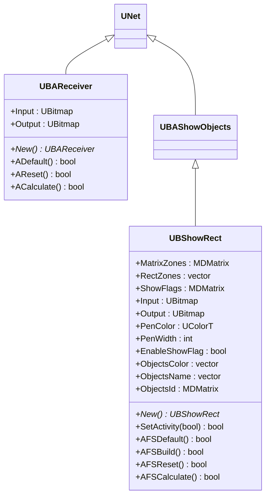
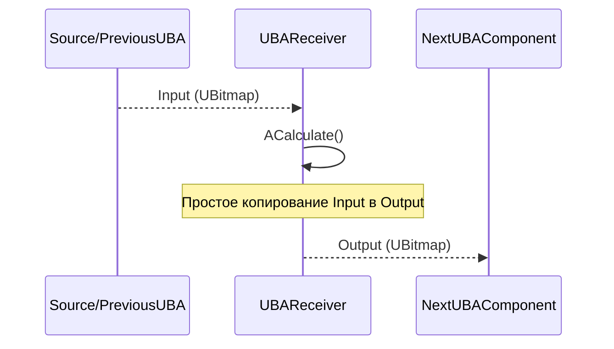
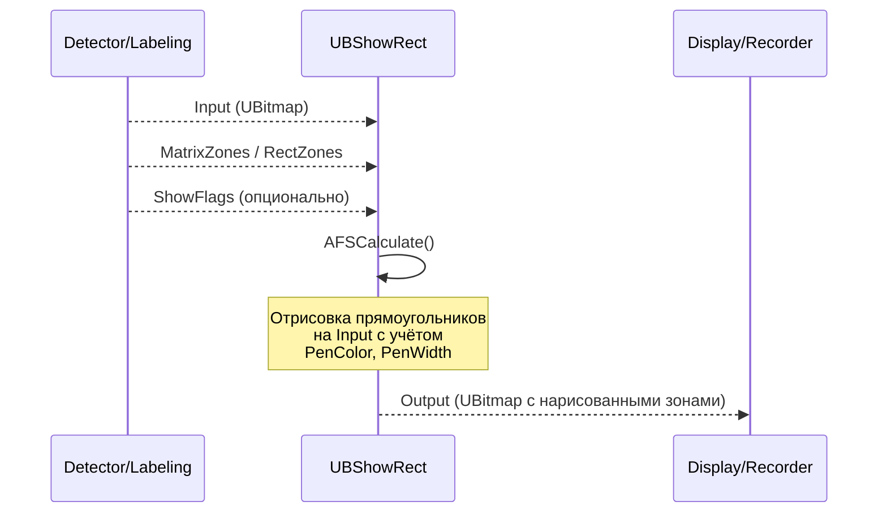
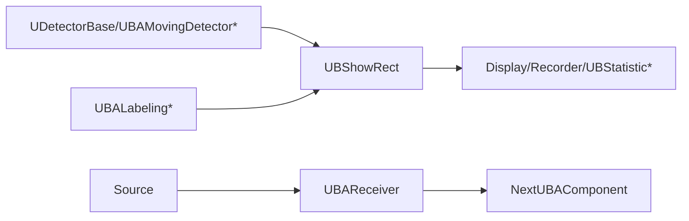

## RU

## Receiver & ShowRect — приёмник и визуализация прямоугольников (Rdk-CvBasicLib)

### Назначение

Компоненты `UBAReceiver` и `UBShowRect` обеспечивают:
- **UBAReceiver** — простой приёмник/проброс изображений в пайплайнах.
- **UBShowRect** — визуализацию прямоугольных зон (bounding boxes) поверх изображения, используемую для отображения результатов детекции.

---

## EN

### UML-диаграмма классов



**Иерархия наследования:**
- `UBShowRect` наследуется от `UBAShowObjects`, который предоставляет базовую функциональность отрисовки объектов.

---

### UBAReceiver — приёмник изображений

#### UML-диаграмма последовательности



#### UML-диаграмма активности


#### Свойства и методы

| Свойство/Метод | Тип | Назначение |
|----------------|-----|------------|
| `Input` | `UBitmap` | Входное изображение |
| `Output` | `UBitmap` | Выходное изображение (копия Input) |
| `ADefault()` | `bool` | Инициализация по умолчанию |
| `AReset()` | `bool` | Сброс состояний |
| `ACalculate()` | `bool` | Копирование Input в Output |

**Назначение:** Простой компонент для проброса изображений в пайплайнах, когда требуется явное разделение этапов обработки или синхронизация потоков данных.

---

### UBShowRect — визуализация прямоугольных зон

#### UML-диаграмма последовательности



#### UML-диаграмма активности (UBShowRect::AFSCalculate)

```mermaid
flowchart TD
    Start([Start]) --> CheckEnable{EnableShowFlag?}
    CheckEnable -->|Нет| Skip[Output = Input (копия)]
    CheckEnable -->|Да| ReadInput[Прочитать Input]
    ReadInput --> ReadZones["Прочитать MatrixZones<br/>или RectZones"]
    ReadZones --> ReadParams["Прочитать PenColor, PenWidth<br/>ObjectsColor, ObjectsName"]
    ReadParams --> InitCanvas[Инициализировать Canvas = Input]
    InitCanvas --> LoopZones[Цикл по зонам]
    LoopZones --> CheckFlag{ShowFlags задан?}
    CheckFlag -->|Да| CheckShow{ShowFlags[i] > 0?}
    CheckFlag -->|Нет| DrawRect["Отрисовать прямоугольник<br/>с цветом из ObjectsColor<br/>или PenColor"]
    CheckShow -->|Да| DrawRect
    CheckShow -->|Нет| SkipRect[Пропустить зону]
    DrawRect --> DrawLabel{ObjectsName задан?}
    DrawLabel -->|Да| DrawText[Отрисовать текст метки]
    DrawLabel -->|Нет| NextZone
    DrawText --> NextZone[Следующая зона]
    SkipRect --> NextZone
    NextZone --> MoreZones{Ещё зоны?}
    MoreZones -->|Да| LoopZones
    MoreZones -->|Нет| WriteOut[Записать Canvas в Output]
    WriteOut --> End([End])
    Skip --> End
```

#### Свойства и методы

| Свойство/Метод | Тип | Назначение |
|----------------|-----|------------|
| `Input` | `UBitmap` | Входное изображение, на которое наносятся зоны |
| `Output` | `UBitmap` | Результирующее изображение с нарисованными прямоугольниками |
| `MatrixZones` | `MDMatrix<double>` | Матрица зон (каждая строка: x, y, width, height или left, top, right, bottom) |
| `RectZones` | `vector<UBRect>` | Вектор прямоугольных зон |
| `ShowFlags` | `MDMatrix<int>` | Флаги видимости для каждой зоны (опционально) |
| `PenColor` | `UColorT` | Цвет линий прямоугольников (по умолчанию) |
| `PenWidth` | `int` | Толщина линий |
| `EnableShowFlag` | `bool` | Включить/выключить отрисовку |
| `ObjectsColor` | `vector<UColorT>` | Цвета для каждой зоны (если задано, переопределяет PenColor) |
| `ObjectsName` | `vector<string>` | Текстовые метки для зон |
| `ObjectsId` | `MDMatrix<int>` | Идентификаторы объектов (для связи с метками) |
| `SetActivity(bool)` | `bool` | Установить флаг активности (аналог EnableShowFlag) |

---

### UML-диаграмма компонентов



---

### Примеры использования (C++)

```cpp
// Приёмник
auto recv = storage->CreateComponent<RDK::UBAReceiver>();
recv->Default();
recv->Build();
recv->Input = inputBitmap;
recv->Calculate();
UBitmap output = recv->Output;

// Визуализация прямоугольников
auto show = storage->CreateComponent<RDK::UBShowRect>();
show->Default();
show->PenColor = UColorT(0, 255, 0); // зелёный
show->PenWidth = 2;
show->EnableShowFlag = true;
show->Build();

// Заполнение зон из детектора
std::vector<UBRect> zones;
// ... заполнение zones из детектора ...
show->RectZones = zones;

show->Input = inputBitmap;
show->Calculate();
UBitmap annotated = show->Output;
```

---

### Примеры конфигурации XML

```xml
<!-- Приёмник -->
<Component Id="Receiver" Class="UBAReceiver">
    <Parameters/>
</Component>

<!-- Визуализация прямоугольников -->
<Component Id="ShowRects" Class="UBShowRect">
    <Parameters>
        <PenColor>#00FF00</PenColor>
        <PenWidth>2</PenWidth>
        <EnableShowFlag>true</EnableShowFlag>
    </Parameters>
</Component>
```

---

### Связь с конфигурационными проектами (`Bin/Configs`)

- **UBAReceiver** используется как промежуточный компонент в пайплайнах для явного разделения этапов обработки или синхронизации потоков данных.
- **UBShowRect** является финальным компонентом в большинстве пайплайнов детекции, отображая результаты детекции (`UDetectorBase`, `UBAMovingDetector*`, `UBALabeling*`) поверх исходного изображения перед сохранением или выводом на экран.

Оба компонента часто встречаются в конфигурациях `Bin/Configs/*` для задач видеонаблюдения и анализа движения.

---

## Receiver & ShowRect — receiver and rectangle visualization (Rdk-CvBasicLib)

**Classes**: `UBAReceiver`, `UBShowRect` — simple image receiver/forwarder and rectangle zone visualization component for displaying detection results (bounding boxes) on images.
