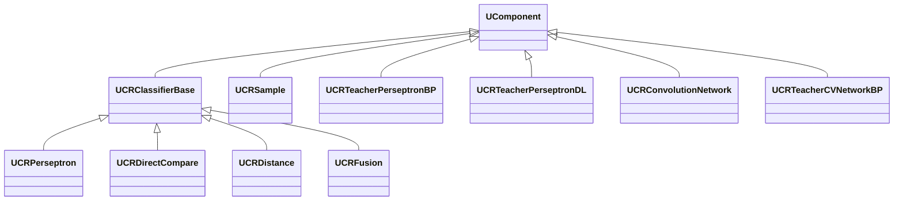
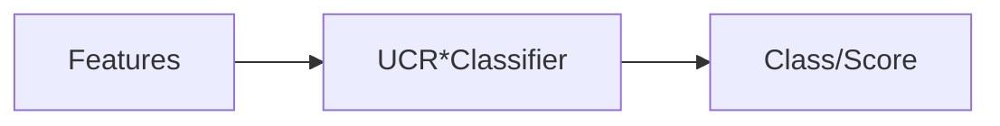

## UCR* — классификаторы и учителя (Rdk-CvBasicLib)

Семейство компонентов `UCR*` реализует классификаторы, учителей и вспомогательные блоки для обучения и инференса.

- `UCRPerseptron` — многослойный перцептрон.
- `UCRDirectCompare` — прямое сравнение с эталонами.
- `UCRDistance` — классификация по расстояниям.
- `UCRFusion` — объединение нескольких классификаторов.
- `UCRSample` — представление обучающих выборок.
- `UCRTeacherPerseptronBP` / `UCRTeacherPerseptronDL` — учителя перцептрона (backprop / deep learning).
- `UCRConvolutionNetwork` / `UCRTeacherCVNetworkBP` — сверточные сети и учителя.
- `UCRPrincipalComponentAnalysis` / `UCRBarnesHutTSNE` — понижение размерности/визуализация.

### Классы и связи

### Входы/выходы
- Классификаторы: вход — признаки/bitmap; выход — класс/скор.
- Учителя: вход — обучающие выборки (`UCRSample`), ошибки; выход — обновлённые веса.
- PCA/t-SNE: вход — матрицы признаков; выход — проекции/координаты.

### Storage-инстансы
- В `ClDesc`/`Configs` как `ClassName = "UCRPerseptron"` и др.; конфигурируются топология, функции активации, параметры обучения.

Пояснение: блок-схема показывает поток данных/сигналов (входы → компонент → выходы).

---

## UCR* — classifiers/teachers family (Rdk-CvBasicLib)

**Classes**: `UCRPerseptron`, `UCRDirectCompare`, `UCRDistance`, `UCRFusion`, `UCRSample`, `UCRTeacher*`, `UCRConvolutionNetwork`, `UCRTeacherCVNetworkBP`, `UCRPCA`, `UCRBarnesHutTSNE` — core of learning/classification in CV pipelines.

