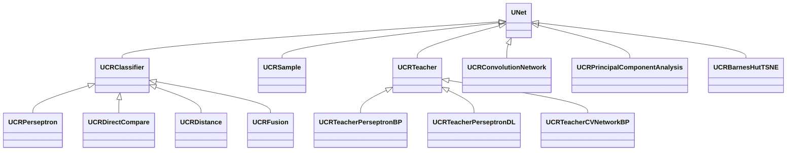
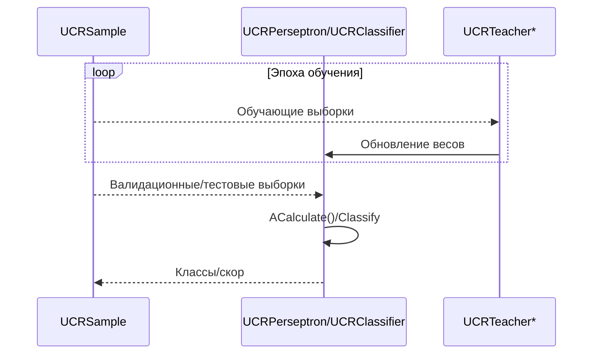
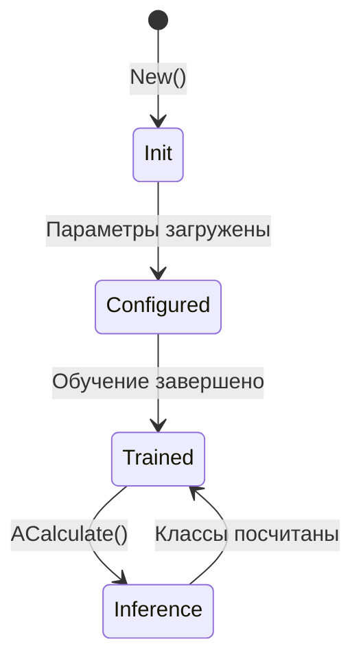
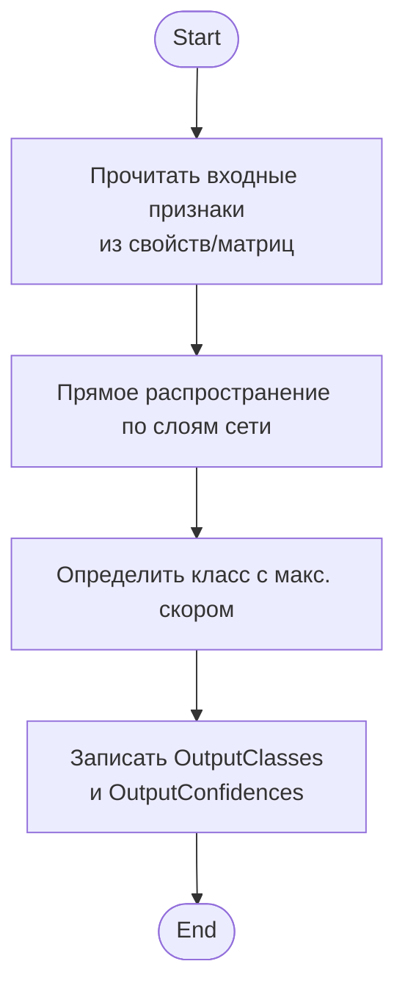
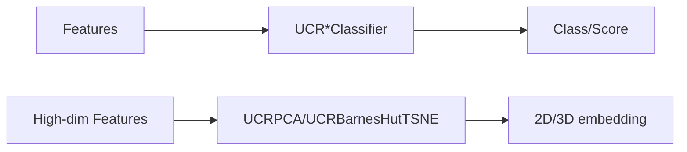

## RU

## UCR* — классификаторы и учителя (Rdk-CvBasicLib)

Семейство компонентов `UCR*` реализует классификаторы, учителей и вспомогательные блоки для обучения и инференса.

- `UCRPerseptron` — многослойный перцептрон.  
- `UCRDirectCompare` — прямое сравнение с эталонами.  
- `UCRDistance` — классификация по расстояниям.  
- `UCRFusion` — объединение нескольких классификаторов.  
- `UCRSample` — представление обучающих выборок.  
- `UCRTeacherPerseptronBP` / `UCRTeacherPerseptronDL` — учителя перцептрона (backprop / deep learning).  
- `UCRConvolutionNetwork` / `UCRTeacherCVNetworkBP` — сверточные сети и учителя.  
- `UCRPrincipalComponentAnalysis` / `UCRBarnesHutTSNE` — понижение размерности/визуализация.

### UML-диаграмма классов



### UML-диаграмма последовательности (обучение и инференс)



### UML-диаграмма состояний (классификатор)



### UML-диаграмма активности (пример: UCRPerseptron::ACalculate)



### UML-диаграмма компонентов



### Входы/выходы

- **Классификаторы (`UCR*Classifier`)**
  - Вход: признаки (матрицы признаков, изображения) из предыдущих компонентов.  
  - Выход: предсказанный класс, вероятности/скоры, дополнительные метрики.

- **Учителя (`UCRTeacher*`)**
  - Вход: `UCRSample` (данные + метки), ошибки на выходе классификатора.  
  - Выход: обновлённые веса модели, статистика обучения.

- **PCA/t‑SNE (`UCRPrincipalComponentAnalysis`, `UCRBarnesHutTSNE`)**
  - Вход: матрицы признаков высокой размерности.  
  - Выход: матрицы проекций/координат для визуализации и последующей обработки.

### Storage-инстансы

- В `ClDesc`/`Configs` как `ClassName = "UCRPerseptron"`, `"UCRDirectCompare"`, `"UCRDistance"`, `"UCRFusion"`, `"UCRConvolutionNetwork"` и т.д.  
- Конфигурируются:
  - Топология сети (число слоёв, нейронов).  
  - Функции активации и параметры обучения (скорость, регуляризация).  
  - Ссылки на обучающие выборки (`UCRSample`) и учителей (`UCRTeacher*`).

### Пример использования (C++)

```cpp
auto sample = storage->CreateComponent<RDK::UCRSample>();
auto cls = storage->CreateComponent<RDK::UCRPerseptron>();
auto teacher = storage->CreateComponent<RDK::UCRTeacherPerseptronBP>();

sample->SetName("TrainData");
cls->SetName("Perceptron");
teacher->SetName("PerceptronTeacher");

sample->Default();
cls->Default();
teacher->Default();

sample->Build();
cls->Build();
teacher->Build();

// Цикл обучения (упрощённо)
for (int epoch = 0; epoch < 100; ++epoch) {
    teacher->Calculate(); // считывает sample и обновляет веса cls
}

// Инференс
cls->Calculate();
auto classes = cls->OutputClasses;
auto confs = cls->OutputConfidences;
```

### Пример конфигурации XML

```xml
<Component Id="Sample" Class="UCRSample">
    <Parameters>
        <!-- Параметры источника обучающих данных -->
    </Parameters>
</Component>

<Component Id="Perceptron" Class="UCRPerseptron">
    <Parameters>
        <NumInput>256</NumInput>
        <NumHidden>128</NumHidden>
        <NumOutput>10</NumOutput>
    </Parameters>
</Component>

<Component Id="PerceptronTeacher" Class="UCRTeacherPerseptronBP">
    <Parameters>
        <LearningRate>0.01</LearningRate>
        <Momentum>0.9</Momentum>
    </Parameters>
</Component>
```

### Связь с конфигурационными проектами (`Bin/Configs`)

- Компоненты `UCR*` образуют завершающую часть цепочки распознавания в конфигурациях `Bin/Configs/*`: получают признаки от UBA‑блоков/нейросетей и выдают классы.  
- `UCRPCA` и `UCRBarnesHutTSNE` часто используются в конфигурациях экспериментов для анализа признакового пространства.

---

## EN

## UCR* — classifiers/teachers family (Rdk-CvBasicLib)

**Classes**: `UCRPerseptron`, `UCRDirectCompare`, `UCRDistance`, `UCRFusion`, `UCRSample`, `UCRTeacher*`, `UCRConvolutionNetwork`, `UCRTeacherCVNetworkBP`, `UCRPCA`, `UCRBarnesHutTSNE` — core of learning/classification in CV pipelines.  
They implement both training and inference stages and are configured from XML via `ClassName = "UCR*"` entries in configs.
