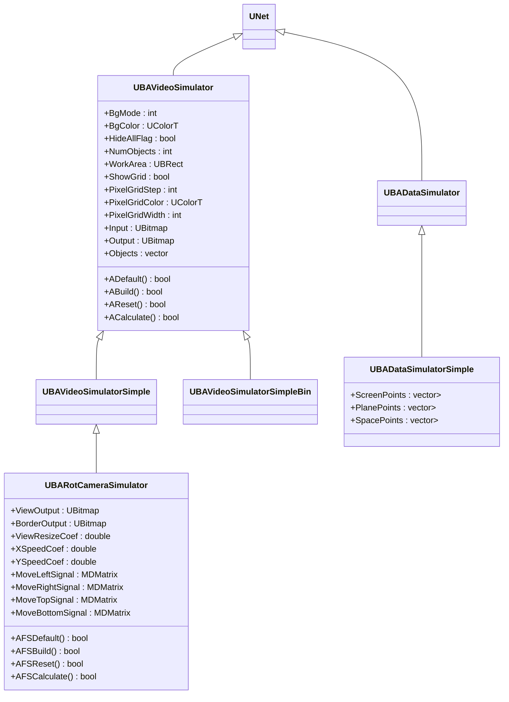
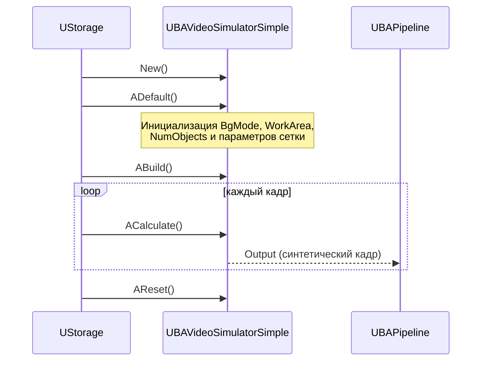
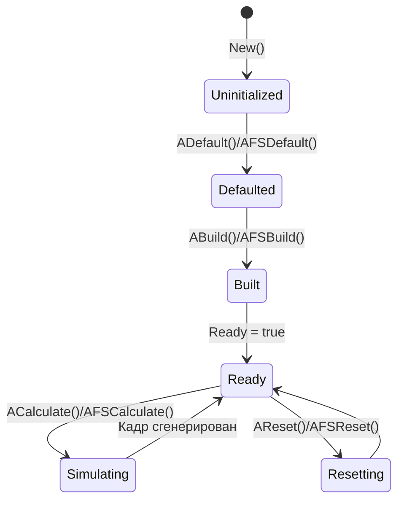
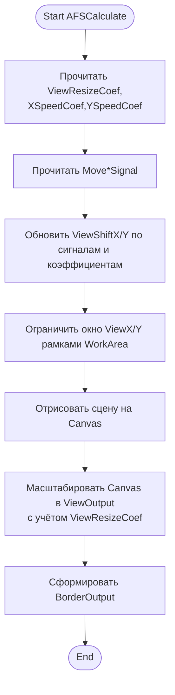
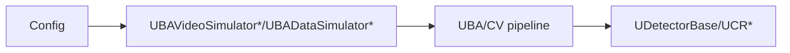
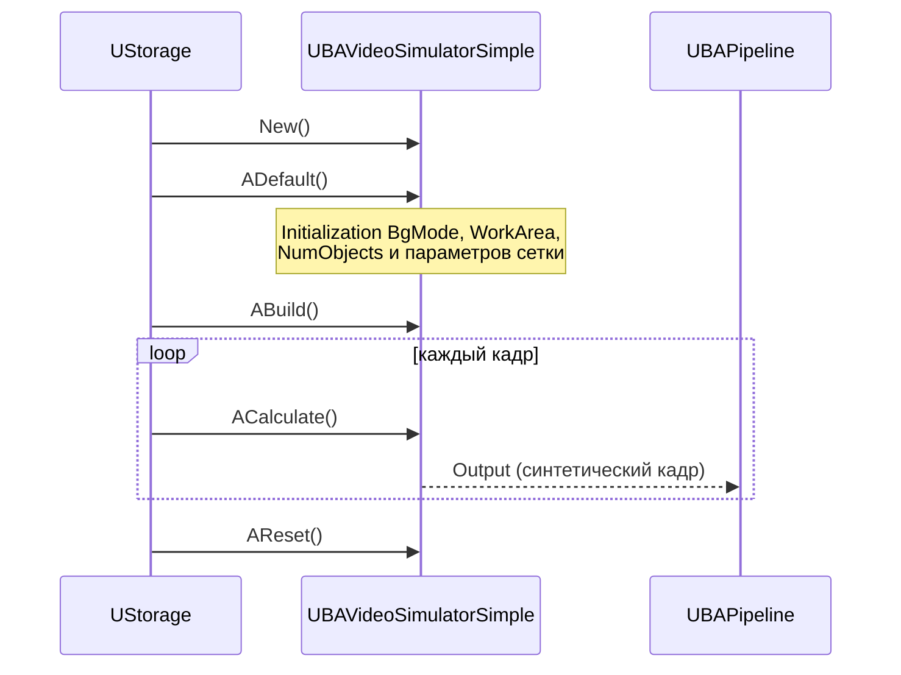

## RU

## Video/Camera Simulators — видеосимуляторы (Rdk-CvBasicLib)

**Классы**: `UBAVideoSimulator`, `UBAVideoSimulatorSimple`, `UBAVideoSimulatorSimpleBin`, `UBARotCameraSimulator`, `UBADataSimulator`, `UBADataSimulatorSimple` — генерация синтетических видеопотоков и данных для тестов/демо.  
Реализации находятся в `UBAVideoSimulator.cpp`, `UBARotCameraSimulator.cpp`, `UBADataSimulator.cpp` и связанных файлах.

### UML-диаграмма классов



### UML-диаграмма последовательности (пример: UBAVideoSimulatorSimple)



### UML-диаграмма состояний (симуляторы)



### UML-диаграмма активности (UBARotCameraSimulator)



### UML-диаграмма компонентов



### Входы/выходы

- **UBAVideoSimulator/UBAVideoSimulatorSimple/UBAVideoSimulatorSimpleBin**
  - Вход: параметры сцены (`BgMode`, `WorkArea`, `Objects`, сетка и т.п.).  
  - Выход: `Output` — синтетический видеокадр (`UBitmap`), а в `UBAVideoSimulatorSimpleBin` также бинаризованный `BinarOutput`.

- **UBARotCameraSimulator**
  - Вход: `Input` — фон/исходное изображение; управляющие сигналы `Move*Signal`.  
  - Выход: `ViewOutput` — окно обзора, `BorderOutput` — рамка/маска.

- **UBADataSimulator / UBADataSimulatorSimple**
  - Вход: параметры генерации (через свойства и код).  
  - Выход: наборы точек (`ScreenPoints`, `PlanePoints`, `SpacePoints`) для тестов геометрии.

### Свойства (UProperty, ключевые)

| Компонент                 | Свойство           | Тип                               | Направление                     | Назначение                                   |
|---------------------------|--------------------|-----------------------------------|----------------------------------|----------------------------------------------|
| `UBAVideoSimulator*`      | `BgMode`           | `int`                             | `ptPubParameter`                 | Режим фона                                   |
| `UBAVideoSimulator*`      | `BgColor`          | `UColorT`                         | `ptPubParameter`                 | Цвет фона                                    |
| `UBAVideoSimulator*`      | `NumObjects`       | `int`                             | `ptPubParameter`                 | Число движущихся объектов                    |
| `UBAVideoSimulator*`      | `WorkArea`         | `UBRect`                          | `ptPubParameter`                 | Рабочая область                              |
| `UBAVideoSimulator*`      | `Input`            | `UBitmap`                         | `ptPubParameter`                 | Входное изображение (опционально)           |
| `UBAVideoSimulator*`      | `Output`           | `UBitmap`                         | `ptPubParameter`                 | Сгенерированный кадр                         |
| `UBARotCameraSimulator`   | `ViewOutput`       | `UBitmap`                         | `ptOutput \| ptPubState`         | Окно обзора                                  |
| `UBARotCameraSimulator`   | `BorderOutput`     | `UBitmap`                         | `ptOutput \| ptPubState`         | Рамка обзора                                 |
| `UBARotCameraSimulator`   | `ViewResizeCoef`   | `double`                          | `ptPubParameter`                 | Коэффициент масштабирования окна             |
| `UBARotCameraSimulator`   | `Move*Signal`      | `MDMatrix<double>`                | `ptInput \| ptPubState`          | Сигналы движения по осям                     |
| `UBADataSimulatorSimple`  | `ScreenPoints`     | `vector<MVector<double,2>>`       | `ptPubOutput \| ptPubParameter`  | Точки на экране                              |
| `UBADataSimulatorSimple`  | `PlanePoints`      | `vector<MVector<double,3>>`       | `ptPubOutput \| ptPubParameter`  | Точки в плоскости                            |
| `UBADataSimulatorSimple`  | `SpacePoints`      | `vector<MVector<double,4>>`       | `ptPubOutput \| ptPubParameter`  | Точки в пространстве                         |

### Методы (основные)

- `New()` — фабричный метод создания экземпляра конкретного симулятора.  
- `ADefault()/AFSDefault()` — установка параметров по умолчанию (фон, область, количество объектов и т.п.).  
- `ABuild()/AFSBuild()` — подготовка графического контекста (`UAGraphics`/`Canvas`).  
- `AReset()/AFSReset()` — сброс счётчиков и внутренних буферов.  
- `ACalculate()/AFSCalculate()` — генерация очередного кадра/набора точек.

### Пример использования (C++)

```cpp
// Видеосимулятор
auto sim = storage->CreateComponent<RDK::UBAVideoSimulatorSimple>();
sim->SetName("Sim1");
sim->Default();
sim->BgMode = 1;
sim->NumObjects = 5;
sim->Build();

for (int i = 0; i < 1000; ++i) {
    sim->Calculate();
    const UBitmap& frame = sim->Output;
    // передаём frame в последующий пайплайн
}

// Симулятор данных
auto dataSim = storage->CreateComponent<RDK::UBADataSimulatorSimple>();
dataSim->SetName("DataSim1");
dataSim->Default();
dataSim->Build();
dataSim->Calculate();
auto screenPts = dataSim->ScreenPoints;
```

### Пример конфигурации XML

```xml
<Component Id="Sim1" Class="VideoSimulatorSimple">
    <Parameters>
        <BgMode>1</BgMode>
        <NumObjects>5</NumObjects>
        <WorkArea>
            <Left>0</Left>
            <Top>0</Top>
            <Right>640</Right>
            <Bottom>480</Bottom>
        </WorkArea>
    </Parameters>
</Component>

<Component Id="RotCam" Class="RotCameraSimulator">
    <Parameters>
        <ViewResizeCoef>2.0</ViewResizeCoef>
        <XSpeedCoef>0.5</XSpeedCoef>
        <YSpeedCoef>0.5</YSpeedCoef>
    </Parameters>
</Component>
```

### Связь с конфигурационными проектами (`Bin/Configs`)

- В проектах `Bin/Configs/*` видеосимуляторы используются как источники данных вместо реальной камеры (`TCapture*`).  
- Типичный пайплайн: `VideoSimulator*`/`RotCameraSimulator` → UBA‑обработка (ColorConvert, Crop, Reduce, Binarization) → детектор (`UDetectorBase`/`UBAMovingDetector`) → визуализация/сохранение.

---

## EN

## Video/Camera Simulators — video generators (Rdk-CvBasicLib)

**Classes**: `UBAVideoSimulator*`, `UBARotCameraSimulator`, `UBADataSimulator*` — synthetic video/data generators feeding UBA pipelines.  
They replace real capture sources in configs and allow stable, repeatable test scenarios for detectors and classifiers.





