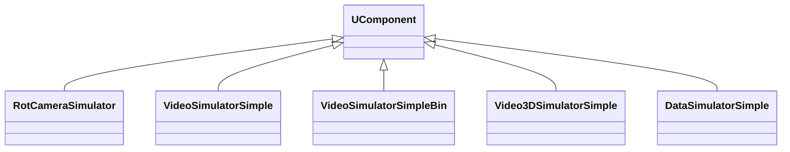
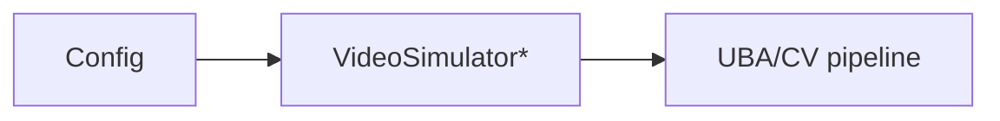

## Video/Camera Simulators — видеосимуляторы (Rdk-CvBasicLib)

**Классы**: `RotCameraSimulator`, `VideoSimulatorSimple`, `VideoSimulatorSimpleBin`, `Video3DSimulatorSimple`, `DataSimulatorSimple` и др. — генерация синтетических видеопотоков для тестов/демо.  
Реализации находятся в `UBAVideoSimulator.cpp`, `UBARotCameraSimulator.cpp`, `UBADataSimulator.cpp` и связанных файлах.

### Общая схема

### Входы/выходы
- Вход: параметры сцены/движения (углы, траектории, шум) из свойств.
- Выход: `UBitmap` кадры или структуры данных (для `DataSimulatorSimple`).

### Storage-инстансы
- В `ClDesc`/`Configs`: `ClassName` соответствующего симулятора; параметры описывают сценарий движения камеры, частоту кадров, размер изображения и т.п.

Пояснение: блок-схема показывает поток данных/сигналов (входы → компонент → выходы).

---

## Video/Camera Simulators — video generators (Rdk-CvBasicLib)

**Classes**: `RotCameraSimulator`, `VideoSimulator*`, `DataSimulatorSimple` — synthetic video/data generators feeding UBA pipelines.

