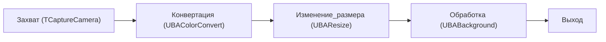
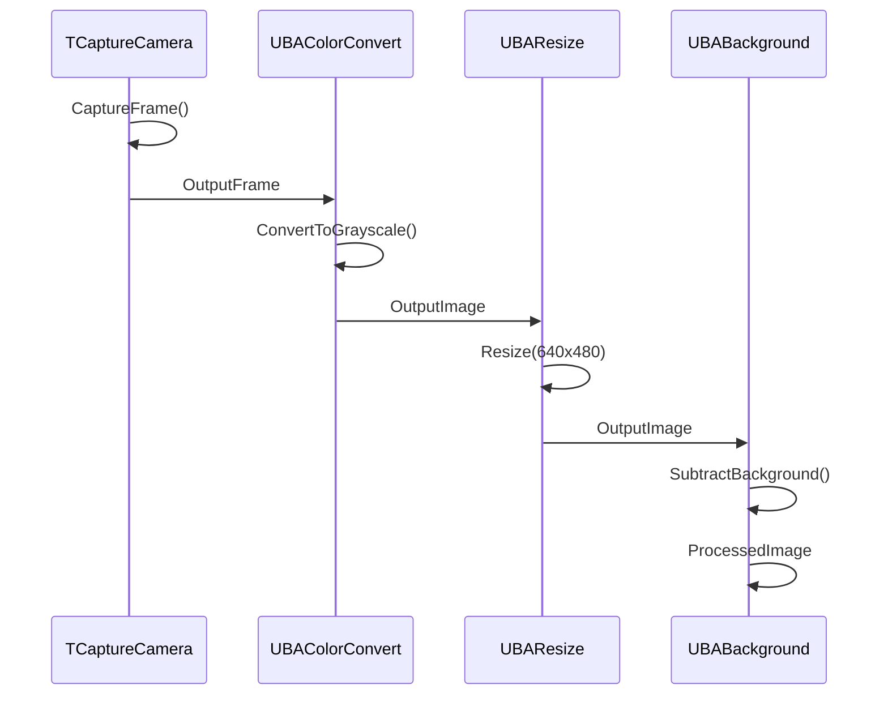
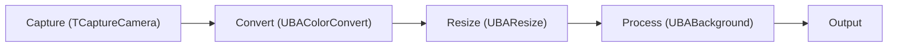

# Пайплайн обработки изображений

## RU

### Типичный пайплайн обработки

### Последовательность обработки

---

## EN

### Typical Processing Pipeline

The diagram represents a typical computer vision chain: acquire frame → convert colors → resize → apply processing/background operations → produce output image or mask.

### Processing Sequence

The sequence diagram in the RU section shows the per-frame execution order and data handoff between components through their output/input properties.
