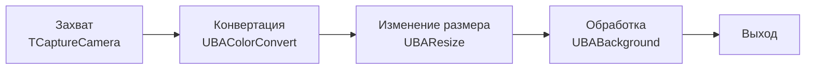
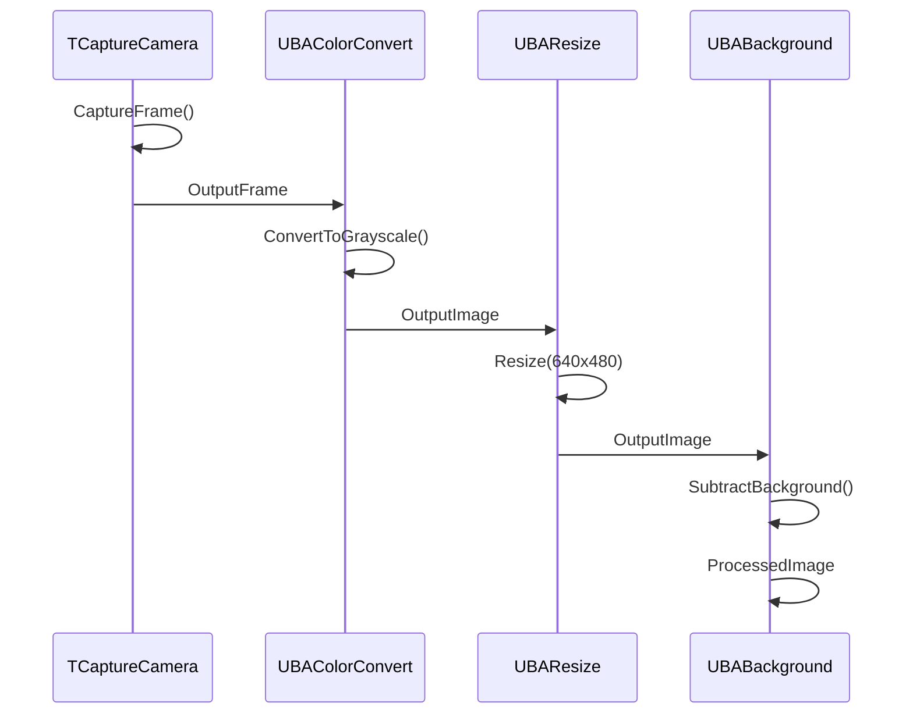

# Пайплайн обработки изображений

## RU

### Типичный пайплайн обработки

```mermaid
flowchart LR
    Capture[Захват<br/>TCaptureCamera]
    Convert[Конвертация<br/>UBAColorConvert]
    Resize[Изменение размера<br/>UBAResize]
    Process[Обработка<br/>UBABackground]
    Output[Выход]
    
    Capture --> Convert
    Convert --> Resize
    Resize --> Process
    Process --> Output
```

### Последовательность обработки

```mermaid
sequenceDiagram
    participant Camera as TCaptureCamera
    participant Convert as UBAColorConvert
    participant Resize as UBAResize
    participant Process as UBABackground
    
    Camera->>Camera: CaptureFrame()
    Camera->>Convert: OutputFrame
    Convert->>Convert: ConvertToGrayscale()
    Convert->>Resize: OutputImage
    Resize->>Resize: Resize(640x480)
    Resize->>Process: OutputImage
    Process->>Process: SubtractBackground()
    Process->>Process: ProcessedImage
```

---

## EN

### Typical Processing Pipeline

### Processing Sequence
