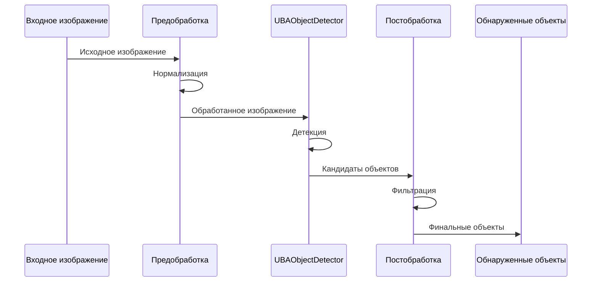

# Поток детекции объектов

## RU

### Последовательность детекции

```mermaid
sequenceDiagram
    participant Image as Входное изображение
    participant Preprocess as Предобработка
    participant Detector as UBAObjectDetector
    participant Postprocess as Постобработка
    participant Output as Обнаруженные объекты
    
    Image->>Preprocess: Исходное изображение
    Preprocess->>Preprocess: Нормализация
    Preprocess->>Detector: Обработанное изображение
    Detector->>Detector: Детекция
    Detector->>Postprocess: Кандидаты объектов
    Postprocess->>Postprocess: Фильтрация
    Postprocess->>Output: Финальные объекты
```

---

## EN

### Detection Sequence

```mermaid
sequenceDiagram
    participant Image as Входное изображение
    participant Preprocess as Предобработка
    participant Detector as UBAObjectDetector
    participant Postprocess as Постобработка
    participant Output as Обнаруженные объекты
    
    Image->>Preprocess: Исходное изображение
    Preprocess->>Preprocess: Нормализация
    Preprocess->>Detector: Обработанное изображение
    Detector->>Detector: Детекция
    Detector->>Postprocess: Кандидаты объектов
    Postprocess->>Postprocess: Фильтрация
    Postprocess->>Output: Финальные объекты
```
