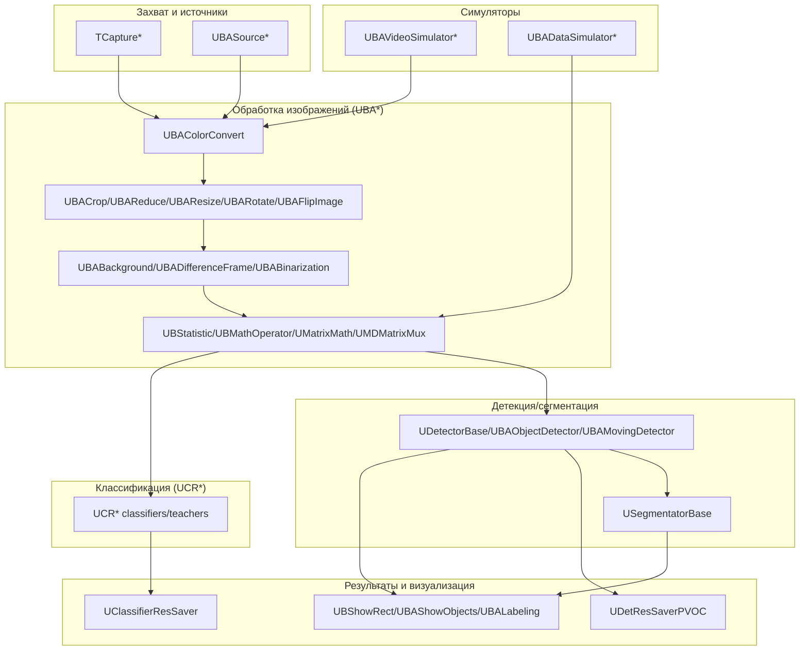
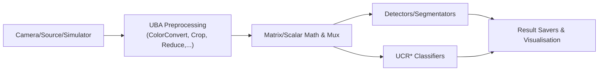
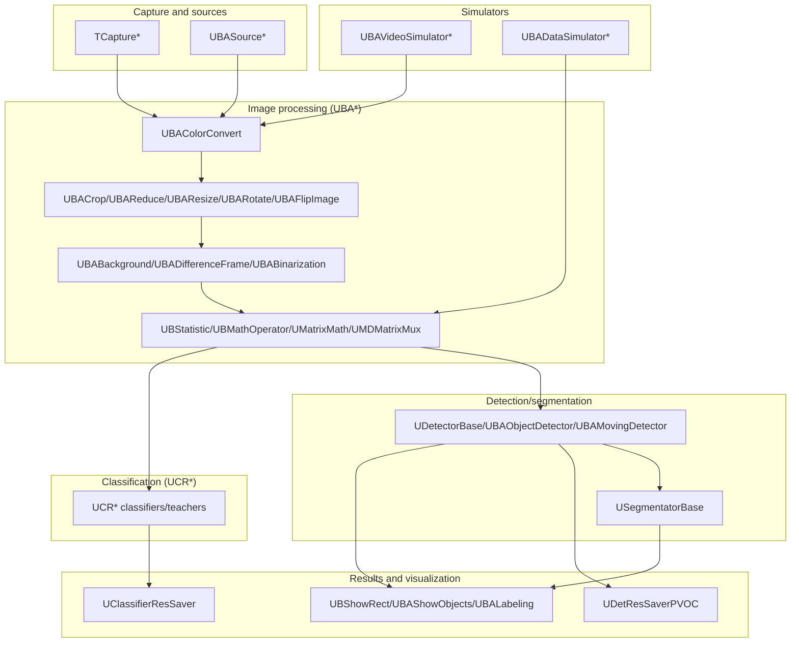

## RU

## Rdk-CvBasicLib — UML-обзор компонентов

### Назначение

Этот документ даёт UML-обзор библиотеки `Rdk-CvBasicLib` и связывает обзорные диаграммы с детальной документацией по компонентам.

### UML-диаграмма компонентов библиотеки

### Связанные компонентные документы

- `Components/ColorConvert.md` — конвертация цветовых пространств.  
- `Components/CropReduce.md` — обрезка и уменьшение изображений.  
- `Components/GeometricTransformations.md` — геометрические преобразования (resize, rotate, flip).  
- `Components/CaptureAndSources.md` — захват и источники изображений.  
- `Components/VideoSimulators.md` — видеосимуляторы и симуляторы данных.  
- `Components/BackgroundBinarizationLabeling.md` — фон, разность, бинаризация, разметка, looping, GUI.  
- `Components/DetectorsSegmentators.md` — детекторы, сегментаторы, сохранение и визуализация результатов.  
- `Components/MovingDetectors.md` — детекторы движения.  
- `Components/UCRFamily.md` — семейство классификаторов и учителей UCR*.  
- `Components/MatrixMathMux.md` — математические операторы и мультиплексоры матриц/скаляров.  
- `Components/PipelinesModelsStats.md` — пайплайны, модели и статистика.  
- `Components/ReceiverAndShowRect.md` — приёмник и визуализация прямоугольников.

### Поток данных высокого уровня

### См. также

- `Architecture.md` — подробная архитектура библиотеки.  
- `Diagrams/Image-Processing-Pipeline.md` — детальная схема пайплайна обработки.  
- `Diagrams/Object-Detection-Flow.md` — схема потока детекции объектов.

---

## EN

## Rdk-CvBasicLib — UML component overview

### Purpose

This document provides a UML overview of the `Rdk-CvBasicLib` library and links overview diagrams to detailed component documentation.

### Library component UML diagram

### Related component documents

- `Components/ColorConvert.md` — color space conversion.  
- `Components/CropReduce.md` — image crop and reduce.  
- `Components/GeometricTransformations.md` — geometric transforms (resize, rotate, flip).  
- `Components/CaptureAndSources.md` — capture and image sources.  
- `Components/VideoSimulators.md` — video and data simulators.  
- `Components/BackgroundBinarizationLabeling.md` — background, difference, binarization, labeling, looping, GUI.  
- `Components/DetectorsSegmentators.md` — detectors, segmentators, result saving and visualization.  
- `Components/MovingDetectors.md` — motion detectors.  
- `Components/UCRFamily.md` — UCR* classifier and teacher family.  
- `Components/MatrixMathMux.md` — math operators and matrix/scalar multiplexers.  
- `Components/PipelinesModelsStats.md` — pipelines, models, and statistics.  
- `Components/ReceiverAndShowRect.md` — receiver and rectangle visualization.

### High-level data flow

### See also

- `Architecture.md` — detailed library architecture.  
- `Diagrams/Image-Processing-Pipeline.md` — detailed processing pipeline diagram.  
- `Diagrams/Object-Detection-Flow.md` — object detection flow diagram.
